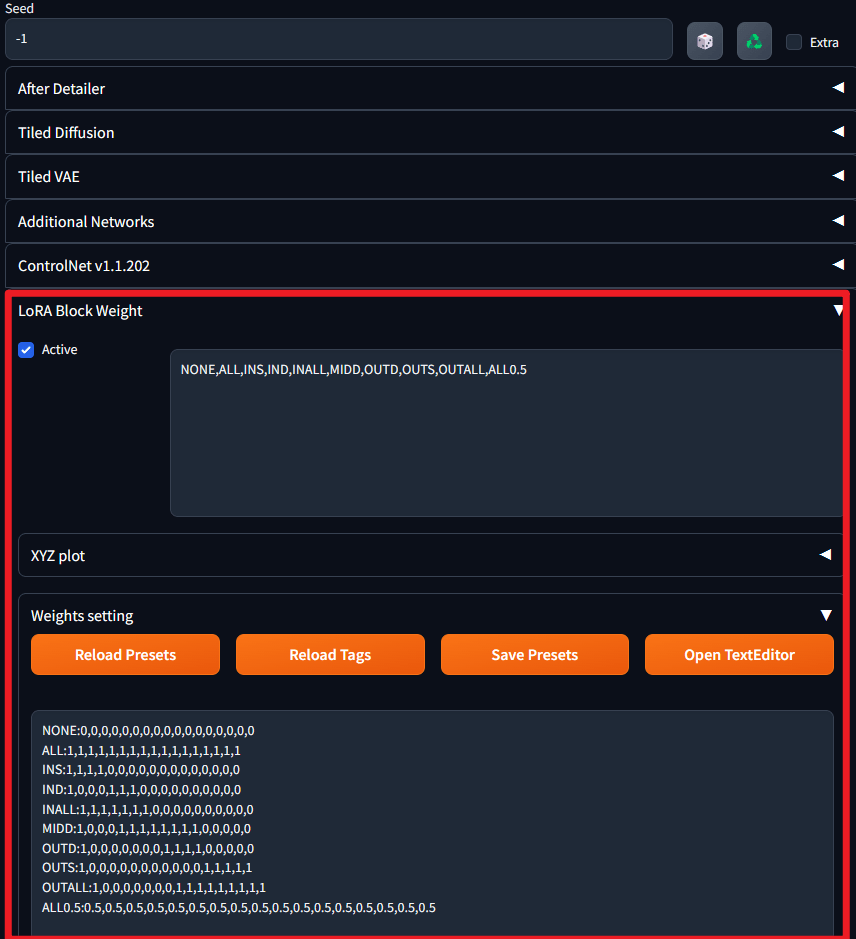
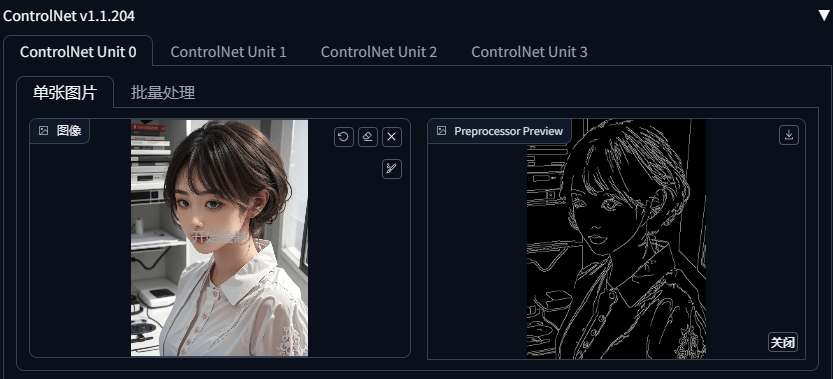
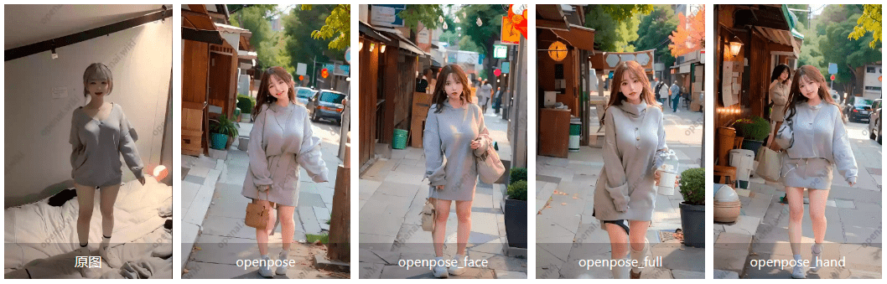

# AI绘画Stable Diffusion简易使用

> 一张AI绘图需要以下的步骤 : 搭建可复用环境, 安装可复用模型, 针对模型使用关键词, 生成AI图片, 穿帮修复

- 搭建相关环境一般使用三种方式 :
  1. 拉取GitHub源码部署 ( 可能有很多坑 )
  2. 使用第三方本地整合包 ( 要求有超过3070的电脑, 此类方式要使用所有SD功能 )
  3. 利用云上平台进行搭建
  
- 所有与 AI绘画 相关的问题 , 可以参照 AIdraw : https://guide.novelai.dev/ 

- AI可以通过文字描述凭空生成一张图片(文生图功能)

- AI可以在基础图片上重新绘制或修改一幅图片(图生图功能)

- AI 是无法做到你给他一张图片就直接会照着画出来无数张这个物体或人物的图片的, 就比如说, 我这里有一个立绘, 你想让AI只根据这一个立绘就完美画出来各种动作角度, 抱歉, 做不到或者说是技术限制, 目前根本就做不好(这有个专业术语叫one shot), 即想法是美好的, 现实是残酷的, 目前局限性很大

- AI 虽然无法根据单一张图片就完美复刻物体, 但是在拥有足够的素材进行训练以后, 就可以学习到一个人物或者画师的画风, 通常来说，要拥有较好的效果, 人物学习最低需要10张以上, 画风学习需要50张以上

- 目前的主流AIGC产品有如下列表中的内容 :

  | 名称             | 计费方式  | 用户数量 | 发展速度 | 绘画效果 | 使用方式 |
  | ---------------- | --------- | -------- | -------- | -------- | -------- |
  | Stable Diffusion | 免费开源  | 非常多   | 迅速     | 中上     | 自由部署 |
  | MidiJourney      | 按张收费  | 较多     | 缓慢     | 较好     | 在线使用 |
  | Dall·E           | 按API收费 | 较少     | 极其缓慢 | 一般     | API调用  |

- 对于AIGC, 能流畅运行的电脑最好有一张显存超过8GB的30系以上的Nvidia显卡, AMD显卡无法适用, 因为该系列显卡不支持CUDA, CUDA可以理解为Nvidia（英伟达）专门为自家显卡推出的算力软件, 如果电脑不支持CUDA, 那么只能通过CPU来进行运算, 显然CPU的运算速度肯定比GPU要慢很多

- 由于 [Stable Diffusion WebUI - AI绘画资源和教程导航 - openAI](https://openai.wiki/stable-diffusion.html#stablediffusion｜教程内容) 上有相关的教程, 可以直接点击相关链接去学习, 本文档实际上相当于我自己的一个笔记, 只是有这种一边学习一边系统化整理的习惯而已


## 云端安装模型

- 本次使用第三种方式, 在阿里云上进行相关搭建和使用

  > 只要从来没有用过函数计算或NAS存储, 即可参与阿里云试用, 但是试用的计算量很有限

- 进入阿里云免费试用专场, 选择 **函数计算FC** 进行3个月的试用, 在工作台里, 创建应用

- 创建角色默认即可, 只是个称呼

- 进入应用菜单, 选择 **通过模板创建应用**, 这里不直接选择 SD, 而是选择人工智能里面的 **AI数字绘画stable-diffusion自定义模型版**, 部署类型选择直接部署, 在此步先不要继续, 先去领取NAS的免费试用, 否则会产生别的费用, NAS用来保存自定义模型

- 同样进入免费试用专栏, 搜索NAS, 找到 **NAS存储** 点击试用, 领取50GB的3个月试用

- 进入刚刚的函数计算控制台, 授权角色, 点一下直接授权刚刚创建的角色即可

- 下面的高级配置中, 地域选择杭州, 镜像地址直接复制下面示例说明中的地址即可, 部署成功后访问域名即可

  > 访问域名时, 需要使用外网下行流量, 这个只有在配置的时候要用, 保持钱包有钱即可

- 点击admin开头的进行相应的环境初始化, 一路下一步即可, 在最后的账号设置处设置好密码即可

- 登录后在可视化界面的地址栏处, 删掉个人空间这里的 `{source:5}` 字样, 直接输入 `/mnt/auto/sd/`, 建议记住这个路径, 这样之后就不需要再设置了

- 在此处展开models文件夹, 点开 Stable-diffusion 文件夹, 这里存放的就是我们的模型, 大模型推荐使用 NeverEnding Dreams ( 即NED ), 在 Stable-diffusion 同层级中可以找到 Lora 文件夹, 这里存放小模型

  > mix4 和 20d 用来画妹子, ss9 用来画帅哥

- 所有模型上传完毕之后, 回到 函数计算FC 的应用菜单, 点击打开访问域名中的另一个域名, 即前端图形化操作界面

- 界面的左上角是大模型名称, 可以通过下拉框选择, 然后在下面选择 **文生图** 标签页, 上面的提示词即正相关词, 下面的反向提示词即为负相关词, 按照需求进行填写即可

- 右侧生成按钮下面有一个像印章(MP3)一样的小图标, 点一下会出现一个选项卡弹出页面, 这里我们选择 **低秩微调模型LoRA** 选项卡, 这里点一个传好的小模型, 比如 mix4, 就会出现尖括号词组, 如 `<lora:mix4:0.8>` 这里第一个参数即代表一个 LoRA, 第二个参数为模型名, 注意模型名要填写模型的card上显示的完整名称, 第三个参数为相关性, 相关性是乘积关系, 小于一是减少相关性, 大于一是增加相关性, 采样器选择 `DPM++ SDE Karras`, 采样步数为 40, 勾选面部修复, 生成种子不要选 -1 即可, 生成完毕后勾选喜欢的图片, 点击局部绘制, 把生成的不喜欢的地方涂黑, 然后微调下随机数, 慢慢的就能生成自己喜欢的图片了

- 使用 LoRA 时, 需要配合提示词, 例如使用 mix4 就需要增加一个 mix4 提示词, 即 `<lora:mix4:0.8>,mix4` 一般在 CivitAI 中, 模型爱好者发布的 LoRA 信息中, 其 Trigger Words 就是相关的提示词

- 这样就搭建好了一个简单的AI绘图模型了, 可以自行炼丹了, 如果要深入, 则观看靠谱的轩轩的视频即可

- 分享作品时, 分享内容为 : 图片 ; 正反关键词 ; 模型信息 ; 其他参数

- 如果自己不知道输入哪些关键词出图, 那可以在 CivitAI 中找到喜欢的图片, 下载好对应的模型, 直接在别人的图片对应内容中复制, 点击生成按钮左下角的小箭头生成图片

### 如何查询免费额度余额

- 进入阿里云 函数计算FC 控制台, 找到概览, 在右下角的资源包处可以看到相应的专项套餐剩余量, 除去免费的部分, 还有两个地方要收费, 一个是磁盘使用费 (不是NAS中模型的费用, 是SD的环境占用, 一般为0.0063元/GB/小时), 另一个是外网下行流量费用/公网出流量 (上传模型不收费, 但是下载计算的流量, 一般为0.5/GB)

  > 我的阿里云余额已经用完了, 阿里云的运行速率低于3060, 且经常卡住, 所以有条件尽量还是自己本地部署使用

-----------------

## win系统傻瓜包

- 网上相关UP有制作一键启动的傻瓜客户端, 只要保证电脑上内存大于64GB, N系显卡, 且显存>8GB, 就可以正常使用了, 好一些的显卡, 例如强于3080的, 可以直接训练相关的AI模型

# SD相关学习内容

> 在学习时参照了很多大佬的教程, 相关链接如下 :
>
> [(6条消息) 探索【Stable-Diffusion WEBUI】的插件：画布扩绘（Outpaint）_若苗瞬的博客-CSDN博客](https://blog.csdn.net/ddrfan/article/details/130316244)
>
> [Stable Diffusion - openAI](https://openai.wiki/painting/sd)

- Stable Diffusion 直译为稳定扩散, 原是指潜扩散模型 (即 Latent Diffusion Model, LDM), 现阶段大家使用它的时候都是利用 Stable-Diffusion WEB UI (仓库地址:[stable-diffusion-webui](https://github.com/AUTOMATIC1111/stable-diffusion-webui))

- Stable Diffusion是目前主流绘图工具中的最优解, 因为它是一个免费开源的项目, 可以被任何人免费部署和使用, 且不需要支付任何费用, 其优点不仅仅在于它的高效和实用性, 其开源性也为用户提供了更多的可能, 在GitHub等全球最大的开源社区中, 用户可以上传自己的代码供他人使用, 并且可以从其他开源项目中获取灵感和资源, 这也是Stable Diffusion能够不断发展和进步的原因之一

- 闭门造车终究会影响事物的发展速度, 正如 OpenAI 已经不再 open 一样, 如果 OpenAI 是开源的, 那么将会拥有一些更加强大的功能, 并会有无数开发者为其提供额外的功能

  > 相应的可能还会听到 AIGC 这个名词, 其全名为 `AI generated content`, 又称生成式AI, 意为人工智能生成内容, 现在使用的例如AI文本续写, 文字转图像的AI图, AI主持人等, 都属于AIGC的应用
  >
  > [关于AI]自2022年下半年开始, 随着Stable Diffusion和ChatGPT的出现, 标志着AI时代已经来了, 而且来得非常突然, 目前为止, 国内大多数外行人还不知道Stable Diffusion和ChatGPT, 因为大多数人都认为这距离自己很遥远, 自己并不会从中获利, 而且学习过程复杂, 但是AI其实并不难使用, 因为使用时你不需要去了解AI是如何编写和运作的, 只需要搭乘这辆AI的列车, 就可以快速提升工作效率, 因为乘客是不需要知道列车如何产生动力和控制方向的, 你只要没有买错票就好

- 相对的, Windows 系统现在大家使用的都是由大神 ( [**秋葉aaak**][https://space.bilibili.com/12566101] ) 制作的统一启动包, 基本是下载解压后一键启动即可开始使用

- Stable Diffusion 在使用的时候, 大模型, 小模型, 以及相关插件有很多, 下面分别简单介绍一下

- 大模型即我们常说的底模, 一般为 check point 模型, 大小基本2G起步, 现阶段大模型基本都内置了 VAE 模型, 故无特殊需求时我们一般不再额外使用 VAE 模型生图

- 在生成图片时有不同的参数和属性, 需要了解的基础有 :
  - 正相关提示词 (prompt) : 即你想要的相关提示词, 可以在标签超市找 https://tags.novelai.dev/ 
  
    > 大部分 LoRA 模型添加时就添加到正相关提示词中, 在使用时可以叠加多个 LoRA 进行生图
  
  - 负相关提示词 (negative prompt) : 即你不想要的相关提示词, 可以在标签超市找 https://tags.novelai.dev/ 
  
  - 迭代步数 : 也称采样步数, 一般在50以内, 通常28是一个不错的值
  
  - 采样器 : 没有优劣之分, 一般推荐 Euler a, DPM++ 2M Karras, DPM++ SDE Karras这几个
  
  - 分辨率 : 就图片分辨率 , 一般别太大 , 想要大图就用小分辨率+高清修复
  
  - 批次和数量 : 顾名思义, 批次就是走几轮, 数量就是每次几张, 不是好显卡这两个参数建议都写为1
  
  > AI 基本上无法生成超级大图, 想要生成高清图片正确的做法是生成 2k 以内分辨率的图片再使用放大功能(也叫超分辨率) 进行放大图片
  
- 有时候你可能会看到别人发的 Tag 里面会有一些符号 , 比如大小括号等等

- 这属于进阶用法, 以 word 这个 Tag 作为例子 :

  - `(word)` - 将权重提高 1.1 倍

  - `((word))` - 将权重提高 1.1 * 1.1 = 1.21 倍, 乘法的关系

  - `[word]` - 将权重降低 90.91%

  - `(word:1.5)` - 将权重提高 1.5 倍

  - `(word:0.25)` - 将权重减少为原先的 25%

  - `\(word\)` - 在提示词中使用字面意义上的 () 字符

    > 使用数字指定权重时, 必须使用 `()` 括号, 如果未指定数字权重, 则假定为 `1.1` , 另外权重增加通常会占一个提示词位, 应当避免加特别多括号

- 提示词相关性(CFG Scale) , 代表你输入的提示词对图片的引导程度 , 可以理解为越小AI越自由发挥 , 如果数值过大的话 , 会出现锐化 , 线条变粗的效果

- 随机种子是生成过程中所有随机性的源头, 每个种子都是一幅不一样的画, 默认的 -1 是代表每次都换一个随机种子, 由随机种子, 生成了随机的噪声图, 再交给AI进行画出来

- 面部修复 (Restore or Fix) : 大部分情况下该项都会勾选, 这个操作的意义实际上在于由噪点图生成图像时迭代步数较低或者是其他原因导致噪点并未完全消除, 导致图片不自然或者是扭曲的结果, 这里简单将其理解为美颜效果即可

- 高清修复 (Hires.fix) : 由于现阶段AI算法和模型以及计算机算力的问题, 导致我们在生成时不能直接生成高清图片, 故仅能先生成低分辨率图片, 然后借助AI图像放大算法生成高清图, 勾选此项后需要选择放大算法

## 模型下载和分类

- 大模型, 一般指大小超过2GB的模型, 一般放在 `根目录\models\Stable-Diffusion` 文件夹下

  > 模型的下载可以有多种方法, 可以找相关的大佬去要, 也可以自己训练, 一般都用下面两种方法下载
  >
  > 1. 可以在网上下载, 比如C站, 即 https://civitai.com 下载模型, 这里的模型都有对应的预览图, 要搜索大模型的话, 勾选筛选里面的 `Checkpoint` 即可, 需要注意该网站是要梯子才能进的, 每个模型里面会有该模型的介绍以及对应的 Tags (即在网站中对应的标签) 和 Trigger Words (即触发该模型的关键词), 每个大模型的介绍需要细看一下, 里面一般会有作者推荐的运行参数
  >
  > 2. 如果使用的是傻瓜包, 那就在模型管理下, 这里下载模型是不需要科学上网的, 找到 `Stable Diffusion模型` 选项卡, 在此处下载即可, 此处不同的选项卡区别见后文, 这种方式唯一的问题就是没有预览图, 像开盲盒一样
  >
  > [PS] 如果对别人生成的图片很好奇, 可以点击对应图片右下角的 `!` 标志, 可以看到对应的正负面词, 但是具体用了那些额外插件就不知道了

- 在 C站 筛选模型的时候, 可以看到有不同的 **Model types**, 比如 `Checkpoint`, 它们的意义和作用都不一样, 简要介绍如下 :

  > - Checkpoint : 一般是指大模型
  > - Textual Inversion : 即 Embedding, 指一部分提示词整合的限定提示词
  > - Hypernetwork : 一般指仅作用于图片风格修改的小模型
  > - Aesthetic Gradient : 
  > - LoRA : 一般是指有特定风格的小模型
  > - LyCORIS : 可控层数更多的 LoRA
  > - Controlnet : 一般指专门用于限定图片人物动作姿势的插件模型
  > - Poses :
  > - Wildcards : 
  > - Other : 
  
- 同样的插件也尽量在启动器中下载 , 在下载之前记得关闭 webUI 界面 , 因为添加插件之后一般也会需要重启 webUI 界面

## 一些专有名词解释

- NSFW : 即 Not Safe for work, 简单点说就是当一个模型有NSFW的功能时, 出特殊动作(一般18禁)时更不容易发生人物变形, 质量更高

## 网页UI界面及相关笔记

- 常见的模型可以直接分为两大类 , 即大模型和用于微调大模型的小型模型
- 辨别模型类型请使用这个工具 : https://spell.novelai.dev/ 

### StableDiffusion模型

- 在最上面的 `Stable Diffusion 模型`, WebUI中为下图所示内容 :

  

- Stable Diffusion 模型这里选择的内容代表当前正在使用的大模型, 如果实时复制了大模型到对应的文件夹内之后, 在网页UI对应内容旁边点击刷新按钮即可刷新大模型

  > 后续有需要时会直接将 Stable Diffusion 简称为 SD
  
- 大模型大小在GB级别, 一般常见的有 2G, 4G, 7G 模型 , 但是需要注意 , 模型大小不代表模型质量

  > 部分合并出来的大模型VAE烂掉了, 画面会发灰, 这时候需要你去设置中手动选择vae并应用保存
  
- 为了方便插件的安装和显示以及针对国外相关教程, 建议使用 webUI 时使用英文界面, 如果真的有需求, 尽量使用 `zh-Hans (Testing)` 这个选项

### VAE

- 紧跟大模型之后的 `外挂VAE模型`, WebUI中为下图所示内容 :

  

- VAE 即 Variational autoencoder, 变分自编码器, 作用为滤镜+微调, 其相关原理见后续详解内容

- 加载 VAE 后色彩的饱和度会更高, 但是不同的 VAE 其饱和程度也不一样, 比如下图所示, 可以看到不同 VAE 作用下同一张图片的不同效果

  

- 需要注意的是, 有的大模型可能自带VAE, 如果再去添加VAE, 可能会直接影响整体出图效果, 但是还是得多试才行, 主要一些融合模型的 VAE 会烂掉 (典型 : Anything-v3), 需要外置 VAE 的覆盖来救救, 有时画面发灰就是因为这个原因

  > VAE 放置位置一般是 `根目录\models\VAE` 文件夹
  >
  > 从C站基本上很难找到VAE, 我们可以直接使用傻瓜包里的模型管理去下载, 即选择 `变分自编码器(VAE)模型` 标签来进行下载, 同样的, 不需要梯子即可正常下载

### 绘图方式

- 一般绘图方式分为 文生图(text to image), 图生图(image to image), 关于文生图这里不再赘述, 图生图即从某张已有的图片出发去生成图片, 或者通过线稿, 涂鸦等去生成新图片
- 图生图选项卡中, **局部重绘** 功能是需要多进行研究的内容, 主要功能顾名思义, 比如出了一张图, 但是对某一块内容不满意, 或者对于生成的某一个物体边缘不满意, 就可以进行局部重绘, 除此之外还有Outpaint画布扩绘(即脑补图片外围内容), 另外还有缩放视频插件等

### Embedding (Textual Inversion)

- Embedding, 又名 Textual Inversion, 即嵌入或文本反转, 这里可以直接理解其为**打包的提示词** , 一般大小在 KB 级别

- 我们如果要使用原版SD生成游戏角色, 一般需要特别多的tag去定义才能达到想要的效果

- 但是如果引入了某一特定人物对应的 Embedding 后, 那可以只引用例如 `dva` 这一个提示词, 就实现了对应图片的生成

  > 由于说白了 Embedding 就是一堆 tag 的合集, 故其大小按照一个txt文件的体积看即可, 这样仅为了好记忆, 但是其本质还是一种模型
  >
  > Embedding 的放置位置为 `根目录\embeddings` 文件夹
  >
  > Embedding 的下载还是在 C站, 即筛选时将 `Model types` 选择为 `Textual Inversion` 即可
  >
  > 大部分情况下可能 C站 找不到想要的 embedding, 可以在 [Hugging Face](https://huggingface.co/) 里面去搜索

- Embedding 在界面中不会直接展示, 使用时需要点击  按钮来展开对应内容

- 此处的 `嵌入式(T.I. Embedding)` 标签页中会显示对应的 Embedding 模型, 点击一个, 即可将相应的关键词放入正相关提示词中

### LoRA

- LoRA, 全称 Low-Rank Adaptation of Large Language Models, 直译为大语言模型低阶适应

  > 这是微软研究人员为解决大语言模型微调而开发的一项 AI 技术, 其对应的技术实现原理见后续内容

- LoRA 最大的作用就是对人物和物品的复刻, 即只要挂载了对应的 LoRA 模型, 就可以基本 99% 地复刻出指定的人物特征

- LoRA 的适用范围很广泛, 其实它可以实现画风, 画面材质, 特定人脸, 固定人物动作, 特定细节等等功能

- 通俗点来理解, LoRA 几乎可以训练所有与图片相关的内容

  > LoRA 也是在 C站 进行下载, 即筛选时将 `Model types` 选择为 `LoRA` 即可, 需要注意的是下载的时候一定不要用迅雷下载, 会乱码且无法使用, Lora 是一种小模型, 一般放在 `根目录\models\Lora` 文件夹下
  >
  > [注] LoRA 和 embedding 文件的作用看起来类似, 但是其实 embedding 仅仅是一个 tags 的合集小模型文件, 其能够通过定义 tags 实现出多视图等特定功能, 而 LoRA 则是一种被训练过的特性提取模型, 一般针对的是单一内容, 但是深挖了细节, 例如 : embedding 可以看成是简单的模仿, 比如制作网站, embedding 是做出了动态网页, 由于网页量惊人, 有相关的互动效果, 但是实际上并没有后端的数据访问效果, 只模仿到了形 ; 而 LoRA 则是一个前后端整体框架完善的网站, 抄到了精髓, 故一般情况下, 同样效果我们使用 LoRA 更多一些
  
- 在使用 LoRA 时, 需要首先看好要使用的 LoRA 其出图时对应的大模型, 至于某个 LoRA 究竟应该用哪个大模型去生成, 需要在 C站 下载时打开对应的预览图信息, 在此处查看 Model 项内容, 即可找到对应 LoRA 的大模型

  > 大模型和 LoRA 并不是特定组合, 只是不同的大模型针对同一个 LoRA 的生图效果可能不同

- LoRA 在界面中不会直接展示, 使用时需要点击  按钮来展开对应内容, 此处 `lora` 标签页中会显示对应的 LoRA 模型, 点击一个模型即可将相应的LoRA 关键词放入正相关 tag 中, 其形式一般为 `<lora:XX:1>`, 尖括号第一个参数即代表要使用 LoRA 模型, 第二个参数是使用的 LoRA 模型的具体名称 (不同版本的 LoRA 其模型名是不一样的, 抄预览图信息的时候也要注意这里), 第三个参数表示使用这个 LoRA 的比重, 或者说是强度值, 权重, 如果你有很熟悉的 LoRA 的话, 可以直接使用类似的 tag 调用模型而不需要再去点击添加正相关词

  > LoRA 模型的一个首当其冲的问题, 即是其预览图和实际跑出来的图片可能会有买家秀和卖家秀一样的效果, 即生成内容差距很大
  
- 针对使用同一个 LoRA 会导致买家秀和卖家秀的问题, 实际上只是犯了一些基础错误, 以 汉服LoRA(即LoRA为hanfu_v3) 为例, 实际使用时, 尽量参照以下几点来进行 :

  1. **用 LoRA 配套的大模型效果会更好**, LoRA 的训练其实就是参照一个选择的大模型来训练参数的, 如果在使用这个 LoRA 的时候, 没有使用当时训练时使用的大模型, 那当然就会出现不同的效果了, 获取作者 (即 LoRA 发布人) 使用的大模型, 前文也有提到过, 即点开预览图的 `!` 标志来查看对应的 Model 信息, 复制这个模型名, 然后直接在C站筛选`Browsing Mode` 为 `Everything`, 因为你也不知道训练用的大模型是不是XX禁的模型, 然后选择 `Model types` 为 `Checkpoint`, 即搜索大模型, 然后在搜索栏输入复制的名称即可
  2. **最好使用和 LoRA 作者相同的参数**, 即相关生成图片的正负提示词, 然后其他的参数也最好一致, 复制时直接点击信息下面的 `Copy Generation Data`, 在 Stable Diffusion 的前端界面中, 点击 `↙` 按钮即可, 出图的质量一般在这样设置之后, 就和预览图差不多了, 至于如何生成示例图, 则在后续笔记中进行详解
  3. **正确设置 LoRA 的使用权重**, 我们知道调用 LoRA 的时候, 会使用到 `<lora:hanfu_v3:0.9>` 这样的正相关提示词, 这里的第三个数就是权重, 权重越大, 代表其对生成图的影响越大, 权重值尽量不要设置到 1 以上, 不然很容易出效果奇差的图, 即便是十分希望 LoRA 影响出图结果, 也不要将其权重设置为 1, 最好设置为 0.8 或者 0.9, 如果只是想稍微带一点 LoRA 元素作为图片修饰, 那么将其权重设置为 0.4 到 0.6 之间即可
  4. **LoRA 有触发词时一定要使用触发词**, 在一个模型的下载界面, 其 `Trigger Words` 对应的紫色词语就是触发词, 一般将其加入到正向提示词中之后, 在参数一样的情况下, 就能生成相关的图片了, 触发词一般用一个即可, 不同的触发词只是代表的风格不同, 另外提一下对应的 `Tags`, 即在触发词上面的词语, 它们只是代表 LoRA 在 C站 对应的标签, 而和 Stable Diffusion 本身没有任何关系
  5. **新手/第一次使用模型时尽量不要混用 LoRA**, 在使用时, 由于使用者并不了解 LoRA 的训练图集, 如果随意混用则会导致模型相互污染, 出图效果也不会很理想, 即使有时候出现了很惊艳的图片, 也不是调好参数了, 只是碰巧炼丹出丹了而已, 有时候作者会在 LoRA 的简介里说明配合哪些其他 LoRA 使用效果更好, 如果一定要执着于混用 LoRA 的话, 最好还是先看一下其原理, 再去对图片分层次单独设置权重再使用, 这样多个 LoRA 混用不仅有好效果, 而且还有特殊性

  > [注] 以下内容为特殊情况
  >
  > - 有时候作者会疏忽导致没有在任何地方标明 LoRA 炼丹时对应的底模, 这时候就是作者的问题了, 如果实在是想要, 那就在评论区碰碰运气, 看看评论区的人有没有对应的好的效果图, 用他使用的大模型就行了
  > - 有时候作者会疏忽导致没有在模型对应的信息中标明 LoRA 的触发词, 这时一般就是指这个 LoRA 被加载之后, 不需要相应的触发词去作为提示词就能发挥作用, 再者就是作者写到了简介里, 所以最好在下载对应模型时, 将其预览图, 相关信息, 以及简介都保存下来 , 也做好模型的备份

#### 模型整理

> 不管是 SD大模型, 还是 LoRA模型, 在不断的添加之后会变得非常多, 而它们就像物品一样, 多了感觉就不好管理了
> 另外, 由于很多模型文件名很奇怪, 版本和衍生版也不停在变化, 总之就是针对这么一大堆文件如果我们为了方便改了模型名字, 今后又很难去比较更新同步了, 所以借助 SD-webUI 进行整理和归类是最优解
>
> 由于一般来说我们最多的额外模型就是 LoRA 和 LyCORIS, 所以将模型整理放在此节

- 首先声明一点, 一般模型的名称都带有版本号, 不是特殊情况尽量不要修改模型名 (除非这名字长到离谱)

  > 实际上可以通过 HASH 值去确认模型, 这样你的模型叫啥都不重要了, 有的图像生成时也会在模型参数那里显示 HASH 值, 一般这种图片在 C站 的话旁边都会显示对应 HASH 值 的模型

- 如果说我们手贱改掉了 LoRA模型 的名字时, 可以通过调用 LoRA模型 时使用其别名即可正常调用了, 即在 WebUI 中设置好 `When adding to prompt, refer to lora by` 这个选项, `Alias from file` 即是别名选项, `Filename` 是文件名选项, 这样就不会在修改文件名后影响到生成图片了, 但是有的模型别名可能很奇怪, 这取决于作者 (此方法仅针对LoRA模型, 基础模型(大模型)并不适用此方法)

- **设置LoRA字号** 

- 确认好我们的 LoRA模型 位置准确无误后, 第一步就是修改这里显示的字号了, SD的webUI对应根目录中有 `style.css` 文件, 这里我们定位 `.extra-network-cards .card .actions .name` 相关class, 在此处修改字体大小等信息即可

- **设置LoRA预览图和备注** 

  > 最终的目标 : Markdown描述文件 + 备注提示词 + 完美预览图

- 大部分已经使用过一段时间 SD-webUI 的人基本都知道如何去修改一个模型的预览图, 我们知道如果要使用一个模型的话, 可以 :

  - 点击一个大模型的卡牌, 即相当于在基础模型下拉列表中选择它
  - 点击一个LoRA模型, 即相当于在当前输入框 (prompt) 中输入和启用这个模型, 用于生成图片
  
- 但如果你先把鼠标指向模型的名字, 然后再指向替换预览图片 (这里翻译可能不同, 意思一样就行了) 时, 就可以把刚刚生成的图片, 设置成为这个模型的预览图了
  
  > 预览图卡牌模式的默认是2:3的比例, 显示大小可以在设置中修改
  > 另外, 将模型同名的jpg或者png图片文件放入模型所在目录, 也能展示为缩略图/卡牌
  
- 同样的, 每种模型可能有一些建议设置, 这种内容我们也不可能每次都去对应的网页或者笔记中去看它, 这样我们可以直接通过编辑模型同名 txt 文件使其介绍在 SD-webUI 中显示

- 即将一个模型同名的`txt`文件放入模型所在目录中, 那么这个文本文件中的内容, 就将展示为模型的备注, 这样一来就方便多了, 既可以不改模型文件名, 又能简单知道模型的特点, 记得不要写太多, 不然可能显示不全

  > 这里可以直接标明模型的参考参数, 参考提示词等信息

- **分组管理** 

- 另外, 如果模型过多, 还可以进行分组管理, 以LoRA模型为例, 模型文件/预览图/模型备注文本文件, 都不要直接放在 `根目录\models\Lora\`目录下, 而是放在更深一层的子目录中, 比如`根目录\models\Lora\anime\` 目录下, 这样在 SD-webUI 中会出现这些子目录的分组名, 点击相关分组即会自动过滤并仅显示子目录下的模型, 如果想要显示全部模型，则点击 `all` 就可以了

  > 分组仅通过子目录进行组织, 并不是必须按类型分, 可以按自己的喜好怎样方便管理怎样建子目录
  > 如果你有`Anything`或`GuoFeng`很多个版本的模型, 也可以用模型名字当子目录的

- 需要注意的是 : 

  - 如果你要使用模型分组, 就不要在使用 webUI 翻译插件时翻译 `all` 和 `Search` 这两个单词 (即找到翻译文件, 自己改掉这两个单词)
  - 前者影响点击 `all` 以后取消过滤的功能, 而后者会让搜索框忽大忽小, 处女座不能忍
  
  > 显而易见, 使用子目录分组的话, 一个模型就不能属于多组, 对于比较模糊的情况, 可能难选分组
  > 但是这样的好处就是不需要额外的配置, 分组时十分方便
  
- 如果鼠标指向一个LoRA模型的时候, 发现一个圆圈围起来的感叹号, 那么点击它会出现这个模型生成时的详细信息 (即训练时的元数据)

  > 这里可以看到模型训练时用的分辨率, 图片多少张, 半身全身, 提示词, 以及其它很多参数, 这些参数可以作为我们日后自己训练模型时的参考

- **模型预览插件(Model Preview)**

- 我在对一个模型进行下载时有个习惯, 即一般会将其介绍和预览图等信息放在一个 md 文档中, 而此文档在使用[模型预览插件](https://github.com/CurtisDS/sd-model-preview-xd)时有很棒的效果

  > 相关插件的详细介绍可以参照 GitHub 的介绍文档, 基本已经十分详细了
  >
  > 如果有闲情逸致的话, 可以使用 html 文档描述, 因为这种文档可以调用 css 文件导致其完成度等上限都很高, 但是主要问题就是这样弄的话会很麻烦, 所以建议还是用 Markdown 文档描述

- 该插件可以直接从WEB UI中安装, 安装方式也很简单, 即(...)

- 安装后会出现新的标签页, 它支持 : 

  - 多张图片预览 (支持 .jpg .jpeg .png 格式), 并且可以点击放大查看
  - 备注信息 (.txt)
  - 模型Markdown格式信息描述 (.md)
  - 模型HTML格式信息描述 (.html)
  - 提示词信息 (.prompt)
  - 搜索关键字 (.tags)
  
- 具体的可以参照插件作者的提示, 从而借此插件给模型加入更加丰富的内容, 以一个带有 .md 介绍文档的插件为例 ( 以国风3为例, 将3Guofeng3_v33.safetensors和3Guofeng3_v33.md放置在 `根目录\models\Stable-diffusion` 目录中 ) :
  
  > 有的插件其介绍文档不需要自己去写, 可以直接从[huggingface](https://huggingface.co/)上下载模型的描述.md文件, 这种介绍文件大部分情况下并不能满足我的使用, 所以我一般都是自己写的, 抱脸网的使用方式类似于 GitHub
  
  - 需要注意的是, 这里的说明文件仅能说明内容, 文档中如果有插入显示图片的情况是无法直接显示的, 一般你的图片如果有外链, 那可以直接使用外链插入, 即你可以理解为网络链接形式的图片是可以正常显示的
  
    > 在上传图片前, 可以先参照如下的命名规则, 这些命名规则会被插件正常读取
    >
    > 假定你有一个叫 `model.ckpt` 的模型, 以下的严格命名方式文件均可被读取到 :
    >
    > - 介绍文件: model.txt model.md model.html
    > - 图片文件: model.png model.preview.png model.4.png model.preview.7.png
    > - 标签文件(实际也就是txt文件改名): model.tags
    >
    > [注] 上面的例子中图片文件格式都是 .png 格式, 实际上 .jpg .jpeg .webm 都是可以正常显示的
  
  - 由于模型可能需要带着到处跑, 所以我在模型的相关介绍文档中都是使用的相对路径的图片链接的, 这种情况下当我将模型相关的文件放到实际使用的 Stable Diffusion 中时, 我会做以下操作, 在保证本地调用的同时, 也能在 webUI 的模型预览插件中正常看到 .md 文档中的内容
  
    > 1. 首先将所有模型文件复制到 `根目录\models\Stable-diffusion` 目录中, 这样这里会多一个 `images` 文件夹, 将其重命名为模型名称相关的文件夹, 比如我使用着国风3模型, 但是有多个版本, 那我会将这个文件夹重命名为 `Guofeng` 
    >
    > 2. 保证所有模型相关的图片都在创建好的文件夹下, 比如`根目录\models\Stable-diffusion\Guofeng`, 接下来将模型预览图复制一份, 并按照 `模型名.预览图编号.png` 的格式重命名一下, 比如 `3Guofeng3_v33.3.png`, 这样预览图是会正常显示的
    >
    >    > 如果可选, 建议预览图都使用 .png 格式, 这种格式可以直接在插件中复制相关参数, 而不需要通过 `PNG Info` 插件去查看
    >
    > 3. 接下来将每个图片的链接改为能被插件识别的本地链接, 直接上示例, 如果是 Markdown 文档, 那么可以使用以下两类格式去插入图片
    >
    >    ```markdown
    >    链接格式1
    >    
    >    链接格式2
    >    
    >    ```
    >
    >    > 即地址为 `http://127.0.0.1:7860/file=` + `models/模型目录/相对路径/文件` 的格式就能正常显示了
  
  - 上面显示示例图的方式可以看到插件是会检索整个 StableDiffusion 目录的, 从而能正确识别到预览图所在的模糊目录并将其对应到相关模型并正常显示出来
  
  - 大部分情况下目录中的所有文件都会被插件正常识别, 但是实际上在图片调用时还是得选择外链调用还是本地调用, 而不能直接按 md 文档的 `./images/文件` 这样直接调用图片
  
  - 一般来说正常设置好对应介绍文件和预览图的模型都会这样显示 :
  
    
  
- **统一预览图姿势** 

- 我们知道可以使用 controlnet 插件来定义想要生成的图片的姿势, 通过这一基础我们可以将 LoRA 生成的图片都有一个统一的姿势, 从而更加容易通过描述类似的图片去选择模型

  > 使用时注意参数, 不要让ControlNet控制得太死, 毕竟每个人的发型并不是完全一样的
  >
  > 如果是类似于证件照的情况, 建议使用深度模型 (depth)
  >
  > 如果是半身图, 则使用骨骼姿态 (openpose)

### LoRA和LyCORIS

- 我们知道LoRA 是一种可以用于学习和再现图像, 姿势以及情景等的技术, 而LoRA 的类型包括 LyCORIS, LoHa, LoRA, LoCon, (IA)^3, LoKR 和 DyLoRA 等, 这里我们提到的 LyCORIS 即为本节的相关内容

  > 这里有这么多种, 其实是指微调技术的分类和其算法, LoRA, LyCORIS, LoCon是一些技术项目的名称
  >
  > 时至今日, LoCon 已经被 LyCORIS 合并, 过去需要的拓展 LoCon 现在不再被需要, 只需要安装 LyCORIS 的拓展即可
  >
  > LoHa,  (IA)^3, LoKR 和 DyLoRA 是 LyCORIS 的学习算法之一, 在算法学习时指定使用
  >
  > 上述介绍实际上并没有什么意义, 因为使用时基本不会接触到这些, 但是如果要使用 LyCORIS 和 LoCon 学习的 LoRA, 则需要使用 LyCORIS 专用的拓展程序 (本节之后会有相关内容详解)

- 如果说大模型是一包食材, 那么 LoRA 可以看做为一个调料包, 通过一些简单的调配(学习), 我们可以制作出色香味俱全的佳肴, 甚至是批量的(即批量生成想要的图像, 姿势, 情景等)

- 比如我们如果想要还原某一个逝去的人的生前影像, 那么我们通过制作他的 LoRA, 就可以在 Prompt 中通过一个或一些关键词调用, 即可获得关于他的图片, 如果逼真度高的话说直接生成照片也没什么问题

- 在使用 LoRA 的时候我们会发现, 当使用了很多条件时容易崩溃, 例如 : 所有 LoRA 的权重总和超过 1 时容易崩溃等, 这种问题的影响原因很多, 由于模型等因素的影响, 每次都要单独定位问题, 通常情况下, 权重在 0~1 之间进行指定, 但实际上也可以指定大于1的数或者是负数, 通过调整适用层次结构, 即使权重超过 1 时, 也可以防止崩溃 (具体见下文)

#### LyCORIS插件安装

- LyCORIS 的使用需要相关插件, 秋叶大大的整合包中并不带个插件, 需要额外添加该插件, 还是在拓展标签页, 点击可用标签页, 在此处搜索 LyCORIS , 可以看到一个叫 a1111-sd-webui-lycoris 的插件, 点击安装它即可

- 安装完成后记得整体重启一下整合包以及 Stable-Diffusion webUI, 然后进入插件标签页中的已安装标签页, 在此处检查一次更新, 然后重新加载UI即可, 此时 SD 主目录的 models 文件夹中会有 LyCORIS 文件夹 , 这时候就可以把相关的 LyCORIS 模型放进去了

- LyCORIS 在使用时和 LoRA 差不多, 也是点击即可在相关词栏添加内容, 其格式类似于 `<lyco:LyCORIS模型名称:WEIGHT>` , 第一个参数表示此时调用的是一个 LyCORIS 模型, 第二个参数就是 LyCORIS 模型的名称, 第三个参数即为权重, 注意此处是 lyco 而不是 lora, 第一个参数如果用错会有问题

  > 在定义参数时, 实际上可以直接分层进行调用, 这也是一种 LyCORIS 模型的调用方式
  >
  > ```text
  > 一般来说SD的webUI使用类似于下述格式来使用额外的属性:
  > <TYPE:MODEL_NAME:arg1:arg2:arg3...:argn>
  > 随着LyCORIS中的算法越来越多,这样的参数也越来越多,从而有了这样的参数系统,从而使这样的正向参数更容易被调用和理解,它的格式会像这样
  > <lyco:MODEL:arg1:arg2:k1=v1:k2=v2>
  > 比如现阶段的te/unet/dyn这三种属性,若限定te=1,unet=0.5,dyn=13的话,以下命令均能实现这个效果
  > <lyco:Model:1:0.5:13>
  > <lyco:Model:1:0.5:dyn=13>
  > <lyco:Model:1:unet=0.5:dyn=13>
  > 在使用的时候如果指定了键名,即有unet=0.5这样的陈述,那么属性值的顺序就不重要了,或者你可以省略使用默认值的参数,比如te的默认值就是1
  > 
  > 总的来说,调用LyCORIS的话,你可以使用以下方式:
  > 变量名缩写：<lyco:Model:1:0.5:13>（如果只指定数字，则顺序固定为te/unet/dyn）
  > 全部指定：<lyco:Model:dyn=13:te=1:unet=0.5>（如果所有变量都写入，则可以更改变量的顺序）
  > ```
  >
  > | 属性 | 作用                                                         | 默认格式和值  |
  > | :--: | :----------------------------------------------------------- | :-----------: |
  > |  te  | 文本编码器的权重                                             | `float: 1.0`  |
  > | unet | UNet的权重, 若不填则使用和文本编码器相同的值                 | `float: None` |
  > | dyn  | 当使用dylora时, 你想要使用多少行, 如果设置为0, 则会禁用dylora |  `int: None`  |
  >
  > 并不需要特意去了解 lora 的各个参数是何意, 在使用时直接使用不同的权重设置, 生成X/Y/Z图表后, 在生成的图片中查看其区别会更直观

#### LoRA Block Weight(LoRA 分层)

- 我们可以通过使用 LoRA 轻松画出特定的人物, 物品, 画风, 风格等, 即 LoRA 是一种特殊训练的子集

- 对于一个人物 LoRA 的特征, 我们简单将其剖解为:

  - 容貌 : 发型, 眼睛, 脸型, 嘴巴, 表情

  - 服饰 : 头饰, 服装, 鞋子, 配饰等

  - 姿势动作 : 顾名思义, 即人物的姿势或动作

  - 画面风格 : 整个 LoRA 模型的画面风格

  - 画面背景 : 整个 LoRA 模型的画面背景

  - LoRA过拟合 : 某些 LoRA 训练过拟合产生的问题

    > 过拟合 : 过拟合是指模型在训练数据上表现很好, 但在新数据上表现不佳的情况, 即模型对于训练数据的拟合程度过高, 过于关注训练数据的细节, 从而忽略了普适性和泛化能力, 因此无法很好地适应新数据, 无法达到应有的训练效果
    >
    > 简而言之, 过拟合通常是由模型复杂度过高, 训练数据过少或者训练次数过多等因素造成的一种效果降低的情况, 拿人物来说, 有些LORA只能出半身图, 你用它出全身图就崩了

- LoRA 的工作流程大致可以分为三部分 , 即从 BASE(第一层) 作为开关开始, 经过输入部分(IN), 中间部分(MID), 输出部分(OUT)

  > 一个基础的 LoRA 结构为 : 开关第1层+ IN输入部分(2-7层)+MID(8层)+OUT输出部分(9-17层) 

- 简单的说 , LoRA 的分层即是限定只反映涂抹, 只反映姿势, 不适用于面部等指定效果

  > 关于本节相关内容可以参照这个链接 :  [ハイポリLoRAを層別適用してみた｜やもぺろ](https://yamoberus.fanbox.cc/posts/5510761?utm_source=pocket_saves) 

- 通过分层可以更改 LoRA 的作用位置以及对应权重, 从而实现更为完美的图片效果

- 下面用一组图片来进行相关内容的验证

  **不使用 LoRA 时** 

  

  **添加基础 LoRA 调用后的效果**

  ```text
  使用<lora:chinesedolllikeness1:0.3>和<lora:koreanDollLikeness_v10:0.3>
  ```

  

  > 可以看到仅仅简单调用 LoRA 就能有一些很不错的效果

  **仅对单一特征进行影响**

  ```text
  使用<lora:chinesedolllikeness1:0.3:FACE>和<lora:koreanDollLikeness_v10:0.3:FACE>
  ```

  

  > 可以看到限定了 LoRA 作用于 FACE(面部), LoRA 仅影响了面部, 但是和第一张图还是有区别的

  **取消对某一单一特征的影响**

  ```text
  使用<lora:chinesedolllikeness1:0.3:NOFACE>和<lora:koreanDollLikeness_v10:0.3:NOFACE>
  ```

  

  > 可以看到当配置了对脸部的影响后, 对环境和姿势的影响变明显了

- 当我们知道 LoRA 分层的效果之后, 我们就可以尝试进行使用了

#### LoRA分层插件

- 同样的, 还是在拓展的可用标签页中进行搜索, 搜索 `LoRA Block Weight` , 找到相关插件安装即可, 最好在拓展的已安装标签页检查一次更新, 然后重新加载UI, 此时整合包控制台可能会报错, 记得将整个整合包重启一次

  > 可能重启一次后还会报错, 最好多重启几次, 直到能正常看到下图内容, 并且整合包控制台不报错为止
  >
  > 

- 当插件安装完成后, 我们就可以在应用 LoRA 时, 逐层设置强度了, 例如可以使用下面的内容, 这里的###请看做注释

  ```text
  ###lora block weight
  <lora:"lora name":1:0,0,1,0,0,0,0,0,0,0,0,0,0,0,0,0,0>. 
  ###lyco lora block weight
  <lyco:"lyco name":1:0,0,1,0,0,0,0,0,0,0,0,0,0,0,0,0,0,0,0,0,0,0,0,0,0,0>.  (a1111-sd-webui-locon, etc.)
  
  <lora:"lora name":1:IN02>  
  <lyco:"lyco name":1:1:0:IN02>  (a1111-sd-webui-lycoris)
  ```

- 先不用细究上面的意义, 接下来慢慢剖析插件的使用方式, 为方便起见将该插件称为 (LBW)

- 首先打开对应的插件界面, 可以直接使用当前预设, 也可以自己编辑添加

- 直接点击 `Open TextEditor` 可以创建对应的参数文档, 系统自动用记事本打开文本

- 在记事本中直接输入需要的相关参数, 然后保存一下即可关闭文档

- 回到 webUI 对应界面, 点击 `Reload Presets` 和 `Reload Tags` 按钮将其读取到下方列表中

  > 相关的语法结构可以简单地看成如下形式 :
  >
  > ```text
  > 预设名称:层级数值(以逗号分隔输入)
  > ```
  >
  > 预设名称可以任意, 但是需要注意此处区分大小写, 故在设定后在命令提示符输入时需要注意

#### LoRA层次细分

- 普通的 LoRA 分为 17 层, 而 LyCORIS 分为 26 层, 在下图和上节的示例文本中可以看到相关区别

   

- 不论有多少层, 权重的分层值从左到右依次会被分为 BASE 层, IN层, MID层, OUT层, 尽管我们知道 LoRA/LyCORIS 是这样分层的, 但是实际上哪几层作用哪些图像内容还是不确定, 需要进行测试才知道

- 比如针对普通的 LoRA, 插件作者在测试后, 将17层归为7个小类, 如下表所示

  | 预设名 |          应用层数           | 参数值                            |
  | :----: | :-------------------------: | --------------------------------- |
  |  INS   |  17层的2-4层, 第一层是base  | 1,1,1,1,0,0,0,0,0,0,0,0,0,0,0,0,0 |
  |  IND   |  17层的5-7层, 第一层是base  | 1,0,0,0,1,1,1,0,0,0,0,0,0,0,0,0,0 |
  | INALL  | INS+IND, 整个IN部分, 2-7层  | 1,1,1,1,1,1,1,0,0,0,0,0,0,0,0,0,0 |
  |  MIDD  |  IND+MID+OUTD部分, 5-12层   | 1,0,0,0,1,1,1,1,1,1,1,1,0,0,0,0,0 |
  |  OUTD  | 17层的9-12层, 第一层是base  | 1,0,0,0,0,0,0,0,1,1,1,1,0,0,0,0,0 |
  |  OUTS  | 17层的13-17层, 第一层是base | 1,0,0,0,0,0,0,0,0,0,0,0,1,1,1,1,1 |
  | OUTALL |   OUTD+OUTS, 整个OUT部分    | 1,0,0,0,0,0,0,0,1,1,1,1,1,1,1,1,1 |

  > 进一步测试不同预设对图片的效果影响, 知乎博主经过测试后的基本测试和推断列表如下 :

  

  | 作用区域     | 调用预设      |
  | ------------ | ------------- |
  | 人物容貌     | MIDD左右      |
  | 人物服饰     | IND,OUTD,MIDD |
  | 人物姿势     | IND           |
  | LORA上色风格 | OUTS          |
  | LORA背景     | MIDD          |
  | 过拟合       | OUTALL        |

- 由于 LoRA 和 LyCORIS 的层级不同, 因此权重分层值对应的值个数也不一样

  > 为了在仅使用定义的预设名称就能确定相应的权重分层值时, 建议添加一些能代表 LyCORIS 的特征词或字母组合, 比如在头部添加 Ly, 例如我们要是不想要 LyCORIS 影响脸部, 那么可以创建一个 LyNOFACE 的分层预设

- 参考下图了解每个层级和那些身体部位有关, 比起盲目测试, 这样会更容易一些

  

- 如果要在常规的 LoRA 上使用分层预设, 那么可以像下面这样:

  ```text
  分层语法结构：
  NOFACE:1,1,1,1,1,1,1,1,0,0,0,1,1,1,1,1,1
  正向引导词示例：
  <lora:hypolylora:0.6:NOFACE>
  ```

- 如果要应用 LyCORIS 的 LoRA, 则像下面这样:

  ```
  分层语法结构:
  LyNOFACE:1,1,1,1,1,1,1,1,1,1,1,1,1,1,0,1,0,0,0,0,1,1,1,1,1,1
  正向引导词示例:(仅指定权重)
  <lyco:hypolylora:0.8:LyNOFACE>
  
  示例:(单独指定文本编码器、unet和dylora的权重):
  <lyco:hypolylora:1:1:0:LyNOFACE>
  ###LyCORIS版的hypolylora暂时没写(为了使示例易于理解而统一名称)
  ```
  
- 使用X/Y/Z图表来使用, 可以在下面的例子中看到实际的区别

  

- 上图中对应的各个预设分层语法值如下:

  ```
  NOT:0,0,0,0,0,0,0,0,0,0,0,0,0,0,0  
  ALL:1,1,1,1,1,1,1,1,1,1,1,1,1,1,1,1,1,1,1,1,1  
  INS:1,1,1,1,1,0,0,0,0,0,0,0,0,0,0,0,0,0,0  
  IND:1,0,0,0,1,1,1,1,0,0,0,0,0,0,0,0,0,0  
  INALL:1,1,1,1,1,1,1,1,0,0,0,0,0,0,0,0,0,0,0  
  MIDD:1,0,0,0,1,1,1,1,1,1,1,1,1,0,0,0,0,0  
  OUTD:1,0,0,0,0,0,0,0,0,1,1,1,1,1,0,0,0,0  
  OUTS:1,0,0,0,0,0,0,0,0,0,0,0,0,1,1,1,1,1,1,1  
  OUTALL:1,0,0,0,0,0,0,0,0,0,1,1,1,1,1,1,1,1,1,1
  ```

- 本目录下有个用于快速调整权重值的 Excel 表格, 可以参照使用

#### LoRA控制测试(未完成)

- 为了仅通过修改分层语法值来控制图像, 限定正负相关词以及各种模型等其他参数, 

-------------------------

### Hypernetworks

- Hypernetworks, 直译为超网络, 功能和 Embedding, LoRA 类似, 都是对生成的图片进行针对性调整的模型, 将其理解为低配版的 LoRA 即可, 因为其应用领域基本就是为了训练画风, 其训练难度较大, 很有可能会被后出现的 LoRA 淘汰, 但是其现在仍存在的原因是, 其在画面风格的转换上有独到的地方, 比如像素风, Q版风, 这些风格在生产力领域应该都能有所应用 , 大小一般在几十MB到几百MB不等, 由于这种模型可以自定义的参数非常之多, 一些离谱的 Hypernetwork 模型可以达到 GB 级别

- 虽然 Hypernetworks 最广泛的应用领域是画风, 但是其也可以用于训练人和物品, 通过使用 Hypernetworks 训练, 可以较好地去还原人物(比如蒂法, 毒液等辨识度很高的角色), 而正因神似才导致 Hypernetworks 的发展仅限于此而不是肆无忌惮, 因此现阶段如果还要更高精度的图像生成的话, 还是需要借助 LoRA, 乃至于 Dreambooth 进行协同使用

  > Hypernetworks 也是在 C站 进行下载, 即筛选时将 `Model types` 选择为 `Hypernetwork` 即可,  下载后将其放在 `根目录\models\hypernetworks` 文件夹下即可
  >
  > 如果放入 Hypernetworks 之后没有在 Stable Diffusion 中显示, 点击一下 `刷新` 即可

- Hypernetworks 在界面中不会直接展示, 使用时需要点击  按钮来展开对应内容, 然后这里的 `超网络(Hypernetworks)` 标签页中会显示对应的 Hypernetwork 模型, 点击一个, 即可将相应的 Hypernetworks 关键词放入正相关 tag 中, 其形式一般为 `<hypernet:XX:1>`, 尖括号第一个参数即代表要使用 Hypernetwork 模型, 第二个参数是使用的 Hypernetwork 的模型具体名称, 第三个参数表示使用这个 Hypernetwork 的比重, 或者说是强度值, 权重

- 同样的, 正确设置 Hypernetwork 的使用权重也是很重要的, 权重越大, 代表其对生成图的影响越大, 不同于 LoRA, Hypernetwork 的权重并没有固定的范围, 对于不同的 LoRA 来说其权重范围并不一定, 一般以 0.2 为一个梯度去进行出图调试, 直到有一个满意的结果

- 针对同一个 Hypernetwork 实际使用时, 除了上述说明的内容以外, 也尽量参照以下几点来进行, 其实和 LoRA 的使用注意点差不多 :

  1. **用 Hypernetwork 配套的大模型效果会更好** 
  2. **最好使用和 Hypernetwork 作者相同的参数** 
  3. **Hypernetwork 有触发词时一定要使用触发词** 
  4. **新手/第一次使用 Hypernetwork 模型时尽量不要混用** 

### ControlNet

> 本节参照 openai.wiki 的相关内容, 链接为 [SD WebUI ControlNet V1.1最新模型使用教程-openAI](https://openai.wiki/controlnet-v11-up.html) 

- 同其他AI插件相比较, ControlNet 算是最为简单的插件了, 其作用就是用模型进一步 (精确) 控制生成的图片内容 (主要是人像，也包括建筑风景等), 可用多种算法检测已有图片的边缘, 深度, 身体手部姿态

- 秋叶大佬的整合包中默认就带有ControlNet相关插件内容, 最近更新了 ControlNet 1.1 之后, 多了很多预处理器, 并且模型也都更新了, ControlNet的相关模型也要放置在对应位置

  > 旧的模型放在 : `xxxx\SDWEBUI\models\ControlNet\` 目录中
  > 新的模型放在 : `xxxx\SDWEBUI\extensions\sd-webui-controlnet\models\` 目录中
  >
  > 如果没有对应的模型, 可以在 [openai](https://openai.wiki/controlnet-v11-up.html) 网站寻找相应的模型整合包

- 由于 ControlNet 更新 1.1 版本后和之前的版本区别很大, 故此处仅针对 1.1 版本进行相关笔记记录

- 秋叶大佬的整合包中一般并不包括大型的 ControlNet 模型, 故需要特别下载上述的模型整合包来覆盖已有内容

  > 关于ControlNet的模型不止以上那部分, 在使用期间, 也会自动下载一些其它模型, 这些模型的目录可能位于 `.\stable-diffusion-webui\extensions\sd-webui-controlnet\annotator\clip_vision` , 又或者 `.\stable-diffusion-webui\extensions\sd-webui-controlnet\annotator\downloads` 之类的目录下

#### ControlNet模型名称含义

- 以Canny模型为例, 其模型名称中各个部分的具体含义如下 :

  > 文件名 : control_v11 p_sd15_canny.pth
  >
  > - control : ControlNet 官方模型均以 Control 开头, 用与于其它模型区分
  > - v11 : 代表模型对应的 ControlNet 版本为V1.1
  > - p : 该部分除了P之外, 还有E, U共计三种标识
  >   - 此处为P代表已可以用于生产环境, 可正常使用
  >   - 此处为E代表为实验性阶段模型, 可能存在BUG
  >   - 此处为U代表这是未完成的, 半成品, 不建议使用
  > - sd15 : 模型适合的 StableDiffusion 基础模型版本, 除了SD15代表SD1.5之外, 还有下列内容 :
  >   - SD15 = Stable Diffusion 1.5
  >   - SD15s2 = Stable Diffusion 1.5 With Clip Skip 2
  >   - SD21 = Stable Diffusion 2.1
  >   - SD21v = Stable Diffusion 2.1v-768
  > - Canny : 模型所对应的预处理器名称
  > - .pth : 文件后缀名, 代表这个文件是一个模型文件
  >   - 后缀除了.pth 之外, 还会有一个与该模型名称完全一致, 但后缀为.yaml的配置文件
  >   - 如果你的PTH与Yaml文件名称不一致, 可手动修改为对应的名称

- 一般来说模型的对应情况速查见下表, 以下为模型专有功能描述, 表中仅做一个介绍

  |            **模型名称**            | **预处理器名称**                   |       **类型**       | **模型描述**                                                 |
  | :--------------------------------: | ---------------------------------- | :------------------: | :----------------------------------------------------------- |
  |                                    | invert(from white bg & black line) |       线稿反转       | 白色背景上有黑色线条的图像进行反转（黑色线稿图）             |
  |      control_v11 e_sd15_ip2p       | 无                                 |       指令模型       | 无需预处理器，直接输入指令提示 ，例如“变成“ ”冬天”，画面就会在原来的基础上变成冬天，tag位置输入的是指令 “变成”，而不是纯粹的描述。 |
  |     control_v11 e_sd15_shuffle     | shuffle                            |       随机洗牌       | 将上传的图片打乱，重新组合。                                 |
  |     control_v11 f1p_sd15_depth     |                                    |      深度图计算      | 对图像中的各物体深度计算。                                   |
  |                                    | depth_leres                        |                      | 采用卷积神经网络(CNN)架构，LeRes可以直接从单张图像中估算出深度信息。 |
  |                                    | depth_midas                        |                      | 采用了自监督学习的方法，通过学习单张图像与相邻图像之间的关系来预测每个像素点的深度。 |
  |                                    | depth_zoe                          |                      | 采用基于视差的方法进来深度计算，利用了左右两张图像之间的视差信息来推测物体的距离。 |
  |      control_v11 p_sd15_canny      | canny                              |       边缘检测       | 与旧版相比，进行了优化。                                     |
  |     control_v11 p_sd15_inpaint     | inpaint_global_harmonious          |       图像修补       | 支持修复应用，视频光流扭曲。                                 |
  |     control_v11 p_sd15_lineart     |                                    |        线性图        | 该模型对线稿的处理十分优秀，canny处理不好的可以用这个。      |
  |                                    | lineart_coarse                     |                      | 粗略线稿提取                                                 |
  |                                    | lineart_realistic                  |                      | 写实线稿提取                                                 |
  |                                    | lineart_standard                   |                      | 反色线稿提取                                                 |
  |      control_v11 p_sd15_mlsd       | mlsd                               |      直线条检测      | 可以识别建筑、室内设计。                                     |
  |    control_v11 p_sd15_normalbae    |                                    |        法线图        | 根据图像生成法线贴图，适合CG建模师。                         |
  |                                    | normal_bae                         |         bae          | 效果优于midas，特别是在真实图像上，bae预处理后的图像更趋近于真实照片。 尝试学习的算法，它可以直接从一张普通的RGB彩色图像中估算出每个像素点的表面法线。 |
  |                                    | normal_midas                       |        midas         | midas有时候出来的抽象效果也很惊艳，更适合一些平面图画。 该算法是一种基于视觉图像的模型，在图像中评估尝试和光流。 |
  |    control_v11 p_sd15_openpose     | openpose                           |       姿态识别       | 适用于人物当前动作姿态提取                                   |
  |                                    | openpose_face                      |                      | 适用人物姿态+面部表情提取                                    |
  |                                    | openpose_faceonly                  |                      | 仅适用于人物面部识别提取                                     |
  |                                    | openpose_full                      |                      | 适用于人物姿态+手+面部提取                                   |
  |                                    | openpose_hand                      |                      | 适用于人物当前姿态+手部提取                                  |
  |                存疑                | mediapipe_face                     |      人脸轮廓图      | 使用该模型可以提取人脸轮廓。                                 |
  |    control_v11 p_sd15_scribble     | scribble_hed                       |      涂鸦-合成       | 目前可以识别1像素以上的线条 ，对粗线条也有了较好的识别。     |
  |                                    | scribble_pidinet                   |      涂鸦-手绘       | 目前可以识别1像素以上的线条 ，对粗线条也有了较好的识别。     |
  |                                    | scribble_xdog                      |    涂鸦-强化边缘     | 目前可以识别1像素以上的线条 ，对粗线条也有了较好的识别。     |
  |       control_v11 p_sd15_seg       | seg_ofade20k                       | 语义分割 OpenEDS 2.0 | 基于OpenEDS 2.0数据集的图像语义分割算法，可以有效的对图像中不同物体进行分割，并且能够识别和分类出多个物体实例。 |
  |                                    | seg_ofcoco                         |    语义分割 COCO     | 【推荐】基于COCO数据集的图像分割算法，可以快速、精准的检测和分割出复杂的物体实例。 |
  |                                    | seg_ufade20k                       |  语义分割 UFADE20K   | 结合了自注意力机制、动态卷积和SPADE等技术，能够更好的处理图像中物体的空间变化。 |
  |    control_v11 p_sd15_softedge     | softedge_hed                       |      软边缘检测      | 和其余的软件边缘检测相比，更加灵活适配。                     |
  |                                    | softedge_hedsafe                   |                      | Conda的优化版本，提高了精度和稳定性。                        |
  |                                    | softedge_pidinet                   |                      | 【推荐】Deep Learning的边缘检测法，使用了特定的微调方法，使算法在实时和精度上都有很好的表现。 |
  |                                    | softedge_pidisafe                  |                      | 与softedge_pidinet相似，但其更加稳定，能针对一些特定问题提供更为精确的边缘检测结果。 |
  | control_v11 p_sd15s2_lineart_anime | lineart_anime                      |      动漫线性图      | 动漫线稿，单独列出来训练了模型，更适合动漫图的生成！         |
  |      control_v11 u_sd15_tile       | tile_gaussian                      |      瓦片式处理      | 将图像拆分成一个一个小瓦片单位，高斯处理之后再重组，可以提高图像处理效率，同时产生出更加平滑、清晰的图像。 |
  |                                    | threshold                          |         阈值         |                                                              |
  |                t2ia                | t2ia_color_grid                    |                      | 用于图像色彩增强的算法，主要适用于增强qcse鲜艳的图像。       |
  |                                    | t2ia_sketch_pidi                   |                      | 针对手绘素描的算法，适用于将手绘素描转换成真实照片。         |
  |                                    | t2ia_style_clipvision              |                      | 风格化图像处理算法，适用于将图像转换成指定的特定风格。       |

- 借用 [ControlNet V1.1教程](https://openai.wiki/controlnet-v11-up.html) 的相关内容

  ```text
  (extremely detailed CG unity 8k wallpaper), (masterpiece), (best quality), (ultra-detailed), (best illustration), (best shadow), (photorealistic:1.4), 1girl on street, Kpop idol, ((very oversize sweater, buttoned sweater, open sweater)), (grey hair:1.1), collarbone, (midel breasts:1.3), looking at viewer, smile, full body, <lora:HinaIAmYoung22_zny10:1>
  Negative prompt: paintings, sketches, (worst quality:2), (low quality:2), (normal quality:2), low res, normal quality, ((monochrome)), ((grayscale)), skin spots, acnes, skin blemishes, age spot, glans, bad legs, error legs, bad feet, malformed limbs, extra limbs
  Steps: 20, Sampler: DPM++ SDE Karras, CFG scale: 7, Seed: 4224168521, Size: 320x520, Model hash: 7234b76e42, Model: chilloutmix_Ni, Denoising strength: 0.25, Hires upscale: 2, Hires upscaler: R-ESRGAN 4x+ Anime6B
  ```

  > 这里着重注意一下使用的 lora, embedding, 以及大模型和放大算法, 如果你的 StableDiffusion 中没有那就需要去自行下载了, 另外这里的预览图较难复现, 因为在学习时模型的版本就已经不一样了
  >
  > 其实远不用这么麻烦, 通过借助 chilloutmix 模型生成一张半身图即可, 对此图进行相关调整即可, 后文的图可能有些不同, 但是只要理解意思即可

- 在 ControlNet 插件中, 只需要知道基础的这些内容即可, 图中是翻译后的插件

  

- 如果要使用 ControlNet 辅助生图, 一定要勾选此插件的 `启用` 选项

- 一般当显存小于 4GB 的时候, 需要勾选 `低显存模式` 

- 勾选 `完美像素` 可以生成更高质量的图片

- 记得勾选 `预览窗口` 选项, 这样就会显示预处理的执行结果预览框, 否则难以观察效果

- 预处理器是对图片进行预处理用的, 可以理解为先对图片进行一次处理, 然后模型根据这个结果去进行图像生成

  > 例如在预处理器中选择 `Canny` , 点击 💥 按钮, 就会自动生成线稿

- 通过预处理器预览窗口可以很清晰地看到预处理的结果

- **ControlNet模型** 

- 模型列表选择的模型, 必须要和预处理选项框的模型名称相互对应, 如果不一致也可以出图, 但是效果大概率会不理想

  > [注] ControlNet插件的模型选择与底模选择不一样, 这是模型算法的方式选择, 如果你希望更改基础大模型, 还是需要通过左上角的模型选择来控制

- **Control权重/控制权重** 

  - ControlNet的权重, 代表使用 `ControlNet` 生成图片的影响
  - 如果你希望生成的图像过于依赖 `ControlNet` 的设置, 则需要将此权重值加大

- **Control起始步骤/引导介入步数** 

  - 假如你设置的生成步数是20步, 起始步骤设置为0.1时, 代表这20步中的10%开始, 即每2步都会被`ControlNet`引导1次
  - 假如你设置的生成步数是20步, 起始步骤设置为0.5时, 代表这20步中的50%开始, 即每10步都会被`ControlNet`引导1次, 前9步不使用`ControlNet`进行引导生成

- **Control结束步骤/引导终止步数** 

  - 假如你需要提前结束`ControlNet`的引导生成, 那么可以调节此参数的数值, 否则一直到引导结果

- **Control模式/控制模式**

  - 均衡
    - ControlNet的权重与Prompt权重各占一半, 生成图片时相互影响
  - 更注重提示词
    - 如果你希望你所写的Prompt提示词占用生成时的更高权重, 那么可以选择此项
  - 更倾向于让ControlNet自由发挥
    - 如果你希望你所设置的的ControlNet参数占用生成时的更高权重, 那么可以选择此项

- **[回送]**

  - [Loopback] 自动将生成后的图像加载至ControlNet窗口

  > 生成后的图片, 如果想发送至`ControlNet`进行处理, 可以这样操作 :
  >
  > 鼠标左键按住已生成的图片拖拽至`ControlNet`组件区域后松开鼠标, 即可快速实现`ControlNet`区域图片放置

#### ControlNet实践(Canny)

> **对于后面的其它模型功能讲解时, 已经在Canny部分讲解的内容, 将不做过多赘述**

- 以 Canny 为例, 下面是对于使用此预处理器和相关模型的详细介绍 :

  > Canny模型的主要功能是提取并生成线稿, 通过线稿进行二次绘制

- 我们先加载一下Canny模型, 看一下UI界面, 切记需要勾选`Allow Preview`, 不然无法显示预处理器的预览结果窗口

  

- 预处理器直接选择 `canny`, 后面的模型也对应 `canny`, 需要注意的是, 预处理功能仅靠预处理器作用, 即在不点开 `启用` 的时候, 不选择 `ControlNet模型` 的时候, 也能正常生成预览

  > 预处理预览不是点击生成按钮, 只是点击预处理器右侧的 💥 按钮

- **预处理结果**

- 我们选择预处理器后, 对图片做出一次预处理, 结果如图 :

  

  > 可以看到是一副十分粗糙的线稿, 但是我们在后续就可以根据这个结果来引导图像的生成了

- **Preprocessor resolution**

- 当生成了预处理图片后, 即可看到这样的属性值, 这就是图片的分辨率, 不同的 **Preprocessor resolution** 也会使生成的预处理图片效果不同

- **阈值**

- Canny的另外两个参数分别为 `Canny low threshold` 和 `Canny high threshold` , 也就是Canny提取线稿时的最高阈值以及最低阈值

- 高低阈值对线稿的影响, 请自行测试, 因为阈值的大小会因为你图片的内容和个人后续使用需求而不断调整, 所以本站不做过多阐述, 本站仅使用默认参数线稿讲解

- 简而言之, 高低阈值限制将会影响提取线稿的细节控制, 假如最高阈值参数过低, 那么所得到的线稿细节就越少, 反之亦然

- **引导生成**

- 当我们通过调整阈值得到了一个相对合适的预处理图片后, 就可以借此来引导生成图像了

  > 我们在开始之前一定要先确保已经勾选了 `ControlNet` 区域的 `启用` 选项

- 当设置好所有 `ControlNet` 的参数, 为了控制变量, 除了 `预处理` 和 `模型` 选择 `Canny` 之外, 将其他参数都保持默认, 然后点击 `生成` 按钮生图

  

- 可以看到, 生成后的图片姿势没有任何改变, 但是一些细节发生了改变

- 但是这种结果太简单了, 不是我们想要的, 我们此时换一个LoRA角色模型试一下, 效果如下

  

- 可以看到结果已经非常完美了, 角色更换后姿势没有改变, 严格遵守线稿生成

- 至此, 关于Canny的实践部分已经介绍结束, 后面对于其它模型的讲解将不会如此, 实际操作时举一反三即可

#### ControlNet实践(Invert)

> 该预处理器名称为线稿反转, 顾名思义, 该预处理器是用于处理线稿的

- Invert处理器作用即将黑白反转, 而不是对已经生成的图片去生成底片用, 因为传统手绘线稿都是白底黑线, 但是我们通过Canny或其它线稿提取模型生成一张线稿之后, 将会发现底色为黑, 线条为白, 此时我们多进行一次反转预处理, 即可得到一个相对符合实际的线稿, 效果如下图 :

  

#### ControlNet实践(Depth|depth_leres)

- Depth模型的主要功能是捕捉画面深度, 获取图片前后景关系

- 如果有三维动画的相关知识, 那么应该知道深度图图像当中只有黑白二色, 图片颜色越浅的区域, 代表距离镜头越近; 图片越是偏黑色, 则代表这部分区域距离镜头越远

- 可以将其生成的预处理图作为一种更加高端的线稿, 时刻注意 ControlNet 的作用是控制, 那么理解它也就不难了, 为了达到一定的景深效果, 我们会需要进行深度图实践, 其效果如下 :

  

- 第一张是原图; 

- 第二张是生成的深度图, 可以看到该预处理器的深度计算效果非常棒;

- 第三张是根据深度图生成的效果图, 没有更改任何参数;

- 第四张是只改换了角色标签, 但是其它参数全部未做更改;

- 可以看到, 第四张光影还是比第一张要棒的, 与Canny相比之下, Canny提取线稿之后, 线稿将会根据线条结构进行绘制, 背景将会更改
- Depth的作用其实就是前后影关系会与原图完全一致, Depth将会严格根据生成的深度图图去生成图像, 无论是室内还是室外, 都将会在与原图前后景位置信息差不多的地方生成相关物体
- 我们看到原图人物与背景的距离差不多是两三米左右, 那么提取出深度图之后引导生成, 距离也会依照该距离去生成
- 除了depth_leres, 还有depth_midas, depth_zoe, 都是深度图的不同预处理方式, 实际使用还是需要自行斟酌

#### 图像修补(Inpaint_global_harmonious)

- 先用局部蒙版绘制要修改的部分, 重绘幅度调到1, 然后在控制网络选择inpaint型和预处理器

- 最后在控制网络蒙版和局部蒙版相同的区域, 点击 `生成`, 可以支持修复应用, 还可以处理视频光流扭曲

- 该模型在`图生图`内的设置和预处理器如下图所示 :

  

- 在多次实践后可以发现即使不换角色, 不做任何参数的修改, 只是涂抹之后重新生成, 也将会导致色差出现改变, 而更改角色之后, 色差的区别更大了, 可见该模型的更改范围仅限于涂抹区域, 但是色差将会影响全图

#### 动漫线形图(lineart_anime)

- 我们重新使用一张示例图 :

  ```text
  (extremely detailed CG unity 8k wallpaper), (masterpiece), (best quality), (ultra-detailed), (best illustration), (best shadow), (photorealistic:1.4), 1girl on street, Kpop idol, ((very oversize sweater, buttoned sweater, open sweater)), (grey hair:1.1), collarbone, (midel breasts:1.3), looking at viewer,long hair,<lora:HinaIAmYoung22_zny10:1>
  Negative prompt: paintings, sketches, (worst quality:2), (low quality:2), (normal quality:2), low res, normal quality, ((monochrome)), ((grayscale)), skin spots, acnes, skin blemishes, age spot, glans, bad legs, error legs, bad feet, malformed limbs, extra limbs
  Steps: 20, Sampler: DPM++ SDE Karras, CFG scale: 7, Seed: 2557016082, Size: 320x520, Model hash: 7234b76e42, Model: chilloutmix_Ni, Denoising strength: 0.25, Hires upscale: 2, Hires upscaler: R-ESRGAN 4x+ Anime6B
  ```

  

- 该预处理器所对应的模型应该是 `control_v11p_sd15s2_lineart_anime` , 直接按照如下配置生成即可

  

- 虽然此模型和算法更适合动漫效果, 但是我们为了严谨的测试, 我们依然使用真人测试一下效果, 线稿的效果并不是很好, 但是通过该线稿引导生成的姿势状态还不错

  

- 实际上该模型用于动漫风图片引导, 下面我们测试一下, 根据以下配置得到了这样一张图 :

  ```text
  1girl, beautiful face, ((white eyes)), sexy pose, Red moon in the background, stars, space, (lightroom:1.13), soft light, (natural skin texture:1.2), (hyperrealism:1.2), sharp focus, focused
  Negative prompt: (low quality:1.3), (worst quality:1.3),(monochrome:0.8),(deformed:1.3),(malformed hands:1.4),(poorly drawn hands:1.4),(mutated fingers:1.4),(bad anatomy:1.3),(extra limbs:1.35),(poorly drawn face:1.4),(signature:1.2),(artist name:1.2),(watermark:1.2)
  ENSD: 31337, Size: 512x768, Seed: 314482871, Model: Yesmix-v1-6-original, Steps: 30, Sampler: DPM++ 2M Karras, CFG scale: 8, Clip skip: 2, Model hash: 3e9211917c, Hires steps: 25, Hires upscale: 1.7, Hires upscaler: Latent, Denoising strength: 0.6
  ```

  

- 直接抽取其动漫风线形图, 为了防止预览图有噪点, 选用了去噪预处理器, 接下来以此为基础进行新图的生成, 效果如下, 可以看到姿势基本被保留了出来, 但是由于更改了 prompt 以及随机数种子, 所以观察方向变了

- 可以看到 `control_v11p_sd15_lineart` 模型和 `control_v11p_sd15s2_lineart_anime` 效果都还可以, 具体的区别还是要在实际生成图片时进行区分

#### 线形图(lineart)

> 本节对 `lineart_coarse`｜`lineart_realistic`｜`lineart_standard` 这三个线性图预处理器一起对比

- `lineart_coarse`｜`lineart_realistic`｜`lineart_standard`, 这三个预处理器的模型全部使用同一模型, 模型都为 `control_v11p_sd15_lineart` 

- 参数设置等其他步骤按照之前的操作照猫画虎即可, 略过, 直接上效果图 :

  

- 在实际使用时, 三个预处理器最后达到的效果可以看出 :

  - lineart_coarse
    - 线稿比较简洁, 线条相比较于其它预处理器, 的确更粗一些, 效果也很不错, 生成的图像各趋于真实
  - lineart_realistic
    - 该预处理的名称虽为写实线稿提取, 但是生成的图像看起来却比较梦幻一些, 可能是个例效果
  - lineart_standard
    - 该预处理的线稿提取很糟糕, 但其生成的图像光影效果却很真实

#### 人脸轮廓(mediapipe_face)

- 使用 `mediapipe_face` 处理器可以提取图像中的人脸轮廓, 但是并没有相对应的模型, 不过可以暂时使用`control_v11p_sd15_openpose` 模型

- 参数设置等其他步骤按照之前的操作照猫画虎即可, 略过, 直接上效果图 :

  

#### 直线条检测(mlsd)

- 该预处理器一般用于识别建筑, 室内设计, 对建筑行业非常友好

  > [注] 该预处理器对人物没有效果, 不要在角色图像上使用

- 参数设置等其他步骤按照之前的操作照猫画虎即可, 略过, 直接上效果图 :

  

#### 法线图(normal_bae|normal_midas)

- `normal_bae` | `normal_midas` 这两个法线图预处理器一样, 根据图像生成法线贴图, 适合CG建模师, 模型全部使用同一模型, 即 `control_v11p_sd15_normalbae` 

- 参数设置等其他步骤按照之前的操作照猫画虎即可, 略过, 直接上效果图 :

  

  

- normal_bae算法所提取的法线更加贴近于原图, 但是normal_bae曝光过高

#### 身体姿态识别

- `openpose`｜`openpose_face`｜`openpose_full`｜`openpose_hand`这几个处理器都支持识别身体姿态

- 有一些支持面部识别, 这里先统一测试支持身体姿态识别的预处理器, 后续再统一测试其它功能

  

- 对于全身图, 通过身体姿态识别预处理器可以显示出相关的人体姿态, 如下图 :

  

- 因为`openpose`｜`openpose_face`｜`openpose_faceonly`｜`openpose_full`｜`openpose_hand`这几个预处理器使用的都是`control_v11p_sd15_openpose`模型, 所以就不展开了, 这些预处理器都是可以识别到身体姿态的, 而且效果也都是大同小异, 最后面两个是可以识别到`身体`+`手部`的预处理器, 即`openpose_full`和`openpose_hand`, 以下是这些骨骼更新角色, 但不更换参数的情况下, 重新引导生成的图像 :

  

- 对比可以发现, 即使提取的Pose骨骼难以分辨那些细微的差距, 但是生成图片时也会有很大的区别

  - openpose
    - 提取的骨骼较为贴近于原图, 生成效果也大差不差, 可能头有点歪
  - openpose_face
    - 该预处理器支持识别面部, 且身体的识别效果也比较好, 和openpose差不多, 但是生成时使用已识别到的面部信息做为头部角度, 所以要固定姿势的话该预处理器效果更佳
  - openpose_full
    - 因为模特图的手部不太明显, 所以识别到的手势有点奇怪, 但是抛开左手不谈, 右手的姿势也是不对的, 腿也没有完全入镜, 和模特姿势差异巨大, 不建议使用
  - openpose_hand
    - 左手的骨骼明明提取是正确的, 但是生成的图像却是向上的, 明显有问题, 不推荐使用

#### 手势姿态识别

- `openpose_full`｜`openpose_hand`这两个预处理器都支持识别手势, 还是放在一起看

  

- 和上面类似, `openpose_full`｜`openpose_hand`这两个预处理器使用的都是`control_v11p_sd15_openpose`模型

  

- 对手部的骨骼提取效果是很不错的, 但是经过重新引导二次生成的图像却一言难尽了, AI画手的这个硬伤还是得慢慢解决, 后续再讨论这个问题, 实际上可以使用深度图来调整手部姿态

#### 面部识别

- `openpose_face`｜`openpose_faceonly`｜`openpose_full`这三个预处理器都支持面部识别, 放在一起来看

  

- 和上面一样, `openpose_face`｜`openpose_faceonly`｜`openpose_full`这三个预处理器使用的都是`control_v11p_sd15_openpose`模型

  

- 这些模型只能做到面部角度的识别和五官定位, 更推荐使用`openpose_full`, 因为该有的信息全部都有, 但如果你只希望定位头部角度的话, `openpose_faceonly`也不错

#### 涂鸦效果

- `scribble_hed`｜`scribble_pidinet`｜`scribble_xdog`这三个预处理器都是用于涂鸦功能的, 目前可以识别1像素以上的线条, 对粗线条也有了较好的识别, 放在一起来看

  

- 对于涂鸦效果, 测试时删除所有正向Prompt来生成重新引导

  

- 通过对比可以看到, `scribble_hed`和`scribble_pidinet`的预处理效果线条很粗, 而`scribble_xdog`的细节会更多一些

#### 语义分割

- `seg_ofade20k`｜`seg_ofcoco`｜`seg_ufade20k`这三个预处理器, 全部使用 `control_v11p_sd15_seg` 这一个模型

  

- 这个模型不仅可以分割风景也可以分割人物, 关于人物的分割部分, 这里生成了一个复杂一点的图片, 可以看到各预处理器效果如下

  

  

- 语义分割这个功能更适合场景分割, 对于人物分割也能用, 但是效果可能没有那么好

- 就三种分割方式而言, 更推荐使用`seg_ofcoco`, 该预处理方式可以分割更多细节

#### 随机洗牌

- 该预处理器的主要功能就是图像打乱, 重新组合, 可以看到生成的效果图是同风格, 但是没啥实用性

  

  

#### 软边缘检测

- `softedge_hed`｜`softedge_hedsafe`｜`softedge_pidinet`｜`softedge_pidisafe`这四个预处理器的模型全部使用`control_v11p_sd15_softedge`模型, 且功能一致, 我们放在一起来看

  

  

- | 预处理器          | 描述                                                         |
  | ----------------- | ------------------------------------------------------------ |
  | softedge_hed      | 和其余的软件边缘检测相比, 更加灵活适配                       |
  | softedge_hedsafe  | Conda的优化版本, 提高了精度和稳定性                          |
  | softedge_pidinet  | 【推荐】Deep Learning的边缘检测法, 使用了特定的微调方法, 使算法在实时和精度上都有很好的表现 |
  | softedge_pidisafe | 与softedge_pidinet相似, 但其更加稳定, 能针对一些特定问题提供更为精确的边缘检测结果 |

#### 艺术算法

- `t2ia_color_grid`｜`t2ia_sketch_pidi`｜`t2ia_style_clipvision`这三个预处理器都没有模型, 这里就简单的来看一下效果, 其实可以理解为预处理完毕后就有了某种结果, 而不需要再去引导生成图片

- **t2ia_color_grid** 用于图像色彩增强的算法, 主要适用于增强qcse鲜艳的图像, 这是用来生成与原图色谱一致, 布局相近的图像的, 主要用来生成风景画或抽象画

  

- **t2ia_sketch_pidi** 针对手绘素描的算法, 适用于将手绘素描转换成真实照片, 可能即将要被`softedge_hed`合成柔线图所取代

  

- **t2ia_style_clipvision** 风格化图像处理算法, 适用于将图像转换成指定的特定风格, 这个预处理器可能有点问题, 一直没法出效果

#### 阈值(threshold)

- threshold 预处理出黑白剪影图, 用来生成海报还不错, 也没有对应的模型

  

#### 瓦片式处理

- `tile_gaussian`将图像拆分成一个一个小瓦片单位, 高斯处理之后再重组, 可以提高图像处理效率, 同时产生出更加平滑, 清晰的图像

  

  

- 直接感官其实没什么区别, 建议直接使用高清分辨率修复

#### 指令模型

- 即是指 IP2P 这个模型, 无需预处理器, 直接输入指令提示即可

  

- 在启用 ControlNet 并选择该模型后, 我们将提示词清空, 然后输入相关的指令, 例如 `make it into fire`, 即可得到如下的效果 :

  

------------------------------

### 图像放大算法(Upscaler)

- 与传统的放大算法不同, AI 放大算法是通过大量数据训练的模型

- 其原理是首先对高质量图像进行人工破坏, 以模拟现实世界中的图像损失, 然后, 将损坏的图像缩小到较小尺寸, 接着训练一个神经网络模型来恢复原始图像

- 由于大量的训练数据被嵌入到模型中, 从而使得它能够填补缺失的信息, 这就像人们在记住一个人的面孔时不需要仔细研究每个细节, 我们主要关注一些关键特征

- 图像放大算法目前可以大致分为以下两种类型

  - 传统的图像放大算法 (如最邻近和 Lanczos 等)

    > 传统放大算法是一种根据图像分辨率 (像素值) 通过数学运算推导并插值的思路
    > 这种传统类型存在一个最大的缺点, 即当图像缺失, 损坏或存在意外噪点时, 它会将所有这些因素都计算在内, 导致无法正确进行采样

  - AI 图像放大算法  (包括 ESRGAN 及其衍生版本等)

    > AI 图像放大算法正如其名称所示, 是一种模型学习技术, 是当前 WebUI 中主流的放大算法
    >
    > 它学习如何将高质量的数据集先降级/损坏, 然后进一步缩小它们, 最后将它们恢复到原始图像
    >
    > 简而言之, 这个模型被训练成能够高效地消除各种图像劣化, 例如在图像放大时出现的锯齿等, 从而实现高质量化

- 一般来说 SD 无法直接生成大分辨率的图像, 这是由于当图像倍数放大后, 其对应原生噪点图计算难度会以指数倍上涨, 为了在保证图像整体效果的前提下提高其分辨率, 一般需要借助放大算法, 即高清修复操作

- WebUI中为下图所示内容 :

  

- 放大算法在秋叶大佬的整合包中一般会自带一些, 但是在实际使用时, 我们可能遇到某些模型的预览图使用了一些额外的放大算法, 这需要我们自行去安装相关算法

#### 第三方放大算法安装

> 记得科学上网, 后续不再赘述这个前提

- 第三方放大算法模型目前可从以下网站获取并添加到 WebUI 中

  ```
  https://upscale.wiki/wiki/Model_Database
  ```

  > 该网站介绍了各种不同的 Upscaler,  但是有一个注意事项, 是这里可能有版权问题

- 以下载 4x-UltraSharp 算法为例, 登入上面网站, 然后查找下载模型, 查找到之后是这样的 :

  

- 这里可以通过查看后面的样图来确定效果, 即 Sample 相关的链接可以看到效果图

- 点击放大算法名称的这个链接, 一般会直接进入下载页面, 在此处找到类似于 `4x-UltraSharp.pth` 这样的模型文件, 下载它即可, 这里注意一下第五列, 即上图显示值为 `ESRGAN` 的这一列, 比如这里标志是 ESRGAN , 则需要将其放入以下目录 :

  ```
  根目录/models/ESRGAN
  ```

- 安装完成后, 我们重启 WebUI, 即可看到新的放大算法模型已经被正常加载了

  > ESRGAN ("old Architecture") Models , 即基于老架构的放大算法模型

#### 算法版权

> 我们在使用到高清修复的同时, 往往忽视了放大算法本身就是一个学习模型, 也是需要注意版权的

- 在一般情况下, 如果一个模型没有版权, 那意味着所有权利都被保留
- 需要获得私人许可或创作者的明确许可才能在商业或修改方面使用它
- 但是, 一般可以在非商业项目中使用此处的所有模型, 这些项目可能不以任何方式花费金钱
- 如果您获得了以其他方式使用模型的许可, 包括商业用途, 仍应该给作者以信誉, 并链接到原始模型来源

- 首先简单了解一下各种标志的版权

  

  - **PD** (放弃权利) : 指保护期限已结束或权利已被放弃的状态

  

  - **CC 0** (放弃权利) : 此类即指可以自由地向作品添加, 扩展和重新利用, 而不受版权限制

  

  - **CC-BY** (表明作者) : 以显示原作者的署名(姓名, 作品标题等)为主要条件, 允许修改, 允许商业目的的二次利用的最自由的 CC 版权

  

  - **CC-BY-NC** (表明作者-非商用) : 允许修改或重新分发, 主要条件是显示原作者的信用(姓名, 作品标题等), 并且是非商用目的

  

  - **CC-BY-SA** (表明作者-继承) : 显示原作者的署名(姓名, 作品标题等), 如果进行修改, 则必须在与原作相同的 CC 版权(本版权)下公开, 允许进行商业性的二次利用的 CC 版权是主要条件

  

  - **CC-BY-NC-SA** (表明作者-非商用-继承) : 该 CC 版权允许修改或重新分发, 主要条件是在显示原作者的信用(姓名, 作品标题等)的同时, 仅限非营利目的, 并在进行修改时以与原作品相同的组合 CC 版权公开

  

  - **CC-BY-ND** (表明作者-禁止修改) : 允许以盈利为目的使用(转载, 复制, 共享)原作品, 前提是必须显示原作者的信用(姓名, 作品标题等), 并且不改变原作品的主要条件

  

  - **CC-BY-NC-ND** (表明作者-非商用-禁止修改) : CC 版权是一种允许以盈利为目的使用(转载, 复制, 共享)原作品, 前提是必须显示原作者的信用(姓名, 作品标题等), 并且不改变原作品的主要条件

  

  - **C** (声明所有权利) : 所谓的“保留所有权利”, 表示作品受版权保护

- 除此以外, 还有一些其他版权的标记

  - **WTFPL** (放弃权利)

    > WTFPL(Do What The Fuck You Want To Public License)
    >
    > 一种类似于将作品放入公共领域的版权
  - **GNU GPLv 3** (主张某些权利)
  
    > GPL 是一种针对持有程序(在日本版权法中被视为程序作品)副本的人, 通常允许以下事项:
    >
    > 1. 程序的执行 
    > 2. 检查程序的运行并修改它(前提是可以访问源代码) 
    > 3. 复制物的再分发
    > 4. 改进程序并有权向公众发布改进内容(前提是可以访问源代码)
  
  - **MIT** (主张某些权利)
  
    > MIT 版权是 : 任何人都可以免费且无限制地处理此软件
    >
    > 但是, 必须在所有副本或重要部分中注明版权声明和本许可声明, 作者或版权持有人对软件不承担任何责任
  
  - **无版权声明** (即保留所有权利)
  
- 综合来看, 比较稳的是选择 PD, CC 0, WTFPL 版权相关的算法

- 比如之前下载使用的 **4x-ultrasharp** 版权就是 **CC BY-NC-SA 4.0** , 即需署名, 非商业用途且须以相同方式共享的版权, 同样的 **4x_foolhardy_Remacri** 和 **4x-AnimeSharp** , 以及 **Upscaler** , 均同样适用此版权

- 通常情况下版权不应该影响生成物, 但是在主要为了生成物而进行实践的 AI 图像生成中, 答案实际上模棱两可

- 总而言之, 为了保证图像的正常放大, 使用下列的算法模型效果会好一些, 其对应的版权也有所标注

  - 4 x-UltraSharp: (©Kim 2091)　**CC BY-NC-SA 4.0**
  - 4 x-Valar: (©musl)　**CC 0**
  - 4 x_NMKD-Siax_200 k/NMKD Siax ("CX"): (©Nmkd )　**WTFPL**
  - 4 x_UniversalUpscalerV 2-Neutral_115000_swaG 、Sharp_101000_G, Sharper_103000_G/UniversalUpscalerV 2: (©Mutin_Choler ) **WTFPL**
  - 4 x_Nickelback_70000 G/Nickelback: (©BlackScout)　**GNU GPLv3**
  - 4 x_2 C 2-ESRGAN_Nomos 2 K_200000_G: (©Joey)　**MIT** 

### 查询图片参数

- AI生成图片会自动保存全部参数到原图中, 可以在WebUI的 “图片信息” 一栏内通过解析原图查看到
- 也可以使用秋葉aaaki写的这个工具 : https://spell.novelai.dev/ 
- 非AI生成图片或经过压缩的图片可以通过 Deepdanbooru, Tagger 来尝试反推tag
- Deepdanbooru 默认已经自带了, 可以在图生图页面找到
- Tagger是一个插件, 在新版的整合包内也帮你装好了, 可以在顶栏找到

### 图生图相关操作

#### 局部重绘(Inpaint)

- 图生图中可以使用局部重绘功能来修改图片, 用相应的蒙版来修改或删除图片中的某一部分内容, 而不改变其他部分, 同时有个 pix2pix 的模型, 可以用文字描述来改变图片的某部分内容, 类似的操作都可以称为局部重绘

  > pix2pix模型可以在 [pix2pix]([timbrooks/instruct-pix2pix at main (huggingface.co)](https://huggingface.co/timbrooks/instruct-pix2pix/tree/main)) 进行下载, 相关模型也在文件库中(未完成)

#### 画布扩绘(未完成)

- 既然可以 Inpaint, 当然也可以 Outpaint(画布扩绘), 对应的插件为 **[OpenOutpaint](https://github.com/zero01101/openOutpaint-webUI-extension)** , 插件也可以从 SDwebUI 中直接安装, 相关插件安装方法参照后文拓展安装处
- 安装完成后

### 调参对比图片

#### X/Y/Z图表

- 在生成图片时候, 可以使用 **x/y图表** 快速生成不同参数的图片进行对比 , 例如下面这张图 :

  

- 这项功能可以在 文生图/图生图 界面的左下角种 “脚本” 一栏内选择 “X/Y/Z 图表” 以启用

- 它创建具有不同参数的图像网格。使用 X 类型和 Y 类型字段选择应由行和列共享的参数，并将这些参数以逗号分隔输入 X 值 / Y 值字段。支持整数、浮点数和范围。

- **Simple ranges 简单范围**

  ```latex
  1-5 = 1, 2, 3, 4, 5
  ```

  > 即 **1-5** 就是1到5的意思

- **Ranges with increment in bracket 括号范围**

  ```latex
  1-5 (+2) = 1, 3, 5
  10-5 (-3) = 10, 7
  1-3 (+0.5) = 1, 1.5, 2, 2.5, 3
  ```
  
  > 同样 a-b 就是a到b的意思 , 小括号内的数值就是按多少去迭代的意思 , +2 就是每次增长两个数值
  
- **Ranges with the count in square brackets 方括号范围**

  ```latex
  1-10 [5] = 1, 3, 5, 7, 10
  0.0-1.0 [6] = 0.0, 0.2, 0.4, 0.6, 0.8, 1.0
  ```
  
  > 同样 a-b 就是a到b的意思 , 方括号内的数值是分成几个节点的意思
  

#### **Prompt S/R 替换** 

- S/R 是 X/Y 图的的一种高级操作模式

- S/R 是 搜索/替换 的意思，输入一个单词或短语的列表，它从列表中取第一个并将其视为关键词，并将该关键词的所有实例替换为列表中的其他条目的所有实例替换为列表中的其他条目

- 例如，提示 `a man holding an apple, 8k clean` 和 S/R 提示 `an apple, a watermelon, a gun` 结合，你会得到三个提示。

  - `a man holding an apple, 8k clean`
  - `a man holding a watermelon, 8k clean`
  - `a man holding a gun, 8k clean`

- 列表使用的语法与 CSV 文件中的一行相同，所以如果你想在你的条目中加入逗号，你可以 在你的条目中加入逗号，你必须将文本放在引号中，并确保引号之间没有空格。 确保引号和分隔逗号之间没有空格。
  
  - `darkness, light, green, heat` - 4 items - `darkness`, `light`, `green`, `heat`
  - `darkness, "light, green", heat` - 错误示例 - 4 items - `darkness`, `"light`, `green"`, `heat`
  - `darkness,"light, green",heat` - 正确示例 - 3 items - `darkness`, `light, green`, `heat`

### 拓展安装

- 在安装拓展之前请注意, 有的拓展安装完成之后, 可能只会在其安装时的语言中显示, 例如我之前安装的After Detailer就是在英文界面中安装的, 但是转换为中文界面就不显示这个插件, 其实尽量使用英文界面就好

#### !After Detailer

[adetailer: adetailer for stable diffusion (gitee.com)](https://gitee.com/zhkgo/adetailer)

- !After Detailer是一个针对Stable Diffusion WebUI的扩展, 类似于Detection Detailer, 但它使用的是Ultralytics而不是MMDet

  > Ultralytics 和 MMDet 的解释如下(未完成)

- 安装时按照以下步骤进行 :

  1. 打开webUI的 `拓展` 标签页
  
     > 为了以防万一, 这里尽量直接开启全局代理, 并在整合包中设置好代理服务器设置, 比如这样: 
     >
     > 
     >
     > [注] 这个操作需要重启整合包的整体客户端
  
  2. 点击 `可下载` 标签 , 首先点击 `加载扩展列表` 加载一次扩展列表

  3. 当下发插件列表正常显示后, 在搜索框中直接搜索detailer, 即可看到 !After Detailer 拓展, 我这里是安装好的显示

     

     > 一般来说通过 `从网址安装` 标签页里将 `https://github.com/Bing-su/adetailer.git` 输入到扩展的 git 仓库网址对应的空格处来下载 , 但是能直接下就不用这样麻烦了

  4. 点击拓展后面对应的操作列的 `安装` 按钮

  5. 等待几秒钟之后你会看到安装完成的提示, 并且此处重新刷新拓展列表后搜索该拓展会显示成已安装状态
  
  6. 返回 `已安装` 标签页, 点击 `检查更新` 按钮, 系统自动刷新安装插件列表, 然后点击 `应用更改并重载前端` 按钮
  
     > 这样安装之后就可以在下次正常更新相关插件了
  
  7. 完整退出一次你的整合包客户端, 有必要的话可以直接重启一次电脑来完成这项操作
  
  > 下载拓展之后, 你不需要额外再去下载对应的模型了, 你会在下一次启动 SD 的时候看到对应的插件内容和模型
  

#### ControlNet Inpainting

- ADetail 可以配合 ControlNet 使用, 这时可能还需要你下载一些 ControlNet Inpainting 模型来使用 ADetail

- 如果你已经安装了ControlNet并且拥有ControlNet inpaint模型, 你可以使用ControlNet inpaint扩展

- 在ControlNet选项卡上，选择一个ControlNet inpaint模型并设置模型权重

- 相关模型见下表 :

  | Model                 | Target                | mAP 50                    | mAP 50-95                 |
  | --------------------- | --------------------- | ------------------------- | ------------------------- |
  | face_yolov8n.pt       | 2D / realistic face   | 0.660                     | 0.366                     |
  | face_yolov8s.pt       | 2D / realistic face   | 0.713                     | 0.404                     |
  | mediapipe_face_full   | realistic face        | -                         | -                         |
  | mediapipe_face_short  | realistic face        | -                         | -                         |
  | hand_yolov8n.pt       | 2D / realistic hand   | 0.767                     | 0.505                     |
  | person_yolov8n-seg.pt | 2D / realistic person | 0.782 (bbox) 0.761 (mask) | 0.555 (bbox) 0.460 (mask) |
  | person_yolov8s-seg.pt | 2D / realistic person | 0.824 (bbox) 0.809 (mask) | 0.605 (bbox) 0.508 (mask) |
  
  > yolo 模型可以在 huggingface 的相关页面找到, 链接: [Bingsu/adetailer](https://gitee.com/link?target=https%3A%2F%2Fhuggingface.co%2FBingsu%2Fadetailer) 

#### OpenOutpaint(未完成)

- 对于将图片画布扩大的情况, 我们可以使用 OpenOutpaint 来进行画布扩绘操作

#### 自动补全翻译

- 在输入提示词的时候, 可以借助翻译插件来进行提示词添加, 即需要加个中文库, 例如我们下载了一个 10wtag 的中文库, 需要将其添加到自动补全插件中

  > 中文库文件在文件库的 plugin 文件夹中(未完成)

- 将我们下载好的 csv 文件, 如 `danbooru-10w-zh_cn.csv` 放到 `根目录\extensions\a1111-sd-webui-tagcomplete\tags` 这个文件夹下, 然后重启整合包, 选择设置标签页中的 `标签自动补全` 选项, 在 `翻译文件名` 中选择放好的 `danbooru-10w-zh_cn.csv` 文件, 然后重启 UI 即可


-------------------

## 训练相关

- 目前来说 , 一般用户可以训练的有三种模型 :

  - LoRA (炼丹)

  - Embedding (Textual Inversion)
  - hypernetwork

- 下面两种小模型的分辨方式一般看文件大小 , 小的就是 embedding , 大的就是 Hypernetwork

  > 大模型一般是无法通过个人甚至实验室的计算资源训练的 , 暂且不提

- 一般来说 , 如果只是想学个人物 , 简单的画风 , 推荐用 Textual Inversion

  > Textual Inversion能做到只影响部分 , 甚至是多种不同人物 , 画风混合等等操作 , 而且他训练简单方便 , 快捷

- Hypernetwork 训练通常就过拟合 , 不是很好训练

### LoRA(结合简易训练一起食用)

> 本节内容参照CSDN的若苗瞬大佬, 他看着也是那种比较喜欢写笔记的人
>
> https://blog.csdn.net/ddrfan/article/details/130929685

- LoRA模型 的训练算是一般用户能接触到的最大模型了, 像 Checkpoint 类的大模型基本上没有工作站或者矿场的体量是没法训练的

- **筛选和预处理照片**

- 一般要是训练人像的话, 准备20~40张就够了, 有的模型会有100来张, 具体的说, 照片多角度丰富效果会比较好

  > 图片的要求是尽量简单背景, 且是半身照片, 尽量不要用大头照, 最好不要全身带腿脚的照片, 人像的抠图可以借助一些在线网站完成
  >
  > 照片处理成同样的分辨率, 避免后续自动处理效果参差不齐

- 预处理照片需要使用 webUI 的预处理功能, 在 `训练→图像预处理` 标签页中进行相关操作, 这个页面差不多长这样: 

  

- 将准备好的照片目录作为 `源目录/输入目录` 

- 将某个类似命名 `.\xxyyzz\8_xxyyzz` 的目录作为 `目标目录/输出目录` 

  - `xxyyzz` : 是具体的模型简称
  - `8` : 是里面每张图片训练的次数, 这里我看到两种说法, 一种是设为6-8, 一种是根据图片数量至少设置100, 这个次数会乘以后面设置的训练参数的epoch数, 最后会训练大概几千次吧

  > [注] 最好不要用数字`100`, 而是使用`6`-`8`这样的小数字乘多个 epoch<sup>[1]</sup> 
  >
  > 另外, 目录结构并不是在`\xxyyzz\`下只能有一个`\8_xxyyzz\`, 我们可以把大头照/半身照/全身照分别放入3个子目录, 比如 `5_xxyyzz` 放大头照, 大头少学习, `6_xxyyzz` 放全身照, `8_xxyyzz` 放半身照, 半身主要学习

  > [1]: 在 AI 训练中, "epoch" 通常指的是一个完整的训练周期, 即模型使用整个训练数据集进行一次训练; 在每个 epoch 中, 模型将会对整个数据集进行一次正向传播和反向传播, 然后更新模型的权重和偏置; 通过多次 epoch 的训练, 模型可以逐渐优化其性能, 提高预测准确率和泛化能力; 在训练过程中, 我们可以根据模型在每个 epoch 中的表现来调整超参数, 修改模型结构或者更改优化算法, 以达到更好的训练效果; 因此, epoch 是评估训练过程中模型性能的重要指标之一

- 将宽高设置为上一步设置好的统一分辨率

- 勾选 `使用 Deepbooru生成标签` , 设置完成后, 点击预处理按钮即可, 等到处理完成后, 检查图片和提示词文本, 一般检查以下内容

  - 如果背景很单纯, 或已经比较好的抠图, 确实可以不处理
  - 检查和图片同名的提示词文本内容, 会发现生成了很多已经识别出来的关键词
  - 不在这些自动生成的关键词的图片内容, 大概就是你的LoRA模型的特点
  - 如果某个物品是人物特征的一部分, 请删掉这个关键词
  - 可以加入人物名称到关键词第一位 (无论是网上说法和实测似乎也没啥用, 本条暂时保留)

- **训练工具和参数**

- 一般就用到[bmaltais/kohya_ss](https://github.com/bmaltais/kohya_ss)作为图形化界面, [Akegarasu/lora-scripts](https://github.com/Akegarasu/lora-scripts)作为编辑参数脚本这两个工具来训练

- 实际上训练时都是调用的 kohya_ss 的 [sd-scripts](https://github.com/kohya-ss/sd-scripts) 项目, 这个项目也就是秋叶大佬制作的, 我们仅仅直接使用AI工具, 所以相关项目的部署使用就跳过, 直接借助秋叶大佬的最新整合端进行之后的操作

- 借助整合包来进行训练是最好的方法, 参照秋叶大佬的 [[AI绘画]简单又不失专业的LoRA模型训练一键包](https://www.bilibili.com/video/BV1AL411q7Ub) 这个视频即可, 将相关的训练包下载到本地, 使用方式和 StableDiffusion整合包 一样, 即开即用

- 无论使用整合包还是脚本, 训练参数基本大差不差, **lora-scripts** 里面的训练脚本 `train.ps1` 的完整参数介绍如下 :

  > 该脚本在设置完毕之后直接就能在 powershell 中运行了

  ```python
  # LoRA train script by @Akegarasu
  
  # Train data path | 设置训练用模型、图片
  $pretrained_model = "./sd-models/model.ckpt" # base model path | 底模路径
  $is_v2_model = 0 # SD2.0 model | SD2.0模型 2.0模型下 clip_skip 默认无效
  $parameterization = 0 # parameterization | 参数化 本参数需要和 V2 参数同步使用 实验性功能
  $train_data_dir = "./train/aki" # train dataset path | 训练数据集路径
  $reg_data_dir = "" # directory for regularization images | 正则化数据集路径，默认不使用正则化图像。
  
  # Network settings | 网络设置
  $network_module = "networks.lora" # 在这里将会设置训练的网络种类，默认为 networks.lora 也就是 LoRA 训练。如果你想训练 LyCORIS（LoCon、LoHa） 等，则修改这个值为 lycoris.kohya
  $network_weights = "" # pretrained weights for LoRA network | 若需要从已有的 LoRA 模型上继续训练，请填写 LoRA 模型路径。
  $network_dim = 32 # network dim | 常用 4~128，不是越大越好
  $network_alpha = 32 # network alpha | 常用与 network_dim 相同的值或者采用较小的值，如 network_dim的一半 防止下溢。默认值为 1，使用较小的 alpha 需要提升学习率。
  
  # Train related params | 训练相关参数
  $resolution = "512,512" # image resolution w,h. 图片分辨率，宽,高。支持非正方形，但必须是 64 倍数。
  $batch_size = 1 # batch size
  $max_train_epoches = 10 # max train epoches | 最大训练 epoch
  $save_every_n_epochs = 2 # save every n epochs | 每 N 个 epoch 保存一次
  
  $train_unet_only = 0 # train U-Net only | 仅训练 U-Net，开启这个会牺牲效果大幅减少显存使用。6G显存可以开启
  $train_text_encoder_only = 0 # train Text Encoder only | 仅训练 文本编码器
  $stop_text_encoder_training = 0 # stop text encoder training | 在第N步时停止训练文本编码器
  
  $noise_offset = 0 # noise offset | 在训练中添加噪声偏移来改良生成非常暗或者非常亮的图像，如果启用，推荐参数为 0.1
  $keep_tokens = 0 # keep heading N tokens when shuffling caption tokens | 在随机打乱 tokens 时，保留前 N 个不变。
  $min_snr_gamma = 0 # minimum signal-to-noise ratio (SNR) value for gamma-ray | 伽马射线事件的最小信噪比（SNR）值  默认为 0
  
  # Learning rate | 学习率
  $lr = "1e-4"
  $unet_lr = "1e-4"
  $text_encoder_lr = "1e-5"
  $lr_scheduler = "cosine_with_restarts" # "linear", "cosine", "cosine_with_restarts", "polynomial", "constant", "constant_with_warmup"
  $lr_warmup_steps = 0 # warmup steps | 学习率预热步数，lr_scheduler 为 constant 或 adafactor 时该值需要设为0。
  $lr_restart_cycles = 1 # cosine_with_restarts restart cycles | 余弦退火重启次数，仅在 lr_scheduler 为 cosine_with_restarts 时起效。
  
  # Output settings | 输出设置
  $output_name = "aki" # output model name | 模型保存名称
  $save_model_as = "safetensors" # model save ext | 模型保存格式 ckpt, pt, safetensors
  
  # Resume training state | 恢复训练设置  
  $save_state = 0 # save training state | 保存训练状态 名称类似于 <output_name>-??????-state ?????? 表示 epoch 数
  $resume = "" # resume from state | 从某个状态文件夹中恢复训练 需配合上方参数同时使用 由于规范文件限制 epoch 数和全局步数不会保存 即使恢复时它们也从 1 开始 与 network_weights 的具体实现操作并不一致
  
  # 其他设置
  $min_bucket_reso = 256 # arb min resolution | arb 最小分辨率
  $max_bucket_reso = 1024 # arb max resolution | arb 最大分辨率
  $persistent_data_loader_workers = 0 # persistent dataloader workers | 容易爆内存，保留加载训练集的worker，减少每个 epoch 之间的停顿
  $clip_skip = 2 # clip skip | 玄学 一般用 2
  $multi_gpu = 0 # multi gpu | 多显卡训练 该参数仅限在显卡数 >= 2 使用
  $lowram = 0 # lowram mode | 低内存模式 该模式下会将 U-net 文本编码器 VAE 转移到 GPU 显存中 启用该模式可能会对显存有一定影响
  
  # 优化器设置
  $optimizer_type = "AdamW8bit" # Optimizer type | 优化器类型 默认为 8bitadam，可选：AdamW AdamW8bit Lion SGDNesterov SGDNesterov8bit DAdaptation AdaFactor
  
  # LyCORIS 训练设置
  $algo = "lora" # LyCORIS network algo | LyCORIS 网络算法 可选 lora、loha、lokr、ia3、dylora。lora即为locon
  $conv_dim = 4 # conv dim | 类似于 network_dim，推荐为 4
  $conv_alpha = 4 # conv alpha | 类似于 network_alpha，可以采用与 conv_dim 一致或者更小的值
  $dropout = "0"  # dropout | dropout 概率, 0 为不使用 dropout, 越大则 dropout 越多，推荐 0~0.5， LoHa/LoKr/(IA)^3暂时不支持
  ```

- 如果使用的是整合包的话, 直接在 LoRA训练 标签页中选择新手方式, 按实际情况把相关参数填好就可以了

- 一般一个 LoRA模型 的训练在 4090显卡 加持下能在几分钟内完成, 速度是很快的

- **训练日志和结果**

- 在多次训练后, 我们一般需要对比多次训练的结果, 查看训练阶段的loss情况

- 对比也比较简单, 在 SD-Trainer 的 WebUI 界面中, 点开 `Tensorboard` 标签即可正常查看相关图表, 主要看每个epoch的loss值, 看看有没有那种训练很久不降反升的

- 从这些图表中就可以看出来之前为什么目录不要 `100_xxyyzz` 的原因了, 即由于100过高会导致只有一个 epoch, 从而无法对比哪个更好, 即使你能做到100乘以多个epoch, 结果肯定也是过拟合的

- 所以对于训练的结果, 仅通过日志查看loss肯定是不够的, 因为你需要避免其 **欠拟合** 和 **过拟合** , 这时候需要使用 `可选附加网络(LoRA插件)` 来进行对比多个epoch生成的模型情况

- 对于一个生成人像的 LoRA, 其结果不像当然就是欠拟合, 如果只能画大头照就是过拟合, 对比各个epoch的目的即是看该生成模型是否能生成和目标长得像, 并且能有效的使用提示词改变图像 (特别是大头照, 半身, 全身一类) 

- **各epoch模型对比**

- 如果训练参数设置都比较正常, 每1, 2次epoch保存了模型

- 那么在output目录里面就会有一堆模型 (除了最后一个, 其它都有长长的数字后缀), 此时就可以借助 `可选附加网络(LoRA插件)` 来进行多个epoch/权重的模型对比了

#### 可选附加网络(LoRA插件)

> 由于本节涉及插件安装, 故在此处将其标题高亮, 使其能正常显示在本笔记的目录中

- 在新版的秋叶大佬的整合包中已经默认安装了这个插件了, 即在 `文生图` 标签页的 `随机数种子` 下面可以下拉的插件中, `Additional Networks` 就是这里需要的插件了, 如果没有的话可能需要手动安装下

  > 插件的安装也很简单, 在插件标签页中, 选择可下载标签页, 搜索 `additional` 即可看到 [Kohya-ss Additional Networks](https://ghproxy.com/https://github.com/kohya-ss/sd-webui-additional-networks.git) 扩展, 安装之后更新一次 WebUI, 然后重启整个整合包即可

- 需要注意的是, 插件是不直接识别 SD 里面的 LoRA模型 的, 你需要将需要拿来做对比的模型放到插件的相关目录中, 一般是 `根目录\extensions\sd-webui-additional-networks\models\lora` 这个路径下

- 一般在使用的时候为了控制变量, 仅修改界面中的不同行模型即可, 像下面这样 :

  
  
- 一般在使用该插件的时候, 我们需要配合 X/Y/Z图表 脚本进行生图操作, 在下拉插件下面的脚本处, 选择 `X/Y/Z plot` 即可

- 由于我们只需要对比多个模型和不同权重下的效果, 所以只需要 X/Y轴 即可, 上面的插件如果没选错 模型1 的话, 在此处选择 X轴 为 模型1, 并点一下右侧的小本子图标, 即可正常插入相关模型数据; Y轴 定为权重值, 并设置以 0.2 为间隔的多个权重值, 像下面这样 :

  

  > 记得此处选择的 X轴 和 Y轴 的数据类型, 因为我们需要使用到刚刚插件中的内容, 所以调用的是 AddNet 开头的数据, 上面截图的意思差不多就是 :
  >
  > - X轴是不同的LoRA模型 (包括不用LoRA模型), 即 [可选附件网络模型1] (即插件里选的那个)
  > - Y轴是不同的模型权重值, 即 [可选附件网络权重1] 

- 由于我们使用了插件和脚本, 所以此处的文生图会有一些不同, 即我们只使用一些简单的正/负向提示词, 同我们生成单图不同的的是, 我们在此处生成图片时, 不再单独添加 LoRA模型 相关的提示词了, 其它参数也一样, 正常录入就可以了, 然后和普通生图一样, 点击 `生成` 按钮, 然后等很久, 就得到了我们想要的二维矩阵式图了

- 具体的对比也很主观了, 选出个人认为比较像, 且能贴合你的特定提示词的 LoRA模型, 并将此模型改名作为正式版, 放入 StableDiffusion 的 lora 目录中即可像使用别的 LoRA 一样使用你自己独一无二的模型了

- **注意**

- X/Y/Z图表的适用范围很广, 不仅可以用于对比多次epoch的结果, 也可以用于对比多次生成的不同模型 (比如针对同一个人像, 筛选照片的不同风格等)

- 由X/Y/Z图表生成的对比图不会自动保存, 如果需要细看, 需要手动自己保存一下

- 一定注意, 在对比时提示词里面别再带Lora模型名字

- 可以多生成对比几次, 用不同的关键词, 半身, 全身, 不同背景等等 (记住我们炼丹的目的, 找到又像又好用的)

- 不要只看权重为1.0的, 如果0.8, 0.7像且没有过拟合也可以适用

- 输出模型太多时, 先找loss低, 总训练次数100次左右的, 比如000008, 000010, 000012, 000014……等进行对比

- 假设找到最好的模型是000012, 那么把其它移除, 加入000011, 000013和000012一起再对比

- 训练时亚洲人像底模最好选 ChilloutmixNi.safetensors 这种, 对比时也优先用训练时的基础模型, 如果你是歪果仁且来自西方国家, 那么底模选 v1-5 pruned.safetensors 会好一些

- 总之优先用 ”没有混合太多次“ 的基础模型, 这样适应性强一些

### 模型简易训练教程(待施工)

> 基于秋叶大佬相关介绍进行学习

- 

### Embedding (Textual Inversion)

- 现阶段许多教程教我们训练的东西也就是 Textual Inversion , 其训练出来的模型就叫 Embedding
- Textual Inversion 的工作原理可以这样理解 : 在训练时 , 我们就像是在写一本字典 , 在其中添加一个词语的解释 , 比如我们要求AI去生成一个他不认识的词语 , 那我们就需要告诉AI , 我给你的这堆图片里 , 它们就是这个词 , 这样解释出来一种人物 , 东西甚至是一种风格 , 然后再当读取到这个词语的时候，AI就知道这个词原来对应的是这个东西
- 这一过程并不触及大模型网络的参数或权重 , 完完全全是作用在从**输入的词**到**翻译成连续向量**的过程上 , 这也就解释了为什么这些模型会很小了 , 一张家用显卡在1h左右就可以轻松训练出来1w步数左右的模型
- 这就是“文本反演” (Textual Inversion)—即在文本编码器的嵌入空间(embedding) 中找到新的伪词 , 使它可以捕获高级语义和精细视觉细节

### Hypernetwork

- 超网络是一种在不接触任何权重的情况下微调模型的概念 , 简单说就是用一个网络来生成另一个网络的参数 , 多个网络逐步迭代演变 , 最后形成由多个网络复合或进化成的超网络
- 其工作原理是 : 用一个 Hypernetwork 输入训练集数据 , 然后输出对应模型的参数 , 最好的输出就是这些参数能够使得在测试数据集上取得更加好的效果 , 也就是说 , Hypernetwork 会对整个模型微调 , 使得无论什么 tag 都能起作用

---------------

## 其他内容

### 模型后缀

- 目前常见的模型后缀有 .ckpt , .pt, .pth, .safetensors, (特殊)webui 特殊模型保存方法: png, webp图片格式

- 前四种都是标准的模型 , 但是仅依靠后缀名是无法判断具体模型类型的

- .ckpt, .pt, .pth这三种是 pytorch深度学习框架的标准模型保存格式, 由于使用了Pickle, 会有一定的安全风险

  > 关于Pickle的安全风险, 自行百度 *pickle反序列化攻击* 

- .safetensors 是一种新型模型, 其出现正是为了解决之前提到的三种模型的安全风险而推出的, safetensors 格式与 pytorch 的模型可以通过工具进行相互转换, 其内容数据没有任何区别, 仅是保存数据的方式不同而已

### 正负相关词示例(未完成)

- 在此处会将一些测试后效果不错的 prompt (咒语) 进行保存, 便于之后使用 , 更多的还是得参照本目录下的 `ptompt.md` 文档

- 一般来说我们可以借助 chatgpt 来进行提示词辅助, 例如下面的例子

  > [Q]我想保持眉毛锋利, 但是当我使用微笑或腮红时, 会变成沮丧的眉毛, 你有什么调教眉毛的秘诀吗？
  >
  > [A]为了避免眼尾下垂, 除了面部表情外, 使用“眼睛睁大”或“神采奕奕”的表达会很有帮助
  >
  > 喜悦微笑
  >
  > ```
  > She smiled broadly, her eyes wide with joy.
  > ```
  >
  > 邪魅狂狷
  >
  > ```
  > Radiant smile
  > ```
  >
  > 含情脉脉
  >
  > ```
  > blush, eyes wide
  > ```

- 但是大多数情况下我们不可能每次都能问到 chatgpt, 甚至是问到chatgpt-4, 那么我们可以借助一些提示词的网图或者是相关网站, 例如

  > 标签超市 https://tags.novelai.dev/ 

### 学习相关博客链接

- 一个专注于生成好看的二次元学生会长的日本人 [BD｜note](https://note.com/br_d/) 
- 借助上述大佬相关博文做 AI绘画 推广的知乎某V [董步云 - 知乎 (zhihu.com)](https://www.zhihu.com/people/difini) 
- 

### 如何辨别陌生文件属于哪一类模型,如何安装和使用

- 在判断一个模型是什么类型的时, 可以借助相关在线工具来进行, 比如 https://spell.novelai.dev/ 这个网站, 也是秋叶大佬制作的, 将下载的模型文件拖进来即可, 绝大多数情况下这种方式是很稳的, 只有极小部分情况才会无法识别模型类型
- 知道模型的类型之后, 就可以根据之前的学习内容去安装和使用了

------------

## 相关应用

### 1. 让AI模特穿上设计好的衣服/使用指定的商品

- 通过简单的使用商品图, 批量生成高质量的, 动作, 脸型等内容均可定制的, 穿戴/使用着特定商品/产品的模特图片, 这种图片的还原度已经达到 90%~95% 了

### 2. 让已经存在的模特不需要实际使用/穿戴而使用/穿戴指定的商品

- 同上面一样的思路, 这种 AI 出图的训练, 一般使用 4090 显卡的话, 在有充足的产品图片情况下, 训练 15min 模型, 其成图率就有 15% 左右了, 差不多 30s 一张图

  > 这种商业应用的问题也很多, 首先是版权问题, 模型的版权, 甚至是 Stable Diffusion 的版权等内容

### 3. 风格化结婚照

- 在保留男女夫妻体征等信息的同时 , 为其生成一套风格画 , 比如正常情况下再牛逼也就只能在地球拍 , 但是如果可以的话 , 你可以通过AI让两个人在空间站结婚 , 甚至就在火山口旁边结婚 , 甚至是赛博朋克城市
- 这种并不一定就非要要求客户只看AI图 , 也可以作为套餐的附赠内容 , 比如 3888 的套餐里面 , 赠送 20 张AI风格图

### 4. 付费大数据训练

- 先听一个词 , 人体数据冻存 , 就是说我们可以将一个人的外形等信息通过模型保存起来 , 使这个人永久存在 , 甚至可以将其照片年轻化等等等等

  > 其实这就是一种训练模型的方法 , 只不过被起了个高大上的名字而已

- 这种也就是付费大数据训练 , 通过训练来生成指定的模型 , 从而进行商业化盈利

### 5. 图片画风转换

- 通过将指定的照片以图生图的形式来进行个人头像或者表情包专属定制 , 可能一张只需要几块钱 , 但是量变产生质变 , 该能赚钱就是能赚钱
- 这里还可以延伸出旧照片修复的方向 , 说白了就是图生图

### 6. 专属方向定制

- 比如根据客户需求 , 卖模型整合等内容 , 然后配合提示词什么的 , 一起打包出售 , 说白了就是自己炼丹卖 , 让别人买你训练好的模型