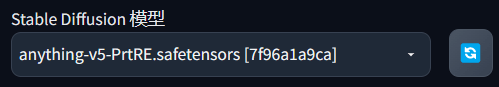

# AI绘画Stable Diffusion简易使用

> 一张AI绘图需要以下的步骤 : 搭建可复用环境, 安装可复用模型, 针对模型使用关键词, 生成AI图片, 穿帮修复

- 搭建相关环境一般使用三种方式 :
  1. 拉取GitHub源码部署 ( 可能有很多坑 )
  2. 使用第三方本地整合包 ( 要求有超过3070的电脑, 此类方式要使用所有SD功能 )
  3. 利用云上平台进行搭建
- 所有与 AI绘画 相关的问题 , 可以参照 AIdraw : https://guide.novelai.dev/
- AI可以通过文字描述凭空生成一张图片(文生图功能)
- AI可以在基础图片上重新绘制或修改一幅图片(图生图功能)
- AI 是无法做到你给他一张图片就直接会照着画出来无数张这个物体或人物的图片的, 就比如说, 我这里有一个立绘, 你想让AI只根据这一个立绘就完美画出来各种动作角度, 抱歉, 做不到或者说是技术限制, 目前根本就做不好(这有个专业术语叫one shot), 即想法是美好的, 现实是残酷的, 目前局限性很大
- AI 虽然无法根据单一张图片就完美复刻物体, 但是在拥有足够的素材进行训练以后, 就可以学习到一个人物或者画师的画风, 通常来说，要拥有较好的效果, 人物学习最低需要10张以上, 画风学习需要50张以上


## 云端安装模型

- 本次使用第三种方式, 在阿里云上进行相关搭建和使用

  > 只要从来没有用过函数计算或NAS存储, 即可参与阿里云试用, 但是试用的计算量很有限

- 进入阿里云免费试用专场, 选择 **函数计算FC** 进行3个月的试用, 在工作台里, 创建应用

- 创建角色默认即可, 只是个称呼

- 进入应用菜单, 选择 **通过模板创建应用**, 这里不直接选择 SD, 而是选择人工智能里面的 **AI数字绘画stable-diffusion自定义模型版**, 部署类型选择直接部署, 在此步先不要继续, 先去领取NAS的免费试用, 否则会产生别的费用, NAS用来保存自定义模型

- 同样进入免费试用专栏, 搜索NAS, 找到 **NAS存储** 点击试用, 领取50GB的3个月试用

- 进入刚刚的函数计算控制台, 授权角色, 点一下直接授权刚刚创建的角色即可

- 下面的高级配置中, 地域选择杭州, 镜像地址直接复制下面示例说明中的地址即可, 部署成功后访问域名即可

  > 访问域名时, 需要使用外网下行流量, 这个只有在配置的时候要用, 保持钱包有钱即可

- 点击admin开头的进行相应的环境初始化, 一路下一步即可, 在最后的账号设置处设置好密码即可

- 登录后在可视化界面的地址栏处, 删掉个人空间这里的 `{source:5}` 字样, 直接输入 `/mnt/auto/sd/`, 建议记住这个路径, 这样之后就不需要再设置了

- 在此处展开models文件夹, 点开 Stable-diffusion 文件夹, 这里存放的就是我们的模型, 大模型推荐使用 NeverEnding Dreams ( 即NED ), 在 Stable-diffusion 同层级中可以找到 Lora 文件夹, 这里存放小模型

  > mix4 和 20d 用来画妹子, ss9 用来画帅哥

- 所有模型上传完毕之后, 回到 函数计算FC 的应用菜单, 点击打开访问域名中的另一个域名, 即前端图形化操作界面

- 界面的左上角是大模型名称, 可以通过下拉框选择, 然后在下面选择 **文生图** 标签页, 上面的提示词即正相关词, 下面的反向提示词即为负相关词, 按照需求进行填写即可

- 右侧生成按钮下面有一个像印章(MP3)一样的小图标, 点一下会出现一个选项卡弹出页面, 这里我们选择 **低秩微调模型LoRA** 选项卡, 这里点一个传好的小模型, 比如 mix4, 就会出现尖括号词组, 如 `<lora:mix4:0.8>` 这里第一个参数即代表一个 LoRA, 第二个参数为模型名, 注意模型名要填写模型的card上显示的完整名称, 第三个参数为相关性, 相关性是乘积关系, 小于一是减少相关性, 大于一是增加相关性, 采样器选择 `DPM++ SDE Karras`, 采样步数为 40, 勾选面部修复, 生成种子不要选 -1 即可, 生成完毕后勾选喜欢的图片, 点击局部绘制, 把生成的不喜欢的地方涂黑, 然后微调下随机数, 慢慢的就能生成自己喜欢的图片了

- 使用 LoRA 时, 需要配合提示词, 例如使用 mix4 就需要增加一个 mix4 提示词, 即 `<lora:mix4:0.8>,mix4` 一般在 CivitAI 中, 模型爱好者发布的 LoRA 信息中, 其 Trigger Words 就是相关的提示词

- 这样就搭建好了一个简单的AI绘图模型了, 可以自行炼丹了, 如果要深入, 则观看靠谱的轩轩的视频即可

- 分享作品时, 分享内容为 : 图片 ; 正反关键词 ; 模型信息 ; 其他参数

- 如果自己不知道输入哪些关键词出图, 那可以在 CivitAI 中找到喜欢的图片, 下载好对应的模型, 直接在别人的图片对应内容中复制, 点击生成按钮左下角的小箭头生成图片

### 如何查询免费额度余额

- 进入阿里云 函数计算FC 控制台, 找到概览, 在右下角的资源包处可以看到相应的专项套餐剩余量, 除去免费的部分, 还有两个地方要收费, 一个是磁盘使用费 (不是NAS中模型的费用, 是SD的环境占用, 一般为0.0063元/GB/小时), 另一个是外网下行流量费用/公网出流量 (上传模型不收费, 但是下载计算的流量, 一般为0.5/GB)

  > 我的阿里云余额已经用完了, 阿里云的运行速率低于3060, 且经常卡住, 所以有条件尽量还是自己本地部署使用

-----------------

## win系统傻瓜包

- 网上相关UP有制作一键启动的傻瓜客户端, 只要保证电脑上内存大于64GB, N系显卡, 且显存>8GB, 就可以正常使用了, 好一些的显卡, 例如强于3080的, 可以直接训练相关的AI模型

# 相关的学习内容

- Stable Diffusion 在使用的时候, 大模型, 小模型, 以及相关插件有很多, 下面分别简单介绍一下

- 在生成图片时有不同的参数和属性, 需要了解的基础有 :
  - 正相关提示词 : 即你想要的相关提示词, 可以在标签超市找 https://tags.novelai.dev/ 
  - 负相关提示词 : 即你不想要的相关提示词, 可以在标签超市找 https://tags.novelai.dev/ 
  - 迭代步数 : 也称采样步数, 一般在50以内, 通常28是一个不错的值
  - 采样器 : 没有优劣之分, 一般推荐 Euler a, DPM++ 2M Karras, DPM++ SDE Karras这几个
  - 分辨率 : 就图片分辨率 , 一般别太大 , 想要大图就用小分辨率+高清修复
  - 批次和数量 : 顾名思义, 批次就是走几轮, 数量就是每次几张, 不是好显卡这两个参数建议都写为1
  
  > AI 基本上无法生成超级大图, 想要生成高清图片正确的做法是生成 2k 以内分辨率的图片再使用放大功能(也叫超分辨率) 进行放大图片
  
- 有时候你可能会看到别人发的 Tag 里面会有一些符号 , 比如大小括号等等

- 这属于进阶用法, 以 word 这个 Tag 作为例子 :

  - `(word)` - 将权重提高 1.1 倍

  - `((word))` - 将权重提高 1.1 * 1.1 = 1.21 倍, 乘法的关系

  - `[word]` - 将权重降低 90.91%

  - `(word:1.5)` - 将权重提高 1.5 倍

  - `(word:0.25)` - 将权重减少为原先的 25%

  - `\(word\)` - 在提示词中使用字面意义上的 () 字符

    > 使用数字指定权重时, 必须使用 `()` 括号, 如果未指定数字权重, 则假定为 `1.1` , 另外权重增加通常会占一个提示词位, 应当避免加特别多括号

- 提示词相关性(CFG Scale) , 代表你输入的提示词对图片的引导程度 , 可以理解为越小AI越自由发挥 , 如果数值过大的话 , 会出现锐化 , 线条变粗的效果

- 随机种子是生成过程中所有随机性的源头, 每个种子都是一幅不一样的画, 默认的 -1 是代表每次都换一个随机种子, 由随机种子, 生成了随机的噪声图, 再交给AI进行画出来

## 模型下载和分类

- 大模型, 一般指大小超过2GB的模型, 一般放在 `根目录\models\Stable-Diffusion` 文件夹下

  > 模型的下载可以有多种方法, 可以找相关的大佬去要, 也可以自己训练, 一般都用下面两种方法下载
  >
  > 1. 可以在网上下载, 比如C站, 即 https://civitai.com 下载模型, 这里的模型都有对应的预览图, 要搜索大模型的话, 勾选筛选里面的 `Checkpoint` 即可, 需要注意该网站是要梯子才能进的, 每个模型里面会有该模型的介绍以及对应的 Tags (即在网站中对应的标签) 和 Trigger Words (即触发该模型的关键词), 每个大模型的介绍需要细看一下, 里面一般会有作者推荐的运行参数
  >
  > 2. 如果使用的是傻瓜包, 那就在模型管理下, 这里下载模型是不需要科学上网的, 找到 `Stable Diffusion模型` 选项卡, 在此处下载即可, 此处不同的选项卡区别见后文, 这种方式唯一的问题就是没有预览图, 像开盲盒一样
  >
  > [PS] 如果对别人生成的图片很好奇, 可以点击对应图片右下角的 `!` 标志, 可以看到对应的正负面词, 但是具体用了那些额外插件就不知道了

- 在 C站 筛选模型的时候, 可以看到有不同的 **Model types**, 比如 `Checkpoint`, 它们的意义和作用都不一样, 简要介绍如下 :

  > - Checkpoint : 一般是指大模型
  > - Textual Inversion : 即 Embedding, 指一部分提示词整合的限定提示词
  > - Hypernetwork : 一般指仅作用于图片风格修改的小模型
  > - Aesthetic Gradient : 
  > - LoRA : 一般是指有特定风格的小模型
  > - LyCORIS : 
  > - Controlnet : 一般指专门用于限定图片人物动作姿势的插件模型
  > - Poses :
  > - Wildcards : 
  > - Other : 
  
- 同样的插件也尽量在启动器中下载 , 在下载之前记得关闭 webUI 界面 , 因为添加插件之后一般也会需要重启 webUI 界面

## 网页UI界面及相关笔记

- 常见的模型可以直接分为两大类 , 即大模型和用于微调大模型的小型模型
- 辨别模型类型请使用这个工具 : https://spell.novelai.dev/ 

### StableDiffusion模型

- 在最上面的 `Stable Diffusion 模型`, WebUI中为下图所示内容 :

  

- Stable Diffusion 模型这里选择的内容代表当前正在使用的大模型, 如果实时复制了大模型到对应的文件夹内之后, 在网页UI对应内容旁边点击刷新按钮即可刷新大模型

  > 后续有需要时会直接将 Stable Diffusion 简称为 SD
  
- 大模型大小在GB级别, 一般常见的有 2G, 4G, 7G 模型 , 但是需要注意 , 模型大小不代表模型质量

  > 部分合并出来的大模型VAE烂掉了, 画面会发灰, 这时候需要你去设置中手动选择vae并应用保存

### VAE

- 紧跟大模型之后的 `外挂VAE模型`, WebUI中为下图所示内容 :

  

- VAE 即 Variational autoencoder, 变分自编码器, 作用为滤镜+微调, 其相关原理见后续详解内容

- 加载 VAE 后色彩的饱和度会更高, 但是不同的 VAE 其饱和程度也不一样, 比如下图所示, 可以看到不同 VAE 作用下同一张图片的不同效果

  

- 需要注意的是, 有的大模型可能自带VAE, 如果再去添加VAE, 可能会直接影响整体出图效果, 但是还是得多试才行, 主要一些融合模型的 VAE 会烂掉 (典型 : Anything-v3), 需要外置 VAE 的覆盖来救救, 有时画面发灰就是因为这个原因

  > VAE 放置位置一般是 `根目录\models\VAE` 文件夹
  >
  > 从C站基本上很难找到VAE, 我们可以直接使用傻瓜包里的模型管理去下载, 即选择 `变分自编码器(VAE)模型` 标签来进行下载, 同样的, 不需要梯子即可正常下载

### Embedding (Textual Inversion)

- Embedding, 又名 Textual Inversion, 即嵌入或文本反转, 这里可以直接理解其为**打包的提示词** , 一般大小在 KB 级别

- 我们如果要使用原版SD生成游戏角色, 一般需要特别多的tag去定义才能达到想要的效果

- 但是如果引入了某一特定人物对应的 Embedding 后, 那可以只引用例如 `dva` 这一个提示词, 就实现了对应图片的生成

  > 由于说白了 Embedding 就是一堆 tag 的合集, 故其大小按照一个txt文件的体积看即可, 这样仅为了好记忆, 但是其本质还是一种模型
  >
  > Embedding 的放置位置为 `根目录\embeddings` 文件夹
  >
  > Embedding 的下载还是在 C站, 即筛选时将 `Model types` 选择为 `Textual Inversion` 即可
  >
  > 大部分情况下可能 C站 找不到想要的 embedding, 可以在 [Hugging Face](https://huggingface.co/) 里面去搜索

- Embedding 在界面中不会直接展示, 使用时需要点击  按钮来展开对应内容

- 此处的 `嵌入式(T.I. Embedding)` 标签页中会显示对应的 Embedding 模型, 点击一个, 即可将相应的关键词放入正相关提示词中

### LoRA

- LoRA, 全称 Low-Rank Adaptation of Large Language Models, 直译为大语言模型低阶适应

  > 这是微软研究人员为解决大语言模型微调而开发的一项 AI 技术, 其对应的技术实现原理见后续内容

- LoRA 最大的作用就是对人物和物品的复刻, 即只要挂载了对应的 LoRA 模型, 就可以基本 99% 地复刻出指定的人物特征

- LoRA 的适用范围很广泛, 其实它可以实现画风, 画面材质, 特定人脸, 固定人物动作, 特定细节等等功能

- 通俗点来理解, LoRA 几乎可以训练所有与图片相关的内容

  > LoRA 也是在 C站 进行下载, 即筛选时将 `Model types` 选择为 `LoRA` 即可, 需要注意的是下载的时候一定不要用迅雷下载, 会乱码且无法使用, Lora 是一种小模型, 一般放在 `根目录\models\Lora` 文件夹下
  >
  > [注] LoRA 和 embedding 文件的作用看起来类似, 但是其实 embedding 仅仅是一个 tags 的合集小模型文件, 其能够通过定义 tags 实现出多视图等特定功能, 而 LoRA 则是一种被训练过的特性提取模型, 一般针对的是单一内容, 但是深挖了细节, 例如 : embedding 可以看成是简单的模仿, 比如制作网站, embedding 是做出了动态网页, 由于网页量惊人, 有相关的互动效果, 但是实际上并没有后端的数据访问效果, 只模仿到了形 ; 而 LoRA 则是一个前后端整体框架完善的网站, 抄到了精髓, 故一般情况下, 同样效果我们使用 LoRA 更多一些
  
- 在使用 LoRA 时, 需要首先看好要使用的 LoRA 其出图时对应的大模型, 至于某个 LoRA 究竟应该用哪个大模型去生成, 需要在 C站 下载时打开对应的预览图信息, 在此处查看 Model 项内容, 即可找到对应 LoRA 的大模型

  > 大模型和 LoRA 并不是特定组合, 只是不同的大模型针对同一个 LoRA 的生图效果可能不同

- LoRA 在界面中不会直接展示, 使用时需要点击  按钮来展开对应内容, 此处 `lora` 标签页中会显示对应的 LoRA 模型, 点击一个模型即可将相应的LoRA 关键词放入正相关 tag 中, 其形式一般为 `<lora:XX:1>`, 尖括号第一个参数即代表要使用 LoRA 模型, 第二个参数是使用的 LoRA 模型的具体名称 (不同版本的 LoRA 其模型名是不一样的, 抄预览图信息的时候也要注意这里), 第三个参数表示使用这个 LoRA 的比重, 或者说是强度值, 权重, 如果你有很熟悉的 LoRA 的话, 可以直接使用类似的 tag 调用模型而不需要再去点击添加正相关词

  > LoRA 模型的一个首当其冲的问题, 即是其预览图和实际跑出来的图片可能会有买家秀和卖家秀一样的效果, 即生成内容差距很大
  
- 针对使用同一个 LoRA 会导致买家秀和卖家秀的问题, 实际上只是犯了一些基础错误, 以 汉服LoRA(即LoRA为hanfu_v3) 为例, 实际使用时, 尽量参照以下几点来进行 :

  1. **用 LoRA 配套的大模型效果会更好**, LoRA 的训练其实就是参照一个选择的大模型来训练参数的, 如果在使用这个 LoRA 的时候, 没有使用当时训练时使用的大模型, 那当然就会出现不同的效果了, 获取作者 (即 LoRA 发布人) 使用的大模型, 前文也有提到过, 即点开预览图的 `!` 标志来查看对应的 Model 信息, 复制这个模型名, 然后直接在C站筛选`Browsing Mode` 为 `Everything`, 因为你也不知道训练用的大模型是不是XX禁的模型, 然后选择 `Model types` 为 `Checkpoint`, 即搜索大模型, 然后在搜索栏输入复制的名称即可
  2. **最好使用和 LoRA 作者相同的参数**, 即相关生成图片的正负提示词, 然后其他的参数也最好一致, 复制时直接点击信息下面的 `Copy Generation Data`, 在 Stable Diffusion 的前端界面中, 点击 `↙` 按钮即可, 出图的质量一般在这样设置之后, 就和预览图差不多了, 至于如何生成示例图, 则在后续笔记中进行详解
  3. **正确设置 LoRA 的使用权重**, 我们知道调用 LoRA 的时候, 会使用到 `<lora:hanfu_v3:0.9>` 这样的正相关提示词, 这里的第三个数就是权重, 权重越大, 代表其对生成图的影响越大, 权重值尽量不要设置到 1 以上, 不然很容易出效果奇差的图, 即便是十分希望 LoRA 影响出图结果, 也不要将其权重设置为 1, 最好设置为 0.8 或者 0.9, 如果只是想稍微带一点 LoRA 元素作为图片修饰, 那么将其权重设置为 0.4 到 0.6 之间即可
  4. **LoRA 有触发词时一定要使用触发词**, 在一个模型的下载界面, 其 `Trigger Words` 对应的紫色词语就是触发词, 一般将其加入到正向提示词中之后, 在参数一样的情况下, 就能生成相关的图片了, 触发词一般用一个即可, 不同的触发词只是代表的风格不同, 另外提一下对应的 `Tags`, 即在触发词上面的词语, 它们只是代表 LoRA 在 C站 对应的标签, 而和 Stable Diffusion 本身没有任何关系
  5. **新手/第一次使用模型时尽量不要混用 LoRA**, 在使用时, 由于使用者并不了解 LoRA 的训练图集, 如果随意混用则会导致模型相互污染, 出图效果也不会很理想, 即使有时候出现了很惊艳的图片, 也不是调好参数了, 只是碰巧炼丹出丹了而已, 有时候作者会在 LoRA 的简介里说明配合哪些其他 LoRA 使用效果更好, 如果一定要执着于混用 LoRA 的话, 最好还是先看一下其原理, 再去对图片分层次单独设置权重再使用, 这样多个 LoRA 混用不仅有好效果, 而且还有特殊性

  > [注] 以下内容为特殊情况
  >
  > - 有时候作者会疏忽导致没有在任何地方标明 LoRA 炼丹时对应的底模, 这时候就是作者的问题了, 如果实在是想要, 那就在评论区碰碰运气, 看看评论区的人有没有对应的好的效果图, 用他使用的大模型就行了
  > - 有时候作者会疏忽导致没有在模型对应的信息中标明 LoRA 的触发词, 这时一般就是指这个 LoRA 被加载之后, 不需要相应的触发词去作为提示词就能发挥作用, 再者就是作者写到了简介里, 所以最好在下载对应模型时, 将其预览图, 相关信息, 以及简介都保存下来 , 也做好模型的备份

### LyCORIS(待施工)

> 安装时添加完虽然会报错, 但是完全重启一次整合包即可

- 

### Hypernetworks

- Hypernetworks, 直译为超网络, 功能和 Embedding, LoRA 类似, 都是对生成的图片进行针对性调整的模型, 将其理解为低配版的 LoRA 即可, 因为其应用领域基本就是为了训练画风, 其训练难度较大, 很有可能会被后出现的 LoRA 淘汰, 但是其现在仍存在的原因是, 其在画面风格的转换上有独到的地方, 比如像素风, Q版风, 这些风格在生产力领域应该都能有所应用 , 大小一般在几十MB到几百MB不等, 由于这种模型可以自定义的参数非常之多, 一些离谱的 Hypernetwork 模型可以达到 GB 级别

- 虽然 Hypernetworks 最广泛的应用领域是画风, 但是其也可以用于训练人和物品, 通过使用 Hypernetworks 训练, 可以较好地去还原人物(比如蒂法, 毒液等辨识度很高的角色), 而正因神似才导致 Hypernetworks 的发展仅限于此而不是肆无忌惮, 因此现阶段如果还要更高精度的图像生成的话, 还是需要借助 LoRA, 乃至于 Dreambooth 进行协同使用

  > Hypernetworks 也是在 C站 进行下载, 即筛选时将 `Model types` 选择为 `Hypernetwork` 即可,  下载后将其放在 `根目录\models\hypernetworks` 文件夹下即可
  >
  > 如果放入 Hypernetworks 之后没有在 Stable Diffusion 中显示, 点击一下 `刷新` 即可

- Hypernetworks 在界面中不会直接展示, 使用时需要点击  按钮来展开对应内容, 然后这里的 `超网络(Hypernetworks)` 标签页中会显示对应的 Hypernetwork 模型, 点击一个, 即可将相应的 Hypernetworks 关键词放入正相关 tag 中, 其形式一般为 `<hypernet:XX:1>`, 尖括号第一个参数即代表要使用 Hypernetwork 模型, 第二个参数是使用的 Hypernetwork 的模型具体名称, 第三个参数表示使用这个 Hypernetwork 的比重, 或者说是强度值, 权重

- 同样的, 正确设置 Hypernetwork 的使用权重也是很重要的, 权重越大, 代表其对生成图的影响越大, 不同于 LoRA, Hypernetwork 的权重并没有固定的范围, 对于不同的 LoRA 来说其权重范围并不一定, 一般以 0.2 为一个梯度去进行出图调试, 直到有一个满意的结果

- 针对同一个 Hypernetwork 实际使用时, 除了上述说明的内容以外, 也尽量参照以下几点来进行, 其实和 LoRA 的使用注意点差不多 :

  1. **用 Hypernetwork 配套的大模型效果会更好** 
  2. **最好使用和 Hypernetwork 作者相同的参数** 
  3. **Hypernetwork 有触发词时一定要使用触发词** 
  4. **新手/第一次使用 Hypernetwork 模型时尽量不要混用** 

### 图像放大算法(Upscaler)

- 与传统的放大算法不同, AI 放大算法是通过大量数据训练的模型

- 其原理是首先对高质量图像进行人工破坏, 以模拟现实世界中的图像损失, 然后, 将损坏的图像缩小到较小尺寸, 接着训练一个神经网络模型来恢复原始图像

- 由于大量的训练数据被嵌入到模型中, 从而使得它能够填补缺失的信息, 这就像人们在记住一个人的面孔时不需要仔细研究每个细节, 我们主要关注一些关键特征

- 图像放大算法目前可以大致分为以下两种类型

  - 传统的图像放大算法 (如最邻近和 Lanczos 等)

    > 传统放大算法是一种根据图像分辨率 (像素值) 通过数学运算推导并插值的思路
    > 这种传统类型存在一个最大的缺点, 即当图像缺失, 损坏或存在意外噪点时, 它会将所有这些因素都计算在内, 导致无法正确进行采样

  - AI 图像放大算法  (包括 ESRGAN 及其衍生版本等)

    > AI 图像放大算法正如其名称所示, 是一种模型学习技术, 是当前 WebUI 中主流的放大算法
    >
    > 它学习如何将高质量的数据集先降级/损坏, 然后进一步缩小它们, 最后将它们恢复到原始图像
    >
    > 简而言之, 这个模型被训练成能够高效地消除各种图像劣化, 例如在图像放大时出现的锯齿等, 从而实现高质量化

- 一般来说 SD 无法直接生成大分辨率的图像, 这是由于当图像倍数放大后, 其对应原生噪点图计算难度会以指数倍上涨, 为了在保证图像整体效果的前提下提高其分辨率, 一般需要借助放大算法, 即高清修复操作

- WebUI中为下图所示内容 :

  

- 放大算法在秋叶大佬的整合包中一般会自带一些, 但是在实际使用时, 我们可能遇到某些模型的预览图使用了一些额外的放大算法, 这需要我们自行去安装相关算法

#### 第三方放大算法安装

> 记得科学上网, 后续不再赘述这个前提

- 第三方放大算法模型目前可从以下网站获取并添加到 WebUI 中

  ```
  https://upscale.wiki/wiki/Model_Database
  ```

  > 该网站介绍了各种不同的 Upscaler,  但是有一个注意事项, 是这里可能有版权问题

- 以下载 4x-UltraSharp 算法为例, 登入上面网站, 然后查找下载模型, 查找到之后是这样的 :

  

- 这里可以通过查看后面的样图来确定效果, 即 Sample 相关的链接可以看到效果图

- 点击放大算法名称的这个链接, 一般会直接进入下载页面, 在此处找到类似于 `4x-UltraSharp.pth` 这样的模型文件, 下载它即可, 这里注意一下第五列, 即上图显示值为 `ESRGAN` 的这一列, 比如这里标志是 ESRGAN , 则需要将其放入以下目录 :

  ```
  根目录/models/ESRGAN
  ```

- 安装完成后, 我们重启 WebUI, 即可看到新的放大算法模型已经被正常加载了

  > ESRGAN ("old Architecture") Models , 即基于老架构的放大算法模型

### 查询图片参数

- AI生成图片会自动保存全部参数到原图中, 可以在WebUI的 “图片信息” 一栏内通过解析原图查看到
- 也可以使用秋葉aaaki写的这个工具 : https://spell.novelai.dev/ 
- 非AI生成图片或经过压缩的图片可以通过 Deepdanbooru, Tagger 来尝试反推tag
- Deepdanbooru 默认已经自带了, 可以在图生图页面找到
- Tagger是一个插件, 在新版的整合包内也帮你装好了, 可以在顶栏找到

### 调参对比图片

#### X/Y/Z图表

- 在生成图片时候, 可以使用 **x/y图表** 快速生成不同参数的图片进行对比 , 例如下面这张图 :

  

- 这项功能可以在 文生图/图生图 界面的左下角种 “脚本” 一栏内选择 “X/Y/Z 图表” 以启用

- 它创建具有不同参数的图像网格。使用 X 类型和 Y 类型字段选择应由行和列共享的参数，并将这些参数以逗号分隔输入 X 值 / Y 值字段。支持整数、浮点数和范围。

- **Simple ranges 简单范围**

  ```latex
  1-5 = 1, 2, 3, 4, 5
  ```

  > 即 **1-5** 就是1到5的意思

- **Ranges with increment in bracket 括号范围**

  ```latex
  1-5 (+2) = 1, 3, 5
  10-5 (-3) = 10, 7
  1-3 (+0.5) = 1, 1.5, 2, 2.5, 3
  ```
  
  > 同样 a-b 就是a到b的意思 , 小括号内的数值就是按多少去迭代的意思 , +2 就是每次增长两个数值
  
- **Ranges with the count in square brackets 方括号范围**

  ```latex
  1-10 [5] = 1, 3, 5, 7, 10
  0.0-1.0 [6] = 0.0, 0.2, 0.4, 0.6, 0.8, 1.0
  ```
  
  > 同样 a-b 就是a到b的意思 , 方括号内的数值是分成几个节点的意思
  

#### **Prompt S/R 替换** 

- S/R 是 X/Y 图的的一种高级操作模式

- S/R 是 搜索/替换 的意思，输入一个单词或短语的列表，它从列表中取第一个并将其视为关键词，并将该关键词的所有实例替换为列表中的其他条目的所有实例替换为列表中的其他条目

- 例如，提示 `a man holding an apple, 8k clean` 和 S/R 提示 `an apple, a watermelon, a gun` 结合，你会得到三个提示。

  - `a man holding an apple, 8k clean`
  - `a man holding a watermelon, 8k clean`
  - `a man holding a gun, 8k clean`

- 列表使用的语法与 CSV 文件中的一行相同，所以如果你想在你的条目中加入逗号，你可以 在你的条目中加入逗号，你必须将文本放在引号中，并确保引号之间没有空格。 确保引号和分隔逗号之间没有空格。
  
  - `darkness, light, green, heat` - 4 items - `darkness`, `light`, `green`, `heat`
  - `darkness, "light, green", heat` - 错误示例 - 4 items - `darkness`, `"light`, `green"`, `heat`
  - `darkness,"light, green",heat` - 正确示例 - 3 items - `darkness`, `light, green`, `heat`

### 拓展安装

- 在安装拓展之前请注意, 有的拓展安装完成之后, 可能只会在其安装时的语言中显示, 例如我之前安装的After Detailer就是在英文界面中安装的, 但是转换为中文界面就不显示这个插件, 其实尽量使用英文界面就好

#### !After Detailer

[adetailer: adetailer for stable diffusion (gitee.com)](https://gitee.com/zhkgo/adetailer)

- !After Detailer是一个针对Stable Diffusion WebUI的扩展, 类似于Detection Detailer, 但它使用的是Ultralytics而不是MMDet

  > Ultralytics 和 MMDet 的解释如下(未完成)

- 安装时按照以下步骤进行 :

  1. 打开webUI的 `拓展` 标签页
  
     > 为了以防万一, 这里尽量直接开启全局代理, 并在整合包中设置好代理服务器设置, 比如这样: 
     >
     > 
     >
     > [注] 这个操作需要重启整合包的整体客户端
  
  2. 点击 `可下载` 标签 , 首先点击 `加载扩展列表` 加载一次扩展列表

  3. 当下发插件列表正常显示后, 在搜索框中直接搜索detailer, 即可看到 !After Detailer 拓展, 我这里是安装好的显示

     

     > 一般来说通过 `从网址安装` 标签页里将 `https://github.com/Bing-su/adetailer.git` 输入到扩展的 git 仓库网址对应的空格处来下载 , 但是能直接下就不用这样麻烦了

  4. 点击拓展后面对应的操作列的 `安装` 按钮

  5. 等待几秒钟之后你会看到安装完成的提示, 并且此处重新刷新拓展列表后搜索该拓展会显示成已安装状态
  
  6. 返回 `已安装` 标签页, 点击 `检查更新` 按钮, 系统自动刷新安装插件列表, 然后点击 `应用更改并重载前端` 按钮
  
     > 这样安装之后就可以在下次正常更新相关插件了
  
  7. 完整退出一次你的整合包客户端, 有必要的话可以直接重启一次电脑来完成这项操作
  
  > 下载拓展之后, 你不需要额外再去下载对应的模型了, 你会在下一次启动 SD 的时候看到对应的插件内容和模型
  
#### ControlNet Inpainting

- 如果你已经安装了ControlNet并且拥有ControlNet inpaint模型, 你可以使用ControlNet inpaint扩展

- 在ControlNet选项卡上，选择一个ControlNet inpaint模型并设置模型权重

- 相关模型见下表 :

  | Model                 | Target                | mAP 50                    | mAP 50-95                 |
  | --------------------- | --------------------- | ------------------------- | ------------------------- |
  | face_yolov8n.pt       | 2D / realistic face   | 0.660                     | 0.366                     |
  | face_yolov8s.pt       | 2D / realistic face   | 0.713                     | 0.404                     |
  | mediapipe_face_full   | realistic face        | -                         | -                         |
  | mediapipe_face_short  | realistic face        | -                         | -                         |
  | hand_yolov8n.pt       | 2D / realistic hand   | 0.767                     | 0.505                     |
  | person_yolov8n-seg.pt | 2D / realistic person | 0.782 (bbox) 0.761 (mask) | 0.555 (bbox) 0.460 (mask) |
  | person_yolov8s-seg.pt | 2D / realistic person | 0.824 (bbox) 0.809 (mask) | 0.605 (bbox) 0.508 (mask) |
  
  > yolo 模型可以在 huggingface 的相关页面找到, 链接: [Bingsu/adetailer](https://gitee.com/link?target=https%3A%2F%2Fhuggingface.co%2FBingsu%2Fadetailer) 


-------------------

## 训练相关

- 目前来说 , 一般用户可以训练的有两种小模型 :

  - Embedding (Textual Inversion)
  - hypernetwork

- 这两种模型的分辨方式一般看文件大小 , 小的就是 embedding , 大的就是 Hypernetwork

  > 大模型一般是无法通过个人甚至实验室的计算资源训练的 , 暂且不提

- 一般来说 , 如果只是想学个人物 , 简单的画风 , 推荐用 Textual Inversion

  > Textual Inversion能做到只影响部分 , 甚至是多种不同人物 , 画风混合等等操作 , 而且他训练简单方便 , 快捷

- Hypernetwork 训练通常就过拟合 , 不是很好训练

### Embedding (Textual Inversion)

- 现阶段许多教程教我们训练的东西也就是 Textual Inversion , 其训练出来的模型就叫 Embedding
- Textual Inversion 的工作原理可以这样理解 : 在训练时 , 我们就像是在写一本字典 , 在其中添加一个词语的解释 , 比如我们要求AI去生成一个他不认识的词语 , 那我们就需要告诉AI , 我给你的这堆图片里 , 它们就是这个词 , 这样解释出来一种人物 , 东西甚至是一种风格 , 然后再当读取到这个词语的时候，AI就知道这个词原来对应的是这个东西
- 这一过程并不触及大模型网络的参数或权重 , 完完全全是作用在从**输入的词**到**翻译成连续向量**的过程上 , 这也就解释了为什么这些模型会很小了 , 一张家用显卡在1h左右就可以轻松训练出来1w步数左右的模型
- 这就是“文本反演” (Textual Inversion)—即在文本编码器的嵌入空间(embedding) 中找到新的伪词 , 使它可以捕获高级语义和精细视觉细节

### Hypernetwork

- 超网络是一种在不接触任何权重的情况下微调模型的概念 , 简单说就是用一个网络来生成另一个网络的参数 , 多个网络逐步迭代演变 , 最后形成由多个网络复合或进化成的超网络
- 其工作原理是 : 用一个 Hypernetwork 输入训练集数据 , 然后输出对应模型的参数 , 最好的输出就是这些参数能够使得在测试数据集上取得更加好的效果 , 也就是说 , Hypernetwork 会对整个模型微调 , 使得无论什么 tag 都能起作用

### 模型简易训练教程(未学习)

- 

---------------

## 其他内容

### 模型后缀

- 目前常见的模型后缀有 .ckpt , .pt, .pth, .safetensors, (特殊)webui 特殊模型保存方法: png, webp图片格式

- 前四种都是标准的模型 , 但是仅依靠后缀名是无法判断具体模型类型的

- .ckpt, .pt, .pth这三种是 pytorch深度学习框架的标准模型保存格式, 由于使用了Pickle, 会有一定的安全风险

  > 关于Pickle的安全风险, 自行百度 *pickle反序列化攻击* 

- .safetensors 是一种新型模型, 其出现正是为了解决之前提到的三种模型的安全风险而推出的, safetensors 格式与 pytorch 的模型可以通过工具进行相互转换, 其内容数据没有任何区别, 仅是保存数据的方式不同而已

### 1. 如何辨别陌生文件属于哪一类模型,如何安装和使用

- 在判断一个模型是什么类型的时, 可以借助相关在线工具来进行, 比如 https://spell.novelai.dev/ 这个网站, 也是秋叶大佬制作的, 将下载的模型文件拖进来即可, 绝大多数情况下这种方式是很稳的, 只有极小部分情况才会无法识别模型类型
- 知道模型的类型之后, 就可以根据之前的学习内容去安装和使用了

### 2. 模型的演变极简历史

> 下面的历史其实并不严谨, 只是大致上的情况, 里面有很多的问题, 比如 LoRA 和 Hypernetwork 的演变不仅是原理不同, 而且还有迭代的不同

- 由于历史原因, 造成模型有这么多种不同的后缀的原因是其发展的不同阶段导致的
- 最开始的模型训练成本十分高, AI 实际上从上世纪就开始了, 当时训练一个模型可能需要几千张4090并行训练许久, 并且花费很高的人力物力才生成的, 之后的各种模型实际上都是依照这个大模型去微调的
- 微调需要的成本就不高了, 可能只需要一张 3080, 并且计算不到半天的时间, 就能有很有效的效果, 也就是说一个人可能就能炼模型, 但是对于一个人来说, 这样的成本还是太高了, 于是类似于 embedding 的小模型应运而生, 有时候只需要训练很小的东西时, 比如只训练文本理解的, 那就逐渐演变成了 embedding, 到后面慢慢产生的兼顾效果和文件体积的 LoRA 以及 Hypernetwork, 也导致这些新模型越来越高

------------

## 相关应用

### 1. 让AI模特穿上设计好的衣服/使用指定的商品

- 通过简单的使用商品图, 批量生成高质量的, 动作, 脸型等内容均可定制的, 穿戴/使用着特定商品/产品的模特图片, 这种图片的还原度已经达到 90%~95% 了

### 2. 让已经存在的模特不需要实际使用/穿戴而使用/穿戴指定的商品

- 同上面一样的思路, 这种 AI 出图的训练, 一般使用 4090 显卡的话, 在有充足的产品图片情况下, 训练 15min 模型, 其成图率就有 15% 左右了, 差不多 30s 一张图

  > 这种商业应用的问题也很多, 首先是版权问题, 模型的版权, 甚至是 Stable Diffusion 的版权等内容

### 3. 风格化结婚照

- 在保留男女夫妻体征等信息的同时 , 为其生成一套风格画 , 比如正常情况下再牛逼也就只能在地球拍 , 但是如果可以的话 , 你可以通过AI让两个人在空间站结婚 , 甚至就在火山口旁边结婚 , 甚至是赛博朋克城市
- 这种并不一定就非要要求客户只看AI图 , 也可以作为套餐的附赠内容 , 比如 3888 的套餐里面 , 赠送 20 张AI风格图

### 4. 付费大数据训练

- 先听一个词 , 人体数据冻存 , 就是说我们可以将一个人的外形等信息通过模型保存起来 , 使这个人永久存在 , 甚至可以将其照片年轻化等等等等

  > 其实这就是一种训练模型的方法 , 只不过被起了个高大上的名字而已

- 这种也就是付费大数据训练 , 通过训练来生成指定的模型 , 从而进行商业化盈利

### 5. 图片画风转换

- 通过将指定的照片以图生图的形式来进行个人头像或者表情包专属定制 , 可能一张只需要几块钱 , 但是量变产生质变 , 该能赚钱就是能赚钱
- 这里还可以延伸出旧照片修复的方向 , 说白了就是图生图

### 6. 专属方向定制

- 比如根据客户需求 , 卖模型整合等内容 , 然后配合提示词什么的 , 一起打包出售 , 说白了就是自己炼丹卖 , 让别人买你训练好的模型