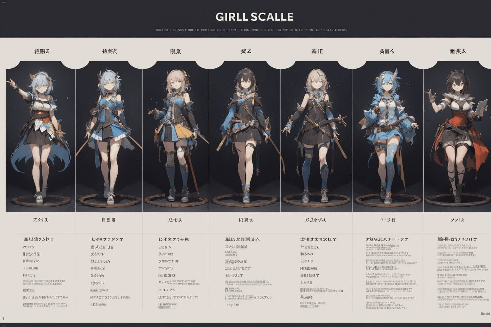

# 念咒表

## 咒语及对应示例图

- 

## 其他笔记

### 批量生成相关设定角色

> 本节主要针对生成二次元图片的情况

**基础需求** :

- Platform: `Stable Diffusion automatic1111 WebUI`
- Model：`BreakDomain_m2150` 
- VAE：vae-ft-mse-840000-ema-pruned. Ckpt
- 使用方法 : 直接将代码框内的内容添加至正相关词中

#### 女孩折线图 


```
Girls Line Chart
```

#### 女孩转换图表


```
Girls Conversion Chart
```

#### 女孩颜色图表


```
Girls Color Chart
```

#### 女孩体重表


```
Girls Weight Chart
```

#### 女孩控制图表


```
Girls Control Chart
```

#### 女孩深度图表


```
Girls Depth Chart
```

#### 女孩情绪图表


```
Girls Mood Chart
```

#### 情绪图表


```
Mood Chart
```

#### 情绪板


```
Mood Board
```

#### 尺码表


```
Size Chart
```

#### 插图风格图表


```
Illustration Style Chart
```

#### 草图图表


```
Sketch Chart
```

#### 女孩渐变图表


```
Girls Gradient Chart
```

#### 女孩尺码表



```
Girls Scale Chart
```

#### 纹理图表


```
Texture Chart
```

#### 对齐图表


```text
Alignment Chart
```

#### 迷你图标图表


```text
Chibi icon chart
```

#### 女孩雷达图


```text
Girls Radar Chart
```

> 虽然不是一种图表形式, 但是效果也不错