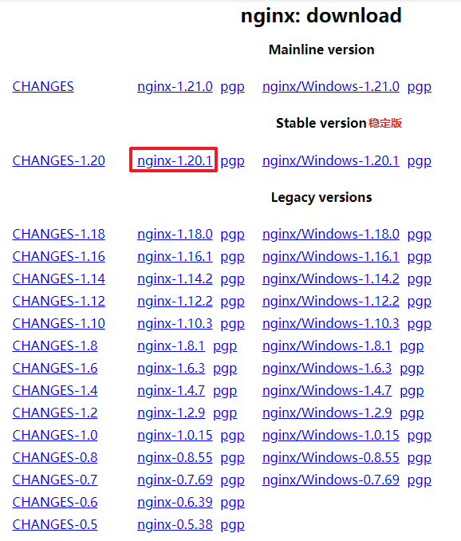
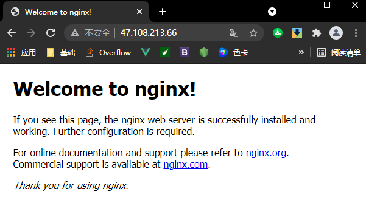

# Linux 系统中安装 Nginx 解压版

--------------

> 之前我们已经演示过了如何在 Linux 服务器中安装 MySQL 以及 Tomcat , 这次我们来演示一下如何在 Linux 系统中安装 Nginx 解压版
>
> * 一般我们部署一个项目可能直接使用 Tomcat 就足够了 , 但是随着技术的发展 , 我们开始倾向于前后端分离系统 , 或者微服务系统 , 这时一个 Tomcat 可能就不够我们使用了 , 而 Nginx 则可以用来当做一个控制多 Tomcat 的工具 , 我们知道每一个 SpringBoot 应用打包之后会自带一个 Tomcat , 再加上我们之前已经在服务器中部署的 Tomcat , 甚至多个 SpringBoot 应用 , 虽然它们使用着多个 Tomcat , 但是其实并没有占据服务器的所有资源 , 此时我们就通过 Nginx 来对这些应用进行控制 , 就能达到很好的管理效果
> * 尽管在这里我这样介绍 Nginx , 但是 Tomcat 和 Nginx 的应用领域是不同的 , Tomcat 一般用于做 Java 语言的动态解析，而 Nginx 则是一款功能强大的负载软件，配合各种插件可以实现各种功能 , 如果硬要用什么和 Nginx 类比的话 , 你可以去看看 Apache .
>
> 话不多说 , 还是从下载开始

### 下载 Nginx

---------------

* Nginx 的下载方式也不唯一 , 选择你喜欢的下载方式即可

  1. **通过 XFTP 上传到 Linux 服务器中** 

  * 首先进入 Nginx 官网下载需要的 Nginx 版本

  * https://nginx.org/en/download.html

  * 官方提供了三种不同类型的版本下载 , 我们这里下载 Stable version , 即稳定版本

    > Mainline version : Mainline 是 Nginx 目前主力在做的版本 , 可以说是开发版
    >
    > Stable version : 最新稳定版 , 生产环境上建议使用的版本
    >
    > Legacy versions : 遗留的老版本的稳定版

     

  * 下载完成之后通过 XFTP 放到想要存放解压版包的位置即可 , 老样子 , 我这里放在了 <kbd>/home/Nginx</kbd> 目录下

  * 首先还是创建好这个目录 , 这一步可以直接在 XFTP 中完成

  ------------

  2. **通过 wget 下载到 Linux 服务器中** 

  - 首先进入 Linux 服务器中的 <kbd>/home/</kbd> 目录下 , 创建 <kbd>Nginx</kbd> 目录

  - 在官网复制需要的下载链接 https://nginx.org/download/nginx-1.20.1.tar.gz

    ```shell
    # 创建目录
    cd /home/
    mkdir Nginx
    # 在目录下下载 Nginx 解压版
    wget https://nginx.org/download/nginx-1.20.1.tar.gz
    ```

----------------------------

### 安装 Nginx

* 和安装 MySQL 一样 , 我们在安装 Nginx 之前需要下载相应的依赖环境

* 首先是 gcc 编译环境

  ```shell
  yum install gcc-c++
  ```

* 一般 gcc 编译环境云服务器自带有 , 我们只需要把它更新一下即可

  ```shell
  yum upgrade gcc-c++
  # 在后续的类似提示中选择y表示确定即可
  ....
  Total download size: 49 M
  Is this ok [y/N]: y
  ....
  ```

* Nginx 的 http 模块需要使用 pcre 来解析正则表达式 , 所以接下来再安装一下 pcre 

  ```shell
  yum install -y pcre pcre-devel
  ```

  > **-y** 表示对之后的所有确认操作选择确认

* 同样的 , 云服务器一般自带有这个环境 , 我们可以把它们更新一下

* 如果提示 *Nothing to do* 则代表不用做操作 , 也就是最新版本 , 那直接进入下一步

* 安装依赖的解压包以及 openssl 库 , 依次执行下面两句命令

  ```shell
  yum install -y zlib zlib-devel
  yum install -y openssl openssl-devel
  ```

* **依赖安装完成了 , 接下来我们开始安装 Nginx**

* 解压下载好的解压版包 , 并将这个目录下的所有文件复制到 <kbd>/usr/local/nginx</kbd> 目录中

  ```shell
  # 解压解压包
  tar -zxvf nginx-1.20.1.tar.gz
  # 创建目标文件夹
  mkdir /usr/local/nginx
  # 将解压包内的文件递归复制到目标目录下
  cd /home/nginx-1.20.1/
  # 检查文件目录
  ls
  # 结果
  auto  CHANGES  CHANGES.ru  conf  configure  contrib  html  LICENSE  man  README  src
  # 递归复制文件
  cp * /usr/local/nginx/ -r
  # 检查文件目录
  ls /usr/local/nginx/
  # 结果
  auto  CHANGES  CHANGES.ru  conf  configure  contrib  html  LICENSE  man  README  src
  ```

* 依次在 <kbd>/usr/local/nginx</kbd> 目录中执行以下三条命令 , 可能会看到警告之类的话语 , 无视它们先继续

  ```shell
  ./configure --prefix=/usr/local/nginx
  make
  make install
  ```

* 接下来配置以下 nginx.conf 文件

  ```shell
  vi /usr/local/nginx/conf/nginx.conf
  ```

* 将 server_name 修改为 Linux 的 IP 地址即可

  ```shell
  # ...... 一些其他内容 .......
  server {
          listen       80;
          # 修改 server_name
          server_name  47.108.213.66; # Change localhost to Linux System IP addr
  
          #charset koi8-r;
  # ....... 一些其他内容 .......
  ```

### 启动 Nginx

-------------

* 进入 <kbd>/usr/local/nginx/sbin</kbd> 目录 , 执行 nginx 启动命令

  ```shell
  # 进入目录
  cd /usr/local/nginx/sbin/
  # 启动 nginx
  ./nginx
  ```

  > [PS] 运行时可能会遇到问题
  >
  > 比如提示某些文件没找到
  >
  > ```shell
  > [root@iZ2vceob6zm3176giqpowfZ sbin]# ./nginx
  > nginx: [alert] could not open error log file: open() "/usr/local/nginx/logs/error.log" failed (2: No such file or directory)
  > 2021/06/22 16:07:10 [emerg] 234316#0: open() "/usr/local/nginx/logs/access.log" failed (2: No such file or directory)
  > ```
  >
  > * 这种问题解决也很简单 , 在 <kbd>/usr/local/nginx/</kbd> 目录下创建上 <kbd>logs</kbd> 目录即可 , 然后接着执行 nginx 启动命令
  >
  > * 在笔者接手的云服务器里 , 按照以上方式执行之后并不能运行 Nginx , 系统提示 80 端口被占用 , 这时首先看一下是谁在占用 80 端口
  >
  > ```shell
  > netstat -anp|grep 80
  > # 结果
  > ....
  > tcp6       0      0 :::80                   :::*                    LISTEN      3621/httpd
  > ....
  > ```
  >
  > * 从结果可知 , 一个叫 httpd 的应用占用了 80 端口 , httpd 是 Apache 的服务端口 , 我们不仅要停掉它 , 一般在本地机器上 , 为了斩草除根 , 我们还要卸掉它
  >
  > * 既然它在占用端口那就证明这台云服务器曾经安装过 Apache 应用 , 好家伙 , 笔者突然想起来原先删除过一个叫 Apache 的目录 , 那现在就只能通过手动方式去卸载它了 , 通过搜索发现基本没有其相关内容 , 那咋办呢
  >
  > * 也不用慌 , 先停掉这个进程 , 它在占用端口嘛 , 我们知道这种占用端口的服务会在重启机器后再次运行 , 但是云服务器我们不可能去重启它 , 只有本地机器才会重启 , 所以我们只要把 nginx 运行起来即可
  >
  > ```shell
  > # 去死吧 httpd
  > sudo fuser -k 80/tcp
  > ```
  >
  > * 再运行一下 Nginx , 看看能否启动
  >
  > ```shell
  > # 进入目录
  > cd /usr/local/nginx/sbin
  > # 运行 nginx
  > ./nginx
  > # 检查 80 端口应用
  > netstat -anp|grep 80
  > # 显示 nginx 启动
  > tcp  0  0 0.0.0.0:80  0.0.0.0:*  LISTEN  234385/nginx: maste 
  > ```
  >
  > * 启动成功 , 先不管 Apache 了 , 我需要我的 Nginx

* 检查一下 Nginx 进程是否已启动

  ```shell
  ps -ef|grep nginx
  # 显示结果
  root      234385       1  0 16:27 ?        00:00:00 nginx: master process ./nginx
  nobody    234386  234385  0 16:27 ?        00:00:00 nginx: worker process
  root      234400  223805  0 16:28 pts/1    00:00:00 grep --color=auto nginx
  ```

* 可以看到 nginx 已经运行起来了 , 基本我们就可以去使用 nginx 了 , 作为 Linux 云服务器 , 我们还需要开启相应的防火墙规则以及阿里云安全组协议

  ```shell
  # 添加 80 端口入站协议
  firewall-cmd --zone=public --add-port=80/tcp --permanent
  success
  # 重载防火墙规则
  firewall-cmd --reload
  success
  ```

* 关于安全组的设置查阅之前的 MySQL 安装演示即可

* https://github.com/CyberYui/LearningNotes/blob/main/MySQL_Learning/MySQL_Linux_Install.md

* 接下来通过电脑浏览器访问 **服务器IP:80** 测试连接 , 当看到以下页面表示连接成功

   
  
* 一般我们使用的 Nginx 相关命令有

  ```shell
  # 开启 nginx ,在相关目录下执行
  cd /usr/local/nginx/sbin/
  ./nginx
  # 关闭 nginx ,同样在相关目录下执行
  ./nginx -s stop
  # 重启 nginx ,同样在相关目录下执行
  ./nginx -s reload
  # 检查是否有某应用的进程,例如nginx
  ps -ef|grep nginx
  ```

  