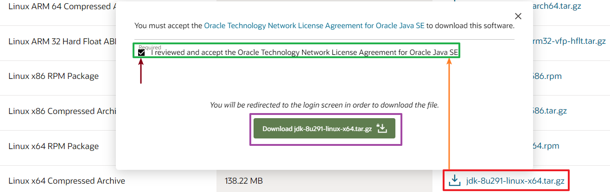
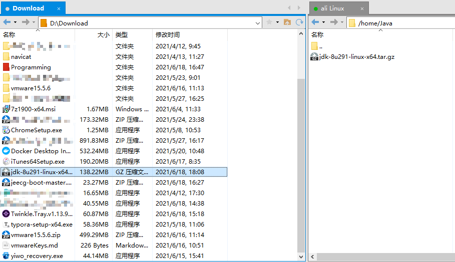
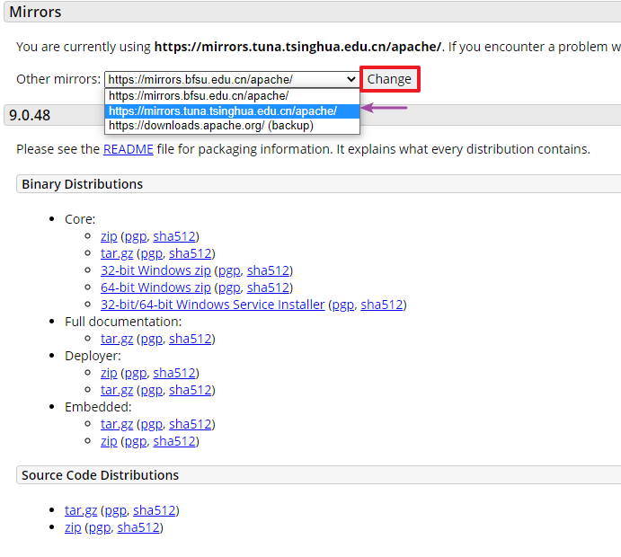

# Linux 系统中安装 Tomcat 解压版 ( 副 Java 安装 )

--------------

> 当我们需要一个服务器去部署自己的项目时 , 我们除了会使用 MySQL 以外 , 可能还会使用到 Tomcat 和 Nginx 等一系列的部署工具 , 本篇就从给 Linux 安装 Java 开始 , 搭建一个 Tomcat 服务器
>
> <font color="#f3b7b9">**[PS] 默认服务器已经安装了 mysql , 不会的话可以看一下我的相关教程**</font> 
>
> Linux 安装 MySQL 链接 : https://github.com/CyberYui/LearningNotes/blob/main/MySQL_Learning/MySQL_Linux_Install.md

### 前言

* 笔者在介绍如何给 Linux 系统安装 MySQL 的时候提到了通过使用 wget 的方式获取解压包的方法

* 这次在安装 java 和 tomcat 的过程中 , 我们就使用不同的方式去下载解压包

* 首先在 Linux 系统中创建好我们想要下载解压版工具的目录 , 我们需要安装 Java 和 Tomcat

* 所以我们需要首先创建两个相关目录 , 我的习惯是把这些工具放到 home 目录中的同名目录下

* 也就是如果要安装 Java , 那我会先在 home 目录中创建 Java 目录 , 然后在里面保存我的 Java 安装包

  ```shell
  [root@iZ2vceob6zm3176giqpowfZ /]# cd /home/
  [root@iZ2vceob6zm3176giqpowfZ home]# ls
  MySQL
  [root@iZ2vceob6zm3176giqpowfZ home]# mkdir Java
  [root@iZ2vceob6zm3176giqpowfZ home]# mkdir Tomcat
  [root@iZ2vceob6zm3176giqpowfZ home]# ls
  Java  MySQL  Tomcat
  ```

* 首先进入 Java 目录和 Tomcat 目录 , 把我们需要的解压包下载好 , 首先是 Java

### Java 的下载

---------------------

* 在现阶段的开发环境中 , Java 8 是被广泛应用的版本 , 这里以 Java 8 下载安装为例 , 进行演示

* 首先进入 Oracle Java 的下载页面

* https://www.oracle.com/java/technologies/javase/javase-jdk8-downloads.html

* 在下面选择 Linux x64 Compressed Archive 版本 , Compressed Archive 表示压缩版

* 你也可以通过下载 Linux x64 RPM Package 版本安装 , RPM 包版本就是我们常用的 Linux rpm 安装版

* 笔者更喜欢使用压缩版 , 这里就介绍压缩版的安装方式

* 由于 Oracle 官网在国外 , 你可能需要使用某些方便上网的小软件才能正常访问 , 点击相应版本右侧的下载链接

* 在跳出的提示框中勾选同意协议 , 然后点击 <kbd>Download jdk-8u291-linux-x64.tar.gz</kbd> 

   

* 点击下载会跳转到 Oracle 登录界面 , 点击登录之后没过多久就会显示下载内容 , 保存到你想保存的地方即可

* 通过 XFTP 软件上传到云服务器中的 /home/Java 目录下

  [PS] 关于 XShell 套件的安装和使用参照我之前的 mysql 安装教程即可 ( **即前言前提到的那个地址** )

   

* 至此 , Java 的安装包已经准备好了 , 接下来准备 Tomcat 的安装包

### Tomcat 的下载

-------------------

* 现阶段中我们常常使用 Tomcat 9 来部署内容 , 本篇也以此为例进行演示

* 首先进入我们创建好的 Tomcat 存档目录 , 下载 Tomcat 9 二进制版本到此位置

* 这次我们通过 wget 方式下载解压版

  ```shell
  cd /home/Tomcat
  # https://mirrors.tuna.tsinghua.edu.cn 可能会有所不同,具体取决于你想在哪下载
  wget https://mirrors.tuna.tsinghua.edu.cn/apache/tomcat/tomcat-9/v9.0.48/bin/apache-tomcat-9.0.48.tar.gz
  ```

* 至此我们准备好了 Java 和 Tomcat 两者的解压版安装包了 , 下一阶段我们就开始安装

  --------------------

  [PS] 关于如何查找 Tomcat 相关版本的下载链接

  * 在上面下载 tomcat 的解压包时我使用了以下的链接

    https://mirrors.tuna.tsinghua.edu.cn/apache/tomcat/tomcat-9/v9.0.48/bin/apache-tomcat-9.0.48.tar.gz

  * 你可能会好奇这种链接是如何寻找的 , 下面开始说明

  * 不论哪种下载方式 , 说白了都是要先进入 tomcat 的官网下载页面 https://tomcat.apache.org/download-90.cgi

  * 页面中对我们重要的只有标签为 <kbd>Mirrors</kbd> 以及 <kbd>9.0.xx</kbd> 这两块内容

  * 首先选好我们中意的镜像 , 点击 <kbd>Change</kbd> 按钮 , 页面会自动刷新一次 , 看上去没啥不同 , 实际上就是给下面的链接都修改了镜像地址

     

  * 你可能感觉 <kbd>Mirrors</kbd> 中的下拉框没有变成你选择的那个是不是出问题了 , 检查下面的下载链接就可以知道了

  * 在 9.0.XX 中的 <kbd>Binary Distributions</kbd> 中看到 <kbd>Core</kbd> 目录 , 我们需要在 Linux 系统中安装 , 所以下载 <kbd>tar.gz</kbd> 版本即可

  * 右键 <kbd>tar.gz</kbd> 点击复制链接地址 , 这样你就获得了 wget 之后需要输入的内容了

  -------------

### Java 的安装

* 在解压 Java 解压包安装之前 , 先确定一下我们的 Linux 里面是否已有 jdk

* 输入 <kbd>java -version</kbd> 查看 jdk 安装版本 , 可以看到我这里已有 1.8.0_272 的 openJdk 了 , 那首先得卸掉它

  ```shell
  [root@iZ2vceob6zm3176giqpowfZ Tomcat]# java -version
  openjdk version "1.8.0_272"
  OpenJDK Runtime Environment (build 1.8.0_272-b10)
  OpenJDK 64-Bit Server VM (build 25.272-b10, mixed mode)
  ```

* 首先检查一下系统 JDK 的默认安装包

  ```shell
  # 搜索 java 查看安装包,这里不会显示我们的解压包的
  [root@iZ2vceob6zm3176giqpowfZ Tomcat]# rpm -qa|grep java
  javapackages-filesystem-5.3.0-1.module_el8.0.0+11+5b8c10bd.noarch
  tzdata-java-2020d-1.el8.noarch
  # 我们要卸载的只有含有openjdk的内容,noarch结尾文件我们不卸载的
  java-1.8.0-openjdk-headless-1.8.0.272.b10-1.el8_2.x86_64
  ```

* 卸载 OpenJDK

  ```shell
  rpm -e --nodeps java-1.8.0-openjdk-headless-1.8.0.272.b10-1.el8_2.x86_64
  ```

* 检查

  ```shell
  [root@iZ2vceob6zm3176giqpowfZ /]# java -version
  -bash: /usr/bin/java: No such file or directory
  ```

* 提示 <kbd>No such file or directory</kbd> 表示我们已经卸载掉了 openjdk

* 接下来安装我们需要的解压版 java

* 首先进入 /home/Java 解压压缩包

  ```shell
  # 进入目录
  cd /home/Java
  # 解压压缩版包
  tar -zxvf jdk-8u291-linux-x64.tar.gz
  # 查看是否解压完成
  [root@iZ2vceob6zm3176giqpowfZ Java]# ls
  jdk1.8.0_291  jdk-8u291-linux-x64.tar.gz
  ```

* 接下来把  jdk1.8.0_291 复制到 /usr/local/java 目录中

  ```shell
  # 创建目录
  [root@iZ2vceob6zm3176giqpowfZ Java]# cd /usr/local/
  [root@iZ2vceob6zm3176giqpowfZ local]# ls
  aegis  bin  etc  games  include  lib  lib64  libexec  mysql  sbin  share  src
  [root@iZ2vceob6zm3176giqpowfZ local]# mkdir java
  [root@iZ2vceob6zm3176giqpowfZ local]# ls
  aegis  bin  etc  games  include  java  lib  lib64  libexec  mysql  sbin  share  src
  # 复制文件,首先进入jdk1.8.0_291
  [root@iZ2vceob6zm3176giqpowfZ local]# cd /home/Java/jdk1.8.0_291/
  # 递归复制内容到 /usr/local/java 中
  [root@iZ2vceob6zm3176giqpowfZ jdk1.8.0_291]# cp * /usr/local/java/ -r
  # 检查是否复制成功
  [root@iZ2vceob6zm3176giqpowfZ jdk1.8.0_291]# ls /usr/local/java/
  bin        javafx-src.zip  legal    man          src.zip
  COPYRIGHT  jmc.txt         lib      README.html  THIRDPARTYLICENSEREADME-JAVAFX.txt
  include    jre             LICENSE  release      THIRDPARTYLICENSEREADME.txt
  ```

  > 软件安装地址允许自定义 , 但通常Linux系统安装软件推荐放在 /usr 目录下

* 配置 Java 的环境变量 , 还是之前在演示 MySQL 的时候配置的 /etc/profile 文件

  ```shell
  # 使用 vi 编辑
  vi /etc/profile
  # 添加以下环境变量
  # java
  export JAVA_HOME=/usr/local/java
  export PATH=$JAVA_HOME/bin:$PATH
  export CLASSPATH=.:$JAVA_HOME/lib/dt.jar:$JAVA_HOME/lib/tools.jar
  ```

  >在Linux系统中使用 <kbd>:</kbd> 作为环境变量分隔符

* 基本安装完成 , 接下来检查一次

  ```shell
  # 修改内容
  vi /etc/profile
  # 重置一次环境变量
  export PATH=/usr/local/sbin:/usr/local/bin:/usr/sbin:/usr/bin:/root/bin
  # 手动应用内容 
  source /etc/profile
  # 显示一次环境变量,检查是否有误
  echo $PATH
  # 结果
  /usr/local/mysql/bin:/usr/local/java/bin:/usr/local/sbin:/usr/local/bin:/usr/sbin:/usr/bin:/root/bin
  # 检查是否配置成功
  java -version
  # 成功显示
  java version "1.8.0_291"
  Java(TM) SE Runtime Environment (build 1.8.0_291-b10)
  Java HotSpot(TM) 64-Bit Server VM (build 25.291-b10, mixed mode)
  # 检查是否配置成功
  javac -version
  # 成功显示
  javac 1.8.0_291
  ```

* 至此 , Java 的安装已完成 , 接下来我们需要安装 Tomcat

-------------------

### Tomcat 的安装

* 笔者一般在使用 Tomcat 的时候不会特意去配置 Tomcat 的相关环境变量 , 所以这里我们也不演示配置环境变量了

  [PS] 配置环境变量的方式和之前给 MySQL , Java 配置是类似的 , 可以自己手动尝试一下

* 首先还是解压我们之前放好在 /home/Tomcat 目录下的解压包

  ```shell
  # 进入目录检查文件是否存在
  cd /home/Tomcat/
  ls
  apache-tomcat-9.0.48.tar.gz
  # 解压解压版 tomcat9
  tar -zvxf apache-tomcat-9.0.48.tar.gz 
  ```

* 同样 , 在 /usr/local 目录下创建一个将用于放置我们的 Tomcat 的目录

  ```shell
  # 进入目录检查是否已有tomcat文件夹
  cd /usr/local/
  ls
  aegis  bin  etc  games  include  java  lib  lib64  libexec  mysql  sbin  share  src
  # 没有,创建此文件夹
  mkdir tomcat
  ls
  aegis  bin  etc  games  include  java  lib  lib64  libexec  mysql  sbin  share  src  tomcat
  ```

* 和复制 Java 文件一样 , 我们把 Tomcat 的文件也复制过来

  ```shell
  # 首先进入解压好的 tomcat 文件夹下
  cd /home/Tomcat/apache-tomcat-9.0.48/
  # 检查一次文件
  ls
  # 结果
  bin           conf             lib      logs    README.md      RUNNING.txt  webapps
  BUILDING.txt  CONTRIBUTING.md  LICENSE  NOTICE  RELEASE-NOTES  temp         work
  # 递归复制 Tomcat 文件
  cp * /usr/local/tomcat/ -r
  # 检查一次文件
  ls /usr/local/tomcat/
  # 结果
  bin           conf             lib      logs    README.md      RUNNING.txt  webapps
  BUILDING.txt  CONTRIBUTING.md  LICENSE  NOTICE  RELEASE-NOTES  temp         work
  ```

* 接下来进入 bin 目录 , 启动 tomcat , Linux 中使用的是 .sh 文件

  ```
  ```

  
