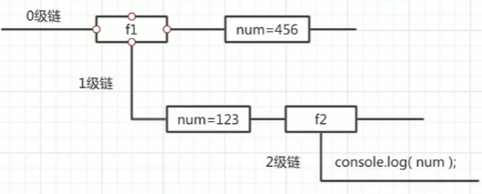

# JavaScript 基础零碎知识

--------------

> 在一门语言的学习过程中 , 有很多模块化的知识 , 例如变量 , 函数等
>
> 但是有一些内容是零碎但重要的知识 , 这些知识在实际的代码编写过程中往往很容易被忽略
>
> 但是它们的的确确十分重要 , 在这里就对这些知识进行记录 , 方便自己查阅

--------------------------

### JavaScript 作用域

#### 作用域

* 通常 , 一段代码中使用到的变量或者函数的名称并不总是有效和可用的

* 限定这个名字 <font color="#f1b06f">可用性的代码范围</font> 就是这个名字的 <font color="#f1b06f">**作用域**</font> 

* 作用域提高了程序逻辑的局部性 , 增强了程序的可控性和可靠性 , 减少了大规模程序中的命名冲突等问题

* 简而言之 , 作用域就是 <font color="#ff9393">**变量或函数等名称在某个范围内起作用和效果**</font> 

* ES6 之前 , JS 的作用域分为 **全局作用域** 和 **局部作用域** , 只有到 ES6 的时候 , 才新增了 **块级作用域** 

* 全局作用域 : 整个 script 标签 或者是一个单独的 js 文件 , 都是一个全局作用域

* 局部作用域 : 在函数内部就是局部作用域 , 即这段 ( 或这行 ) 代码只在函数内部起效果和作用 

  ```javascript
  // Global Scope
  var num = 10;
  console.log(num);
  function newFn(){
      // Local Scope
      var num = 20;
      console.log(num);
  }
  newFn();
  ```

* 在同一个作用域中变量名会有命名冲突

* 块级作用域 : 使用 <kbd>{}</kbd> 包裹的区域 , 被称作块级作用域 , 现阶段各个浏览器均已拥抱 ES6 标准

#### 变量作用域

* 在 JS 中 , 根据作用域的不同 , 变量会分为两种 : **全局变量** 和 **局部变量** 

* 全局变量 : 在全局作用域下的变量 , 全局可用

* **★ [PS]** 如果在函数内部没有声明 , 直接使用或赋值的变量也是一个全局变量

* 局部变量 : 在局部作用域下的变量 , 仅局部可用

* **★ [PS]** 函数的形参也可以当做一个局部变量来使用

  ```javascript
  // Global Variable
  var num = 10;
  console.log(num);
  function newFn(aru){
      // aru is a Local Variable
      // Local Variable
      var num = 20;
      // Another Global Variable
      num2 = 100;
      console.log(num);
  }
  newFn();
  ```

* **★ 从执行效率来看** 

* 全局变量只有浏览器关闭的时候才会销毁 , 比较占内存资源

* 局部变量在程序执行完毕之后就会被销毁 , 比较节约内存资源

-------------------------

#### 作用域链

* 只要是代码 , 就至少有一个作用域 , 如果函数中还有函数 , 那么在这个作用域中就又可以诞生一个作用域

* 内部函数可以访问外部函数的变量 , 这种机制 , 是用链式查找来决定哪些数据能被内部函数访问的 , 这种结构就称作作用域链 ( **就近原则** )

  ```javascript
  // Global Variable
  var num = 10;
  function function1(){
      // Local Variable
      var num = 20;
      // Inner Function
      function function2(){
          // Inner function will use local variable
          console.log(num);
      }
      // transfer inner function
      function2();
  }
  // transfer outer function
  function1();
  ```

#### 作用域链案例

##### 案例-A

* 请观察以下代码 , 它的结果是什么 ?

  ```javascript
  function f1(){
      var num = 123;
      function f2(){
          console.log(num);
      }
      f2();
  }
  var num = 456;
  f1();
  ```

  > 这种代码的执行逻辑可以用链式图来展示 , 这和 CSS 的层叠性差不多 
  >
  >  

* 请观察以下代码 , 它的结果是什么 ?

  ```javascript
  var a = 1;
  function fn1(){
      var a = 2;
      var b = '22';
      fn2();
      function fn2(){
          var a = 3;
          fn3();
          function fn3(){
              var a = 4;
              // a = 4
              console.log(a);
              // b = 22
              console.log(b);
          }
      }
  }
  fn1();
  ```

### ★JS 预解析

----------------

* 作为代码 , 其总会有一些处于边缘情况的编写问题 , 比如下面的情况

  ```javascript
  // ---------------------------------------------------------
  // 1st Question
  // 1st Answer:Uncaught ReferenceError: num1 is not defined
  console.log(num1);
  // ---------------------------------------------------------
  // 2nd Question
  // 2nd Answer:undefined
  console.log(num2);
  var num2 = 10;
  // ---------------------------------------------------------
  // 3rd Question
  // 3rd Answer:running well
  fn();
  function fn(){
      console.log(11);
  }
  // OR
  function fn(){
      console.log(11);
  }
  fn();
  // ---------------------------------------------------------
  // 4th Question
  // 4th Answer:Uncaught TypeError: fun is not a function
  fun();
  var fun = function(){
      console.log(22);
  }
  ```

* JavaScript 代码是由浏览器中的 JavaScript 解析器来执行的 , 或者叫 JS引擎

* JavaScript 解析器在运行 JavaScript 代码的时候分为两步 : 预解析和代码执行

* <1> 预解析 : JS引擎 会把JS里面所有的 var 变量声明以及 function 函数声明提升到当前作用域的最前面

* <2> 代码执行 : 按照代码书写的顺序从上往下执行代码

#### 预解析

* 预解析分为 变量预解析 ( 变量提升 ) 和 函数预解析 ( 函数提升 )

* <1> 变量提升 : 就是把所有的变量声明提升到当前的作用域最前面 , 这仅仅提升变量的声明 , 而不提升赋值操作

  > 现在回看之前的 <kbd>2nd Question</kbd> , 我们可以这样解释它
  >
  > ```javascript
  > console.log(num2);
  > var num2 = 10;
  > // 上述代码相当于执行了以下代码
  > // 首先进行变量提升操作,即将变量声明提升
  > var num2;
  > console.log(num2);
  > num2 = 10;
  > ```
  >
  > 还有之前的 <kbd>4th Question</kbd> , 我们可以这样解释它 , fun 是一个
  >
  > ```javascript
  > fun();
  > var fun = function(){
  >     console.log(22);
  > }
  > // 上述代码相当于执行了以下代码
  > // 一样,首先进行变量声明
  > var fun;
  > fun(); // 此时执行出错,即声明的是变量,而不是函数
  > fun = function(){
  >     console.log(22);
  > }
  > ```

* <2> 函数提升 : 就是把所有的函数声明提升到当前作用域的最前面 , 这仅仅提升变量的声明 , 而不提升函数内容 , 不调用函数

  > 现在就能解释之前的 <kbd>3rd Question</kbd> , 我们可以这样解释它
  >
  > ```javascript
  > ```
  >
  > 
