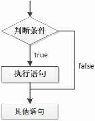
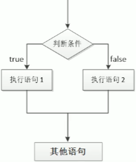
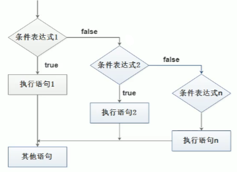

# JavaScript 进阶知识

---------------------

### 流程控制

* 在一个程序执行的过程中 ,  各条代码的执行顺序对程序的结果是有直接影响的
* 很多时候我们需要通过控制代码的执行顺序来实现我们要完成的功能

> 即 : <font color="#dab5d6">**流程控制就是来控制我们的代码按照什么结构顺序来执行**</font> 

* JS 中有三种流程控制结构 , 即 <font color="#dfd282">顺序结构</font> , <font color="#dfd282">分支结构</font> , <font color="#dfd282">循环结构</font> , 这三种结构代表三种代码执行的顺序

   

-----------------------

### 顺序流程控制

* 顺序结构是程序中最简单 , 最基本的流程 , 没有特定的语法结构
* 即 <font color="#fa0a7c">程序按照代码的先后顺序 , 依次执行</font> , 程序中大多数的代码都是这样执行的 , 流程图如上图

----------------

### 分支流程控制

* 分支结构 : 由上到下执行代码的过程中 , 根据 <font color="#fa0a7c">不同的条件</font> , 执行 <font color="#fa0a7c">不同的路径代码</font> ( 执行代码多选一的过程 ) , 从而得到 <font color="#fa0a7c">不同的结果</font> , 一般用 **if 语句** 来完成这种流程 , 但是还有 **switch 语句** 也具有这种效果

#### if 分支语句

* 其语法结构类似如下代码 , 具体的执行流程见下方左图

  ```javascript
  if ( 条件 ){
  	// 执行内容
  }
  // 例子
  if ( 3 > 5 ){
      alert('沙漠骆驼'); // 此内容不显示 , 因为 3 > 5 为 false
  }
  ```

  > 执行思路 : 若 if 的条件为真 , 则执行大括号里面的执行内容 , 否则不执行大括号里面的内容 , 执行 if 句块之后的代码

*   

#### if 双分支语句

* 当我们想要在 if 条件 为 false 时也执行内容 , 可以使用以下的语法结构 , 具体流程如上方右图

  ```javascript
  if ( 条件 ){
      // 内容 1
  } else {
      // 内容 2
  }
  // 例子
  var age = prompt('Please press your age:');
  if (age >= 18){
      alert('我们去网吧走~');
  }else {
      alert('回家做作业去~');
  }
  ```

  > 执行思路 : 若 if 的条件为真 , 则执行内容1 , 否则执行内容2
  >
  > [PS] 值得注意的是 : 
  >
  > 1 . <font color="#fa0a7c">内容1 和 内容2 只有一个会被执行 </font> 
  >
  > 2 . <font color="#fa0a7c">else 后面是不存在判断条件的</font> 

#### if-else-if 多分支语句

* 往往我们在实际判断的时候并不会只有"是和否"这样的双分支情况 , 我们一般会有多个情况分支用来进行判断
* 由此 **if-else-if** 就作为判断不同条件而选择不同语句执行的多分支语句出现了 [理论上能有无穷多个条件分支]
*  

```javascript
if (条件1){
    // 内容1
    // 注意 else if 中间是有空格的
}else if(条件2){
    // 内容2
}else if(条件3){
    // 内容3
}else if(条件n){
    // 内容n
    // .......
}else{
    // 最后の内容 上述皆不成立则执行此内容
}
```

> if-else-if 语句在执行满足任意一个条件的内容之后结束整个多分支语句
>
> <font color="#fa0a7c">内容1 , 内容2 , 内容n ... 只有一个会被执行 即多选一</font> 
>
> [PS] 只要执行到某一个 else , 就代表之前的 if 条件是不满足的 , 这样可以省略一些条件内容

#### 三元表达式

* 三元表达式是由三元运算符组成的式子 , 其性质类似于双分支语句 , 可以实现一些简单的条件选择

  > **一元  ++n** 
  >
  > **二元  3+5 ** 
  >
  > **三元  a?b:c **

* **语法结构** : <font color="#f66bd1">条件表达式 ? 表达式1 : 表达式2</font> 

* **执行思路** : 如果<font color="#f66bd1">条件表达式结果</font>为真 , 则返回 <font color="#f66bd1">表达式1</font> 的值 , 否则返回 <font color="#f66bd1">表达式2</font> 的值

```javascript
let num = 10;
var result = num > 5 ? 'yes' : 'nope'; // 返回 yes
console.log(result);
// if (num > 5){
//     result = 'yes';
// }else{
//     result = 'nope';
// }
```

