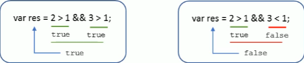
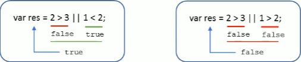

# JavaScript 基础 - 运算符和判断

----------------

> 所谓运算符 , 即操作符 , 是用于实现赋值 , 比较和执行算术运算等功能的符号.
>
> JS 中常用的运算符有 :
>
> * 算数运算符
> * 递增和递减运算符
> * 比较运算符
> * 逻辑运算符
> * 赋值运算符

--------------------------

### 算数运算符

------------------------

#### 算数运算符概述

* 算术运算使用的符号 , 用于执行两个变量或值的算数运算.

|  **运算符**  |   **描述**   |         **实例**         |
| :----------: | :----------: | :----------------------: |
| <kbd>+</kbd> |      加      |       10 + 20 = 30       |
| <kbd>-</kbd> |      减      |      10 - 20 = -10       |
| <kbd>*</kbd> |      乘      |      10 * 20 = 200       |
| <kbd>/</kbd> |      除      |      10 / 20 = 0.5       |
| <kbd>%</kbd> | 取余数(取模) | 返回除法的余数 9 % 2 = 1 |

* 在算数运算中 , 浮点数的算数运算会有一些可能的精度问题

* 比如下面这样的运算 : 

  ```javascript
  console.log(0.1 + 0.2); // 0.300000000000000004
  console.log(0.07 * 100); // 7.00000000000000001
  var num = 0.1 + 0.2;
  console.log(num == 0.3); // false
  ```
  
  > 直接使用小数参与运算 , 数字在转换为 2 进制运算并返回成 十进制 运算的过程中会产生误差
  >
  > 因此 <font color="#f44d59">尽量避免浮点数数直接运算的情况</font> 

#### △ 浮点数的精度问题

* 浮点数值的最高精度为 17 位小数 , 但是在进行算数计算时其精确度远远不如整数

  > <font color="#f44d59">**不要直接判断两个你认为应该相等的浮点数是否相等 !**</font>

#### 补充的一些思想

1. 我们如何判断一个数是否能够被整除呢 ?

   > 很简单 , 当余数为 0 的时候 , 就说明这个数能被整除 , 取余符号 ( % ) 的主要用途也就是这个

2. 需要注意 1 + 2 * 3 这种式子的运算优先级 .

   > 1 + 2 * 3 的结果为 7 , 注意算数运算符优先级 , 先乘除 , 后加减 , 有小括号的话先算小括号里面的

-------------------------

### 表达式和返回值

* 表达式 : 由数字 , 运算符 , 变量等以能求得数值的有意义的排列方法所得到的组合

  > 即由数字 , 运算符 , 变量等内容组成的式子 , 我们称之为表达式

* [PS] : <font color="#58bb58">表达式是有返回值的 , 并且表达式是将右边的结果赋值给左边的</font> 

------------------

### ★ 递增和递减运算符

* 为了解决变量持续或多次自增的问题 , 引入了递增和递减运算符

* 也就是把复杂的 `number = number +1;` 写为了 `num++` 或者 `++num` 的形式

  > 可以看到递增和递减运算符需要配合变量来进行使用

* 如果需要反复给数字变量添加或减去 1 , 可以使用 <font color="#f44d59">递增( ++ )和递减( -- )</font> 运算符来完成

  > 如果单独使用前置和后置自增 / 自减 , 其效果是一样的 , 只有在配合其他内容使用时才能显示出区别

* 在 JavaScript 中 , 递增和递减运算符即可以放在变量前也可以放在变量后 , 它们的区别为 :

  |      位置       |                       作用                       |
  | :-------------: | :----------------------------------------------: |
  | 前置递增 / 递减 | <font color="#f44d59">**先运算 , 后返回**</font> |
  | 后置递增 / 递减 | <font color="#f44d59">**先返回 , 再运算**</font> |

  ```javascript
  var p = 10;
  console.log(++p + 10); // 21,p 先自增变为 11,然后再和 10 相加得出 21
  var q = 10;
  console.log(p++ + 10); // 20,p 先返回值 10,同 10 相加得出 20 返回后,再自增变为 11 
  ```

#### ★ 相关练习 ( 笔面用 )

  ```javascript
  var a = 10;
  ++a; // 11
  var b = ++a + 2; // 12 + 2
  console.log(b); // 14
  
  var c = 10;
  c++; // 11
  var d = c++ + 2; // 11 + 2 = 13 , c + 1 = 12
  console.log(d); // 13
  
  var e = 10;
  var f = e++ + ++e;
  // (e++) + (++e),注意控制的是同一个变量
  // 1. 无特殊顺序,按序计算,先算 e++,返回10,但是e值变为11
  // 2. 再算 ++e,e值先变为 12,再返回,即12
  // 3. 算两个返回值的和,即 10 + 12 =22
  // 即结果为 22 ,但是 e 变为 12
  console.log(f); // 22
  ```

#### 小结

* 前值递增和后置递增运算符可以简化代码的编写 , 让变量的值 +1 比以前的写法更简单
* 单独使用时 , 其运行结果相同
* 与其他代码连用时 , 结果不同 , 不论 ++a 还是 a++ 都要默认其有个小括号
* 注意前置和后置的区别 , 前置是先算后回 , 后置是先回后算
* 实际使用时 , 我们更多使用 i++ 这种形式 , 并且单独使用它 , 而不是和其他的去连用

---------------

### 比较运算符

* 比较运算符也称为关系运算符
* 即<font color="#e8f0d7">两个数据进行比较时所使用的运算符</font> , 比较运算后 , 会<font color="#7bc354">返回一个布尔值 ( true / false )</font> 作为比较运算的结果.

|   **运算符名称**    |           **说明**           |  **案例**   | **结果** |
| :-----------------: | :--------------------------: | :---------: | :------: |
|    <kbd><</kbd>     |            小于号            |    1 < 2    |   true   |
|    <kbd>></kbd>     |            大于号            |    1 > 2    |  false   |
|    <kbd>>=</kbd>    | 大于等于号 ( 大于或者等于 )  |   2 >= 2    |   true   |
|    <kbd><=</kbd>    |  小于等于号( 小于或者等于 )  |   3 <= 2    |  false   |
|    <kbd>==</kbd>    |  判等号 ( 会默认转型比较 )   |  37 == 37   |   true   |
|    <kbd>!=</kbd>    |            不等号            |  37 != 37   |  false   |
| <kbd>===  !==</kbd> | 全等 要求值和 数据类型都一致 | 37 === '37' |  false   |

* 当我们在运行以下代码时 , 会获得 true 的结果 , 即等于 ( == ) 操作会默认转换字符串类型为数字型再进行比较

  ```javascript
  console.log(18 == '18'); // true
  ```

* 为了禁止等于操作的默认转换 , 我们可以使用全等 ( === ) 操作进行判断比较

  ```javascript
  console.log(18 === '18'); // false,要求值和类型全等
  ```

* 为了便于对比 , 再确认一次 <kbd>=</kbd> 是赋值符号 , 而不是等于

-----------------

### 逻辑运算符

* 逻辑运算符是用来进行布尔值运算的运算符 , 其返回值也为布尔值
* 在实际开发中 , 逻辑运算符多用于判断 , 并且经常用于多个条件的判断情况

| **逻辑运算符**  | **说明** |    **案例**     |
| :-------------: | :------: | :-------------: |
|  <kbd>&&</kbd>  |  与 and  |  true && false  |
| <kbd>\|\|</kbd> |  或 or   | true \|\| false |
|  <kbd>!</kbd>   |  非 not  |     ! true      |

#### 逻辑与运算符 ( && )

```javascript
console.log(3 > 5 && 3 > 2); // false
```

> && 两侧都为 true , 结果才为 true , 只要有一侧为 false , 结果就为 false
>
>  

#### 逻辑或运算符 ( || )

```javascript
console.log(3 > 5 || 3 > 2); // true
```

> || 两侧都为 false , 结果才为 false , 只要有一侧为 true , 结果就为 true
>
>  

#### 逻辑非运算符 ( ! )

- 又称为 <font color="#a2cecb">取反符</font> , 用来取一个布尔值相反的值 , 如 true 的相反值是 false

```javascript
console.log(!true); // false
```

> 将其右侧表达式的结果颠倒 , 如果右侧表达式结果为 true , 逻辑非运算后结果变为 false

#### ★ 相关练习 ( 笔面用 )

* 