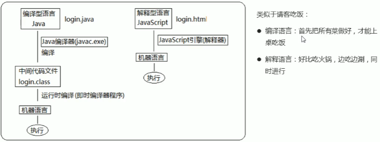

# JavaScript 基础

----------------

## 从简单的输出开始

* Js 中最基础的输出就是 `alert` 命令

  ```javascript
  // Java 中
  System.out.println("This is a warning");
  // JavaScript 中
  alert('This is an alert');
  ```

-----------------------

## JS 简介

* **JavaScript 是运行在客户端的脚本语言** , 也就是不需要编译 , **逐行解释** 并执行的 , 这标志着它不需要环境的配置即可运行 , JS 是一种高级编程语言

* 换句话说 , JS 在运行时是解析一句然后执行一句 , 一旦遇到问题就会直接退出程序

* JS 的应用场景 : 

  * 表单动态校验 ( 密码强度检测 )
  * 网页特效
  * 服务端开发 ( Node.js )
  * 桌面程序 ( Electron )
  * App ( Cordova )
  * 控制硬件 - 物联网 ( Ruff )
  * 游戏开发 ( cocos2d-js )

* HTML / CSS / JS 的关系

  * HTML / CSS 标记语言 -- 描述类语言
  
    [HTML] --- 决定网页结构和内容 (决定看到什么) , 相当于人的身体
  
    [CSS] --- 决定网页呈现给用户的模样 (决定好不好看) , 相当于给人穿衣服 , 化妆
  
  * JS 脚本语言 -- 编程类语言
  
    [JS] --- 实现业务逻辑和页面控制 (决定功能) , 相当于人的各种动作
### 浏览器是如何运行的以及JS的组成

* 浏览器分为 **渲染引擎** 和 **JS引擎** 
  * **渲染引擎** : 用来解析 HTML 与 CSS , 俗称 **内核** , 比如 chrome 浏览器的 blink , 老版本的 webkit
  * **JS 引擎** : 也称为JS 解释器 . 用来读取网页中的 JavaScript 代码 , 对其处理后运行 , 比如 chrome 浏览器的 V8
* JS 的组成
  1. ECMAScript --- JavaScript语法 ( 基础 )
  2. DOM --- 页面文档对象模型 ( API )
  3. BOM --- 浏览器对象模型 ( API )

### ECMAScript

* 是由 ECMA 国际标准化的一门编程语言 , 其主要实现和扩展有两种 , 分别是 : 

  - JavaScript -- 网景公司
  - Jscript -- 微软公司

  [PS] ECMAScript 规定了 JS 的编程语法和基础核心知识 , 是所有浏览器厂商共同遵守的一套 JS 语法工业标准

### DOM ( Document Object Model )

* 文档对象模型是 W3C 组织推荐的处理可扩展标记语言的 **标准编程接口** , 通过 DOM 提供的接口可以对页面上的各种元素进行操作 ( 大小 , 位置 , 颜色等 )

### BOM ( Browser Object Model )

* 浏览器对象模型提供了独立于内容的 , 可以与浏览器窗口进行互动的对象结构.通过 BOM 可以操作浏览器窗口 , 比如弹出框 , 控制浏览器跳转 , 获取分辨率等.

-----------

## 开始 JS

------------------

### JS 的使用

* JS 的书写位置有 **行内 , 内嵌 , 外部** 三种形式

  1. 行内式的 JS 直接写到元素内部即可

  ```html
  <!-- onclick 被写在了行内 -->
  <input type="button" value="CyberYui" onclick="alert('Here is an alert')">
  ```

  2. 内嵌式的 JS 写在 `<Script>` 标签内部
  ```html
  <script>
  	alert('Here is another alert');
  </script>
  ```

  3. 外部式的 JS 写在外部文件中
  假如有一个叫 <kbd>my.js</kbd> 的文件 , 其内容如下
  ```javascript
  alert('Here is outside JS alert');
  ```
  > 要想使用这个文件 , 需要在页面中引用它

  ```html
  <!-- 引入同级目录下的 my.js -->
  <script src="my.js"></script>
  ```
  
* [PS] 需要注意的是 : 

  1. **行内式**

  * 可以将单行或少量 JS 代码写在 HTML 标签的事件属性中 ( 以 on 开头的属性 ) , 比如 onclick
  * 注意单双引号的使用 , HTML 中用双引号 , JS 中使用单引号
  * 可读性差 , 这种方式的 JS 代码如果在 HTML 中存在大量的话 , 不方便阅读
  * 引号易错 , 引号多层嵌套匹配的时候 , 非常容易被弄混
  * 特殊情况下才会使用此种方式

  2. **内嵌式** (最常用)

  * 可以将多行 JS 代码写到 `<script>` 标签中
  * 内嵌 JS 是学习时常用的方式

  3. **外部式** (完成用)

  * 利用 HTML 页面代码结构化 , 把大段 JS 代码独立到 HTML 页面之外 , 既美观 , 也方便文件级别的复用
  * 引用外部 JS 文件的 script 标签中间不可以写代码
  * 适合于 JS 代码量比较大的情况
  * 前端项目使用 webpack 打包之后也会生成这样的文件

--------------

### JS 注释

> 这里由于是学习 , 使用的编辑器进行代码编写 , 用的是 VScode 

* 单行注释 `//单行注释` , 快捷键一般是 <kbd>ctrl</kbd> + <kbd>/</kbd> 

* 多行注释 , 快捷键一般是 <kbd>shift</kbd> + <kbd>alt</kbd> + <kbd>a</kbd> 

  > 一般会把多行注释改成 <kbd>ctrl</kbd> + <kbd>shift</kbd> + <kbd>/</kbd> 

  ```javascript
  /** 注释
  * 这是多行注释
  */
  ```

----------------

## JS 基础

-----------------

### JS 输入输出语句

* 为了方便信息的输入和输出 , JS 中提供了一些输入和输出语句 , 其常用的语句如下

  |         方法         |              说明               |  归属  |
  | :------------------: | :-----------------------------: | :----: |
  |    **alert(msg)**    |        浏览器弹出警示框         | 浏览器 |
  | **console.log(msg)** |    浏览器控制台打印输出信息     | 浏览器 |
  |   **prompt(info)**   | 浏览器弹出输入框 , 用户可以输入 | 浏览器 |

* 实际使用

  ```html
  <script>
    	// 这是一个输入框  
  	prompt('This is a input box,please enter sth.');
      // 这是一个警示框
      alert('Warning !');
      // console 打印信息
      console.log('Here will be shown in your console.');
  </script>
  ```

### ★ JS 变量

> 变量是用于存放数据的 **容器** , 我们通过 **变量名** 获取数据 , 甚至数据可以修改
>
> [PS] 变量就是一个盒子 , 里面装着数据

* 本质 : 变量是在 **内存** 中申请的 , 一块用来存放数据的 **空间** 

* 一个变量的生命周期 : 声明 → 赋值 → 使用 → 删除

* 通过以下命令声明变量

  ```js
  // 声明变量
  var age; // 声明一个名称为 age 的变量
  // 赋值变量
  age = 10; // 给 age 变量赋值为 10
  // 使用:输出结果
  console.log(age); // 输出 age 的值,即 18
  // 此时就停止使用变量了,删除则是程序自行删除的
  ```

  * var 是一个 JS 关键字 , 用来声明变量 (即 variable 的意思)
  * 使用该关键字声明变量之后 , 系统自动为变量分配内存空间
  * age 是自定义的一个变量名 , 我们要通过变量名来访问内存中分配的空间

* 变量的初始化 ( 即将变量的声明和赋值写成一句 )

  > 声明一个变量并赋值 , 我们称之为 <font color=#f52443>**变量的初始化**</font> 

  ```javascript
  // 变量的初始化
  var age = 18;
  ```

#### 案例:变量的使用

* 目标:

  1. 弹出一个输入框 , 提示用户输入姓名
  2. 弹出一个对话框 , 输出用户刚才输入的姓名

* 思路:

  1. 用户输入姓名
  2. 将用户输入的姓名存储到变量中
  3. 输出变量值

* 解决代码:

  ```javascript
  // 获取输入内容,
  var myname = prompt('Please press your name:');
  // 输出名字
  alert(myname);
  ```

#### ★ 变量语法扩展

* 更新变量

  > 一个变量被重新赋值之后 , 它原有的值就会被覆盖 , 值以最后一次赋的值为准

* 同时声明多个变量

  > 同时声明多个变量 , 只需要写一个 var , 多个变量名之间使用英文逗号隔开

  ```js
  // 声明多个变量
  var age = 18,address = '火影',gz = 2000;
  ```

* 声明变量的特殊情况

  1. 只声明不赋值 , 输出结果为 `undefined` ( 未定义 )
  2. 没有声明也没有赋值 , 直接使用会报错
  3. 不声明 , 直接赋值使用 , 变量会被作为全局变量被使用 ← 这种方式不被推荐

#### ★ 变量的命名规范

* 由字母 (A-Z a-z) , 数字 (0-9) , **下划线 (_)** , **美元符号 ($)** 组成 , 如 : usrAge , num01 , _name
* **严格区分大小写** , `var app;` 和 `var App;` 以及 `var APp;` `var APP;` 是不同的变量
* 不能以数字开头, `18age` 是错误的变量名
* 不能是 **关键字** , **保留字** , 例如 : var , for , while ( 可以参照相关文档 )
* 变量名必须有意义 , MMD BBD nl → age , 尽量使用英文单词而不是拼音首字母
* 遵守驼峰命名法 , 首单词字母小写 , 后面单词的首字母需要大写 , 比如 myFirstName

> [PS] name 有时候也会是关键字或者保留字 , 尽量不要用它作为变量名
>
> 允许在变量名中存在的符号只有 **_** 和 **$** 这两种符号

#### 案例 : 课堂练习

* 目标 : 交换两个变量的值

* 思路 : 搞个临时变量

* 解决代码 : 赋值语句是把右边给左边

  ```javascript
  // JS 作为一种编程语言,有很强的逻辑性
  var apple1 = '青苹果';
  var apple2 = '红苹果';
  // 把青苹果放桌子上
  var temp = apple1;
  // 把红苹果给 apple1
  apple1 = apple2;
  // 把青苹果给 apple2
  apple2 = temp;
  // apple1→'红苹果' apple2→'青苹果'
  ```

-----------------

## 数据类型

-------------

### 数据类型简介

* 为了便于吧数据分成所需内存大小不同的数据 , 充分利用存储空间 , 于是定义了不同的数据类型 :

  **值类型(基本类型)**--[简单数据类型]：

  * 字符串 (String)  , 数字(Number) , 布尔(Boolean) , 对空 (Null)  , 未定义 (Undefined)  , Symbol

    | **简单数据类型** |                           **说明**                           | **默认值** |
    | :--------------: | :----------------------------------------------------------: | :--------: |
    |      Number      |            数字型,包含整型值和浮点型值,如21,0.21             |     0      |
    |     Boolean      |            布尔型,如 true , false , 等价于 1 和 0            |   false    |
    |      String      |       字符串型,如 '张三' [在JS中,所有的字符串都带引号]       |     ''     |
    |    Undefined     | `var a;` 声明了变量 a 但是没有赋值 , 此时 a 的类型为 undefined | undefined  |
    |       Null       |             `var a = null;` 声明了变量 a 为空值              |    null    |

  **引用数据类型**--[复杂数据类型]：

  ​	对象(Object) , 数组(Array) , 函数(Function)

### ★变量的数据类型

* **JavaScript 是一种弱类型, 或者说动态的语言** 

* 这意味着不用提前声明变量的类型 , 在程序运行过程中 , 类型会被自动确定

* 与 Java 不同的是 , 在 Java 中我们可以用 `int num=10;` 这样的语句创建一个整型变量

* 但是在 JavaScript 中 , 我们直接使用 `var num = 10;` 就可以创建一个数字型的数据

* 也就是说 , 直接使用 `var num` 是无法确定变量的数据类型的

  [PS] JS 变量的数据类型是由 JS 引擎根据赋值号右侧的数值确定的 , 代码运行完毕之后 , 变量就确定了数据类型

  由于 JavaScript 拥有动态类型 , 同时也意味着一个变量可以拥有不同的数据类型

------------------

### 1.数字型 (Number)

* `var num = 10;` 以及 `var PI = 3.14;` 都是数字型变量

#### 数字型进制

* 最常见的有二进制 (0,1) , 八进制 (0~7) , 十进制 (0~9) , 十六进制 (0~9,ABCDEF)

  ```javascript
  var num1 = 010;
  // 010 八进制,转换为十进制就是 8
  console.log(num1); 
  
  var num2 = 0xA;
  // 0xA 十六进制,转换为十进制就是 10
  console.log(num2); 
  ```

  > 我们只需要知道 , **在 JavaScript 中 , 八进制数前加 0 , 十六进制数前加 0x** 

#### 数字型范围

* JavaScript 中数字的最大和最小值

  ```javascript
  alert(Number.MAX_VALUE); // 1.7976931348623157e+308
  alert(Number.MIN_VALue); // 5e-324
  ```

#### △数字型的特殊值

* 数字型有三个特殊值

  > **Infinity** , 代表无穷大 , 大于任何数值
  >
  > **-Infinity** , 代表无穷小 , 小于任何数值
  >
  > **NaN** , 即 **Not a number** , 代表一个非数值

  ```js
  console.log(Number.MAX_VALUE * 2); // Infinity
  console.log(-Number.MAX_VALUE * 2); // -Infinity
  console.log('pink' - 100); // NaN
  ```

#### ★isNaN

* isNaN() 方法用来判断一个变量是否为非数字类型 , 并返回一个值 , 是数字返回 false , 否则返回 true

  ```js
  console.log(isNaN(12)); //结果返回false
  ```

----------------------

### 2.字符串型 (String)

- 字符串型可以是引号中的任意文本 , 引号可以是双引号也可以是单引号

- 由于 HTML 标签中的属性使用的是双引号 , 所以 JS 里推荐使用单引号

  > JS 中 , 可以使用单引号嵌套双引号 , 或者使用双引号嵌套单引号 (外双内单 , 外单内双)

#### △字符串转义符

* 类似于 HTML 中的特殊字符 , 字符串可以使用转义符

  |  **转义符**   |      **解释说明**       |
  | :-----------: | :---------------------: |
  | <kbd>\n</kbd> | 换行符 , n 意为 newline |
  | <kbd>\\</kbd> |         斜杠 \          |
  | <kbd>\'</kbd> |        ' 单引号         |
  | <kbd>\"</kbd> |        " 双引号         |
  | <kbd>\t</kbd> |        tab 缩进         |
  | <kbd>\b</kbd> |   空格 , b 意为 blank   |

#### 字符串长度及拼接

* 字符串是由若干字符组成的 , 这些字符的数量称为字符串长度

* 通过字符串的 length 属性可以获取整个字符串的长度

  ```js
  var str = 'my name is cyber';
  console.log(str.length); // 16
  ```

* 多个字符串之间可以使用 <kbd>+</kbd> 进行拼接 , 其拼接方式为 <font color="#f52443">字符串 + 任何类型 = 拼接之后的新字符串</font> 

* 拼接前会把字符串相加的任何类型转成字符串 , 再拼接成一个新的字符串

  > 只要有字符串拼接 , 最后的结果就是字符串 (<kbd>+</kbd>号口诀 : <font color="#eddd9e">数值相加 , 字符相连</font>)
  >
  > ```js
  > alert('11' + 12); //1112
  > ```

* 可以通过使用变量的形式输出会变化或者能控制的值

  > ```js
  > var age = 18;
  > console.log('I am '+ age +' years old.'); // I am 18 years old.
  > ```

  > 引号是就近匹配 , 四个引号直接会空出填写变量的地方

#### ★显示年龄案例

* 要求 : 弹出一个输入框 , 要求用户输入年龄 , 之后弹出警示框显示 "你今年xx岁啦" (xx表示刚刚输入的年龄)

  ```js
  var attitude = prompt('你喜欢我吗?');
  var str = '你的回答是:' + attitude;
  alert(str);
  ```

----------------------

### 3.布尔型 (Boolean)

* 布尔类型有 true 和 false 两个值 , 分别表示 真 / 假
* 布尔型可以和数字型相加 , 此时 true 的值为 1 , false 的值为 0

#### ❤ Undefined 未定义型 和 Null 空值

> 未定义型 也是一种数据类型

* 如果一个变量声明未赋值 , 那它就是 undefined , 即未定义数据类型

```javascript
var str;
console.log(str); // undefined
var variable = undefined;
console.log(variable + 'pink'); // undefinedpink -- 任何类型和 string 相连,最后都是 字符串型
console.log(variable + 1); //NaN --- undefined 和数字相加最后的结果为 NaN
var space = null; // 空值 --- undefined 和空值的区别
console.log(space + 'pink'); // nullpink
console.log(space + 1); // 1
```

* 一个声明后没有被赋值的变量会有一个默认值 undefined ( 注意它与其他数据类型的相连和相加结果 )
* 一个声明并赋予 null 值的变量 , 里面存储的值为空 ( 在对象中还会用到它 )

#### typeof 检测数据类型

* 一个变量的实际数据类型并不能想当然地判断 , 需要我们通过可靠的程序去检测

```javascript
var age = 18;
console.log(typeof var); // number
var str = 'cyber';
console.log(typeof(str)); // string --- 不论是空格还是括号包裹,都是可以的
var flag = true;
console.log(typeof flag); // boolean
var vari = undefined;
console.log(typeof vari); // undefined
var timer = null;
vonsole.log(typeof timer); // object
// 一个有趣的例子
var realage = prompt('Please press your age');
console.log(realage);
console.log(typeof(realage)); // string
```

* 事实上 , 我们不仅可以通过 typeof 的返回值判断变量的数据类型 , 还可以通过 chrome 浏览器的控制台输出判断

```javascript
console.log(18); // number -- 藏蓝色
console.log('18'); // string -- 黑色
console.log(true); // boolean -- 蓝色
console.log(undefined); // undefined -- 浅灰色
console.log(null); // null -- 浅灰色
```

### 字面量

* 字面量是在源代码中一个固定值的表示法 , 通俗来说 , 就是字面量表示如何表达这个值
  * 数字字面量 : 8 , 9 , 10
  * 字符串字面量 : '程序员' , '前端程序员'
  * 布尔字面量 : true , false

### ★ 数据类型转换

* 使用表单或者 prompt ( 即用户输入 ) 获取到的数据默认为**字符串类型** , 此时我们需要 :
* **把一种数据类型的变量转换成另外一种数据类型**

△ 通常会实现以下三种类型的转换 : 

* 转换为字符串类型
* 转换为数字型
* 转换为布尔型

--------------------------

#### 转换为字符串

|      **方式**      |           **说明**           |              **案例**              |
| :----------------: | :--------------------------: | :--------------------------------: |
|     toString()     |          转成字符串          | var num=1; alert(num.toString());  |
| String() 强制转换  |          转成字符串          |   var num=1; alert(String(num));   |
| **加号拼接字符串** | 和字符串拼接的结果都是字符串 | var num=1;alert(num+"我是字符串"); |

> 比较重要的是 **加号拼接字符串** 的方式

```javascript
// 类似的代码如下,我们可以实现类型转换
var num = 10;
var str = num.toString();
console.log(str);
console.log(typeof str);
// 直接将数字型的内容传参
console.log(String(num));
// 使用 + 拼接字符串进行转换
console.log(num + ' '); // 加个空格就行了
```

* toString() 和 String() 的使用方式不一样 , 一种是调用 , 另一种是传参
* 第三种 **加号拼接字符串** 的方式也称隐式转换

---------------------------

#### ★转换为数字型

|      **方式**      |           **说明**           |              **案例**              |
| :--: | :--: | :--: |
| parseInt(string) 函数 | 将string类型转换为整数数字型 | parseInt('78') |
| parseFloat(string) 函数 | 将string类型转换为浮点数数字型 | parseFloat('78.21') |
| Number() 强制转换函数 | 将string类型转换为数字型 | Number('12') |
| js 隐式转换 (- * /) | 利用算术运算隐式转换为数字型 | '12' - 0 |

```javascript
var age = prompt('请输入您的年龄');
console.log(age); // 字符型
console.log(parseInt(age)); // 数字型,取整
console.log(parseInt('3.97')); // 3
console.log(parseInt('120px')); // 120
console.log(parseInt('res120px')); // NaN
```

* parseFloat(string) 类似于 parseInt 函数 , 只不过返回的是浮点型数字

```javascript
console.log(parseInt('3.97')); // 3.97
```

> 注意 I 和 F 是大写字母

* 隐式转换是我们在进行算术运算的时候 , JS 自动转换了数据类型

```javascript
// 使用 Number() 函数
console.log(Number(str));
```

* 使用算术运算 ( 减 , 乘 , 除 )

```javascript
// 这种运算有些特点,你再怎么弄也得是数字才能相加减
console.log('12' - 1); // 11
console.log('123' * 2); // 246
```

-----------------------------

#### 案例 : 计算年龄

* 目标 : 在页面中弹出一个输入框 , 输入出生年月日之后 , 能计算出年龄
* 思路 : 保存用户输入的年份 , 然后用今年年份减去它即可
* 解决代码 : 

```javascript
var year = prompt('please press your born year:');
// year 取过来的是字符串类型,刚刚好这里是减法,隐式转换了
var age = 2021 - year;
alert('Your age is '+age+' !');
```

> 只有 ( - * / ) 才有隐式转换 , 加法是没有隐式转换的哟

```JavaScript
// 加两个输入的数,加法没有隐式转换
var num1 = prompt('first num');
var num2 = prompt('second num');
var result = parseFloat(num1) + parseFloat(num2);
alert('The add result is ' + result);
```

--------------------------

#### 转换为布尔型

|      **方式**      |           **说明**           |              **案例**              |
| :--: | :--: | :--: |
| Boolean()函数 | 其他类型转换为布尔值 | Boolean('true') |

* 代表<font color=#f95245>空 否定</font>的值会被转换为 **false** , 比如 '' , 0 , NaN , null , undefined
* 其余值均为true

------------------------------

### 扩展阅读

* 能够知道解释型语言和编译型语言的特点
* 能够知道标识符是否为关键字或保留字
* 能够独立完成一些简单的程序

-----------------------

#### 解释型语言

* 计算机是无法理解除任何机器语言以外的语言的 , 所以必须要把高级程序语言翻译为机器语言才能执行程序 , 程序语言翻译成机器语言的工具 , 被称为翻译器
* 翻译器翻译的方式有两种 : 
  * 编译 -- 编译器在代码执行之前进行编译 , 生成中间代码文件
  * 解释 -- 解释器是在运行时进行及时编译 , 并立即执行 ( 当编译器以解释方式运行时 , 也称为解释器 )
* 两种方式之间的区别在于 <font color=#f95245>翻译的时间点不同</font> 
* JS 是典型的解释型语言 , Java 则是典型的编译型语言

 

------------------------------------------

#### 标识符-关键字-保留字

* 标识符 : 即开发人员为变量 , 属性 , 函数 , 参数取的名字

  > 标识符不能是 **关键字** 或 **保留字** 

* 关键字 : 即 JS 本身已经使用了的字 , 不能再用它们充当变量名 , 方法名

* 保留字 : 实际上就是预留的 "关键字" , 即尽管现在不是关键字 , 但是将来可能会成为关键字 , 同样不能使用它们当变量名或者方法名

* <font color=#f95245>具体的内容可以参照本目录下的 javascript关键字和保留字.md 文件</font> 

-------------------------------------

### 命名规范

* 在实际的代码编写中 , 为了使我们的代码简介易懂 , 需要在项目初期就进行代码的命名格式规范

-----------------------------

#### 标识符命名规范

* 变量 , 函数的命名必须要有意义
* 变量的名称一般用<font color="#c4332f">**名词**</font> 
* 函数的名称一般用<font color="#c4332f">**动词**</font> 

#### 操作符规范 ( 格式化 ) 

* 操作符的左右两侧各保留一个空格

  ```javascript
  let i = 1; // 而不是 let i=1;
  ```

* 单行注释尽量在开始留一个空格

  ```javascript
  // 这样注释
  //而不是这样
  ```

* 其他规范

  ```javascript
  // 多使用空格隔开符号和字符,以免字符符号冗杂
  if ( true ){
      // something
  } // 最后的大括号和开始的字符对齐
  ```

  
