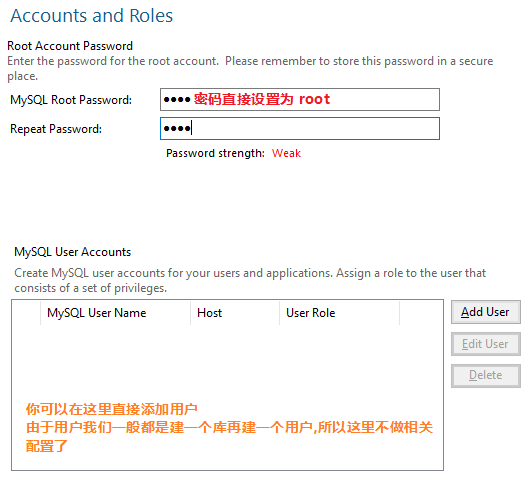
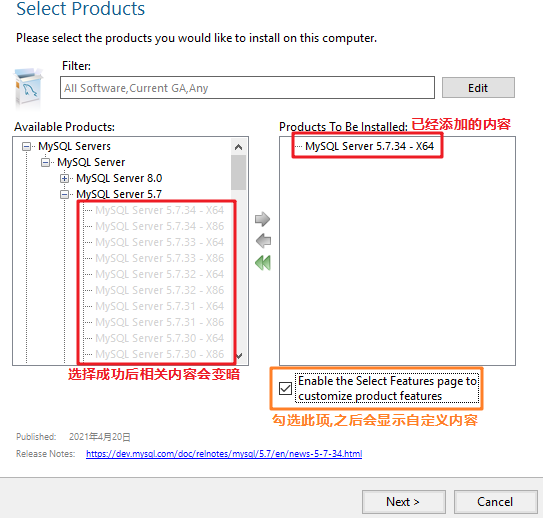
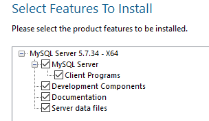
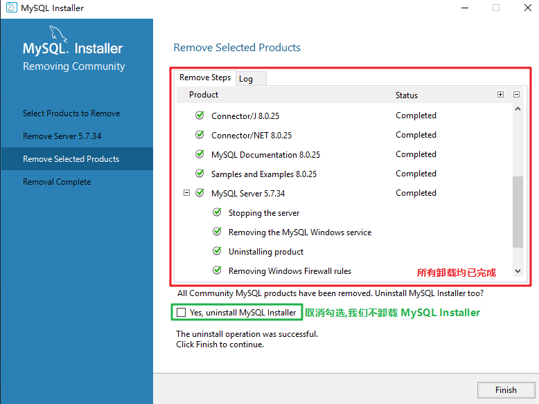

# MySQL 的安装 ( msi 以及 zip) - for Windows

-----------------

> 在日常工作中 , 笔者在安装工具时常用的是压缩版 , 无论是 Windows 还是 Linux , 也无论是 MySQL 还是 Tomcat 等工具 , 都更趋向于使用压缩版进行安装 , 但是我会在本篇的 MySQL 安装演示中添加上安装版本的安装演示 , 请不用担心 , 各取所需即可 , 话不多说 , 开始我们今天的 MySQL 之旅

## msi 版本 (安装版) 安装和删除

### 下载

* 进入以下页面下载 MySQL 数据库

* https://dev.mysql.com/downloads/installer/

  > 一般来说我们下载的是最新版或者是 5.7 的版本 , 所以下载这两个版本的数据库即可 , 关于如何在一台机器上安装两个不同版本的 MySQL 数据库我会在之后的某一篇文章再说
  >
  > 
  >
  > <font color="#f863c8">**图片上是 8.0.25 版本的下载 , 我们还需要下一个 5.7 版本的 MySQL**</font>
  >
  > [PS] 下载的时候可能需要使用 VPN 等工具 , 下载页面会提示登录 , 选择左下角的 <font color="#b1e1d2">No thanks , just start my download</font>即可正常下载了

### 安装

* 当我们下载完成之后 , 会获得一个将近 300MB~500MB 的 msi 文件 , 请注意如果你的安装包很小的话在你配置完安装路径之后会自动下载安装包 , 如果你的网络连接外网还是有些小问题的话 , 尽量不要使用这种方式 , 最好去找一个 msi 安装包

* 双击 msi 文件打开安装程序 , 比如我这里的是 <kbd>mysql-installer-community-8.0.25.0.msi</kbd> 

* 安装包打开后会自动安装 MySQL Installer , 这是 MySQL 针对 Windows 的安装版本管理工具

* 一般我们只需要使用 MySQL Server 版本 , 但是这里的话 , 我们就从安装 Developer Default 版本演示

   

  > 右侧显示了这个版本的介绍以及里面包括的软件内容 , 可以看到这里不仅仅有 MySQL Server

* 点击 <kbd>Next</kbd> 进入下一步操作 , 安装管理会提示需要安装一些依赖内容 , 有了这些依赖内容才能去安装相应的软件 , 比如这样的提示

  > 这里有 <kbd>check</kbd> 按钮可供点选 , 只有当你安装了相应的依赖内容后点击才有效 , 否则永远都会提示你依赖不足 , 无法继续安装这些软件

   

  > 可以看到这里提示为了安装 MySQL for Visual Studio 1.2.9 , 需要安装 2015,2017 或者 2019 版本的 Visual Studio , 我们不需要这些内容 , 可以直接跳过 , 就算以后需要了也可以再从 MySQL Installer 里面安装

* 不管检查依赖项是否拥有 , 只要和 MySQL Server 无关 , 我们就直接跳过 , 这里跳过这一阶段 , 无视之后的警告即可

  > 警告会提示你如果不安装依赖则相应的软件程序不会被安装 , 是否继续 , 确认继续操作 <kbd>continue</kbd> 即可

* 接下来会显示即将安装的各个软件 , 点击  <kbd>Execute</kbd> 到下一步

   

* 安装会自动进行 , 你可能会好奇软件的安装路径选择页面去哪了 , 不好意思 , 这样整体安装的方式是没法控制软件安装路径的 , 这也是我为什么会在大部分情况下选择直接安装解压版的原因

  > 在这里选择任何内容都无法修改相关软件的安装路径 , 笔者看来简直离谱
  >
  > 其实这个安装路径是可以修改的 , 只不过会麻烦一些 , 在之后我们讨论这个问题

* 等待安装完成之后 , 点击 <kbd>Next</kbd> 进入下一步 , 可以看到这样的页面 , 这个页面提示你会有哪些应用需要设置配置信息

   

  > 我们需要专心配置的是 MySQL Server 的配置文件 , 其余的先不作考虑 , 直接默认设置即可

* 继续 Next , 开始配置 MySQL Server 的内容 , 需要修改的没有很多地方 , 我安装 MySQL 数据库的这台虚拟机是安装的 Windows Server 2019 系统 , 也就是打算拿来作为服务器的 , 所以会将 <kbd>Development Computer</kbd> 改成了 <kbd>Server Computer</kbd> , 一般自己使用就默认配置 , 即 <kbd>Development Computer</kbd> 即可

   

* 为了演示 , 我这里还是选择了 <kbd>Development Computer</kbd> 安装选项 , 继续下一步操作 , 点击 <kbd>Next</kbd> 

* 在 Authentication Method 项中 , 会提示选择哪种密码认证方式 , 一种是新版本的形式 , 另一种是老版本的形式

   

* 推荐选择的是强密码加密形式 , 我们安装的是最新版本 , 所以直接按默认走 , 继续下一步即可 , 点击 <kbd>Next</kbd> 

  > 一般我们在使用 MySQL 数据库的时候不会安装这种最新版本的数据库 , 而是会安装 5.7 这种常用版本的数据库 , 但是这里仅仅作为安装演示 , 直接全部拉满最新版内容即可

* 设置好 MySQL 数据库中 root 用户的密码 , 我这里设成了 root , 提示密码强度为弱 , 无视继续下一步 , 点击 <kbd>Next</kbd> 

   

* 接下来设置一下 MySQL 服务的名称 , 默认勾选了开机自动启动服务 , 下面还可以设置以哪个 Windows 用户运行服务 , 我们修改一下服务名为 MySQL8 然后直接进入下一步 , 点击 <kbd>Next</kbd> 

   

* 接下来是日志设置 , 可以设置日志文件的存放位置以及记录的时间间隔 , 我们可以修改一下也可以不做修改直接使用默认内容 , 修改完毕之后点击 <kbd>Next</kbd> 

   

* 接下来提示设置 服务ID 等内容 , 这部分直接默认设置即可 , 需要注意的是 , 下面的 Table Names Case 表示表名大小写的核查 , 一般默认值为 1 也就是不区分大小写 , 在 Linux 中安装的 MySQL 数据库是区分大小写的 , 这点需要注意 , 继续下一步 , 点击 <kbd>Execute</kbd> 开始执行 MySQL Server 的安装

   

* 安装过程很迅速 , 并且会自动初始化数据库和添加服务 , 结束后点击 <kbd>Finish</kbd> 完成安装

* 之后会配置 MySQL Router 以及 Samples and Examples 的设置

* 在 MySQL Samples and Examples 的配置中需要输入一下刚刚安装的 MySQL 数据库的用户名和密码 , 点击 <kbd>Check</kbd> 测试和数据库的连接 , 只要用户名和密码无误即可 , 成功之后就可以进入下一步 , 点击 <kbd>Next</kbd> 

   

* 接下来点击 <kbd>Finish</kbd> , 会跳出一个 CMD 窗口和 MySQL WorkBench 窗口

* CMD 窗口输入 <kbd>\quit</kbd> 即可退出 , MySQL WorkBench 就是一个可视化的数据库管理软件 , 我们一般不使用它 , 关闭即可 , 自己可以安装一个 Navicat 连接数据库使用 , 这样我们这台机器的 MySQL 8.0.25 就算安装成功了

-----------------

**[PS] 如何将安装版的 MySQL 数据库安装到其他盘符**

> 我们知道安装版会将所有的 MySQL 软件安装到系统盘符 , 如果我们想要修改某个 MySQL 套件中的内容的话要怎么做呢 , 这里笔者演示一下我自己的方法

* 首先在电脑中找到 MySQL Installer , 打开它 , 可以看到这样的界面 , 比如我们需要修改 MySQL Server 的安装路径 , 首先卸掉原有的 MySQL Server , 点选 <kbd>Remove..</kbd> 选项

   

* 在页面中勾选需要卸载的软件 , 比如我只要删除 MySQL Server 8.0.25 , 勾选它之后点击 <kbd>Next</kbd> 

   

* 选择删除数据库文件夹 , 如果只是更新数据库但是要保留数据文件的话记得取消勾选

   

* 在接下来的页面中选择 <kbd>Execute</kbd> , 完成之后选择 <kbd>Finish</kbd> 

* 此时返回 MySQL Installer 界面 , 可以看到 MySQL Server 8.0.25 已经不见了

* 接下来我们需要重新安装 MySQL Server , 我这次直接安装 5.7 版本的 MySQL 数据库 , 点选 <kbd>Add..</kbd> 选项

   

* 在接下来的页面中依次展开树形结构

* <kbd>MySQL Servers</kbd> → <kbd>MySQL Server</kbd> → <kbd>MySQL Server 5.7</kbd> → <kbd>MySQL Server 5.7.34 - X64</kbd> 

   

* 点击绿色箭头将其添加进右侧选框中 , 并勾选自定义设置项 , 点击 <kbd>Next</kbd> 进入下一步操作

   

* **[注意]** 这里需要确认操作 , 点选右侧的 <kbd>MySQL Server 5.7.34 - X64</kbd> 项条目 , 下方显示小字 <kbd>Advanced Options</kbd> 代表成功

   

* 点选 <kbd>Advanced Options</kbd> , 可以看到自定义数据库安装路径以及数据文件的文件夹安装路径

  > 这也是笔者最不喜欢 MySQL 安装版的一点 , 放个目录隐藏这么深也是没谁了
  >
  > 不过也是因为这一点所以笔者才走向了所有工具安装解压版的道路

   

* 修改成自己想要的路径即可 , 我这台服务器没有挂载硬盘 , 所以只有 C 盘 , 故不修改直接点击 <kbd>OK</kbd> 保存 , 点击 <kbd>Next</kbd> 进入下一步操作

* 系统提示没有安装 Microsoft Visual C++ 2013 Redistributable Package (x64)

* 这次就不能直接下一步跳过此软件安装了 , 我们得自己安装一下这个微软运行库

* 我在本目录中添加了微软运行库的合集安装 , 可以看到它 , 以下是相关链接 , 记得自行下载一下

* https://github.com/CyberYui/LearningNotes/blob/main/MySQL_Learning/MSVBCRT.AIO.2021.06.09.exe

* 安装完成之后回到 MySQL Installer 界面 , 点击 <kbd>Back</kbd> 回退一步之后再点击 <kbd>Next</kbd> 进入下一步

* 可以看到 <kbd>Next</kbd> 按钮已经不是灰色了 , 点击进入下一步 , 点选 <kbd>Execute</kbd> 开始 MySQL 5.7 的下载

  > 因为我原先安装的是 MySQL 8.0.25 版本 , 所以这里会需要下载 MySQL 5.7

   

* 下载会在 <kbd>Progress</kbd> 列中显示进度 , 当到达 100% 之后本项前面会有相应标志 , 点击 <kbd>Next</kbd> 进入下一步

   

* 接下来选择需要安装的内容 , 直接默认全部安装即可

   

* 接下来的操作类似于 MySQL Server 8.0.25 的安装 , 在这里不做过多介绍了

* 安装版 MySQL 安装界面简洁 , 其卸载也十分简单 , 首先打开 MySQL Installer , 还是之前提到的 Remove 操作 , 点选 <kbd>Remove..</kbd> 选项

* 勾选全部软件 , 然后执行 <kbd>Execute</kbd> 操作 , MySQL Installer 会挨个卸载软件 , 十分丝滑

* 全部卸载完成后会看到以下界面 , MySQL Installer 会提示是否卸载其本身 , 这里我们不选择确定 , 我们需要留着它 , 点击 <kbd>Finish</kbd> 完成 , 会看到只有一个 MySQL Installer 壳子的界面 , 接下来的操作就很方便了

   

* 通过这个 MySQL Installer 的壳子我们可以去安装我们想要的所有 MySQL 相关产品 , 并且还能通过 <kbd>Advanced Options</kbd> 控制它们的路径 , 岂不美哉

* 至此 , 一次完整的 MySQL 安装版的安装和卸载演示就完成了 , 希望能帮到正在看本文档的你

--------------

## zip 版本 (解压版) 安装和删除

----------------------------

> 安装版会将数据库的配置全部设定好 , 基本不需要我们自己做什么配置 , 但是问题就在于一般安装版 MySQL 会自动安装到系统盘符以增加数据库的安全性和唯一性 , 要想修改必须删除之后重新单独安装 , 费事费力 , 很没有可操作性 , 相比之下 , 解压版虽然安装较为繁琐 , 但是由于每一步都是自己配置了的 , 所以日后使用和维护也更加方便 , 笔者最常用的就是解压版本的 MySQL 数据库 , 所以请尽量从这个版本安装

### 下载

* 进入以下页面下载 MySQL 数据库

* https://dev.mysql.com/downloads/mysql/

  > 一般来说我们下载的是最新版或者是 5.7 的版本 , 所以下载这两个版本的数据库即可
  >
  > 
  >
  > <font color="#f863c8">**图片上是 8.0.25 版本的下载 , 我们还需要下一个 5.7 版本的 MySQL**</font>
  >
  > [PS] 下载的时候可能需要使用 VPN 等工具 , 下载页面会提示登录 , 选择左下角的 <font color="#b1e1d2">No thanks , just start my download</font>即可正常下载了

### 安装

* 当我们下载完成之后 , 会获得一个 zip 压缩包 , 使用解压工具将其解压到你想存放数据库的目录即可

* 比如我这里下载的是 <kbd>mysql-5.7.34-winx64.zip</kbd>

* [PS] 解压工具请自行寻找 , WINRAR , Bandizip , 7-zip 都是可以的

* 事实上解压之后你就可以开始使用数据库了 , 但是为了方便使用 , 我们需要配置一下它

  > 就像我们使用 java 一样 , 我们也需要给 MySQL 添加一个环境变量从而能够实现这种方式开启数据库 , 打开控制台而不需要再进入 MySQL 目录就可以直接访问数据库

* 我的 windows 10 版本为 20H2 , 不同 windows 版本配置是差不多的

* 逐级进入以下内容 <kbd>鼠标右键点击 计算机</kbd>→<kbd>属性</kbd>→<kbd>高级系统设置</kbd>→<kbd>环境变量</kbd> 

* 在变量 <kbd>Path</kbd> 上双击并添加以下内容 , 我的路径是这样 , 根据自己路径调整内容即可

* 建议像我这样设置 , 添加一个主目录 MySQL

  > 添加 MySQL 主目录的原因是需要为了之后的安装多版本 MySQL 数据库做准备 , 你也可以不用这样做

* ```bash
  F:\MySQL\mysql-5.7.34-winx64\bin;
  ```

* 配置完成之后就可以通过控制台 ( cmd ) 直接运行 mysql 了 , 但是先别急 , 还需要配置一下数据库的默认配置 , 以及数据库的存放位置

* 如果你之前用过 MySQL , 那么你一定知道有一个 <kbd>mysql.ini</kbd> 文件需要进行设置 , 但是 zip 版数据库可能没有这个文件 , 不用担心 , 自己创建一个就可以了

  ---------------------

  #### 开始配置

  * 首先进入你解压好的 mysql 数据库目录 , 它看起来会像是这样的 <kbd>mysql-5.7.34-winx64</kbd>

  * 创建一个 <kbd>data</kbd> 文件夹 , 创建一个空白的 <kbd>mysql.ini</kbd> 文件

    [PS] <kbd>mysql.ini</kbd> 文件需要你首先新建一个笔记本文件 (.txt) 然后手动更改它的后缀和文件名

  * 修改前后的目录对比应该差不多是这样的

    

  * **data** 目录会在之后存放我们的数据库 , mysql 在读取配置文件的相关配置之后就会知道这个目录在哪啦

  * **my.ini** 文件就是我们需要的配置文件啦 , 首先打开 <kbd>my.ini</kbd> 文件 , 设定其内容如下

    ```ini
    [mysql]
    # 设置mysql客户端默认字符集
    default-character-set=utf8 
    
    [mysqld]
    #设置数据库启动在3306端口
    port = 3306 
    
    # 设置mysql的安装目录
    basedir=F:\MySQL\mysql-5.7.34-winx64
    
    # 设置mysql数据库的数据的存放目录
    datadir=F:\MySQL\mysql-5.7.34-winx64\data
    
    # 允许最大连接数
    max_connections=200
    
    # 服务端使用的字符集默认为8比特编码的latin1字符集
    character-set-server=utf8
    
    # 创建新表时将使用的默认存储引擎
    default-storage-engine=INNODB
    
    # 设置数据库的模式用于生产开发环境,防止非法数据插入
    # STRICT_TRANS_TABLES : 在该模式下,如果一个值不能插入到一个事务表中,则中断当前的操作,对非事务表不做限制
    # NO_ENGINE_SUBSTITUTION : 如果需要的存储引擎被禁用或未编译,那么抛出错误。不设置此值时,用默认的存储引擎替代,并抛出一个异常
    sql_mode=NO_ENGINE_SUBSTITUTION,STRICT_TRANS_TABLES
    
    # mysql 中有这样的一个默认行为:
    # 当一行数据中某些列被更新时,如果这一行中有timestamp类型的值
    # 那么这个timestamp列的数据也会被自动更新到更新操作所发生的那个时间点
    # 这个操作是由explicit_defaults_for_timestamp 控制的
    explicit_defaults_for_timestamp=1
    ```

    > [PS] 关于数据库的模式 sql_mode 的相关内容可以参照下面这个链接
    >
    > https://developer.aliyun.com/article/710525
  
  * 数据库的存放地点和配置我们都调好了 , 接下来就让 mysql 按照我们的配置初始化一下即可

    > [PS] 你的电脑可能还需要一些必须的运行库才能执行以下命令
    >
    > 如果在使用某些命令的时候电脑报错了 , 记得去搜索提示的相关错误查找解决方法
  
  * 在 MySQL 的 bin 目录下以管理员身份打开控制台 , 输入以下命令 , 让 mysql 通过我们的配置文件自行安装 , 并产生一个名叫 MySQL 的 windows 服务

  * 一般直接输入这样的命令即可

    ```sql
    mysqld install
    ```

  * 有时候我们需要在开始安装的时候就使用我们的配置文件 , 那么会用这样的命令
  
    ```sql
    mysqld install MySQL --default-file="F:\MySQL\mysql-5.7.34-winx64\my.ini"
    ```

    > 有时候可能直接使用长句命令更管用
  
  * 成功安装之后控制台会有提示 , 表示服务已经成功安装

    ```powershell
    Service successfully installed
    ```

  * 安装成功后就可以初始化数据库了 , 否则是无法启动服务的
  
  * 有可能此时你已经能够启动服务 , 那是因为你已经创建好了 **data** 目录 , 实际上 , 当你的文件夹中没有 **data** 目录时 , 在执行 <kbd>mysqld --initialize</kbd> 操作时 mysql 会自动创建 **data** 目录
  
  * 一般来说 , 这一步我们需要进入 mysql 的 <kbd>bin</kbd> 目录执行以下命令
  
    ```powershell
    F:\MySQL\mysql-5.7.34-winx64\bin>mysqld --initialize-insecure
    ```
  
  * 但是由于我们事先配置了环境变量 , 所以现在我们就可以直接执行下面的命令了
  
    ```powershell
    C:\Users\Administrator>mysqld --initialize-insecure
    ```
  
  * **-insecure** 命令的作用是创建 mysql 的 root 用户时不创建密码 , mysql 应该会向你提示这个警告
  
  * 如果事先没有创建 **data** 目录 , 你可能会看到这样的错误
  
    ```bash
    mysqld: Can't change dir to 'F:\MySQL\mysql-5.7.34-winx64\data\' (Errcode: 2 - No such file or directory)
    2021-06-16T10:11:07.073465Z 0 [Warning] TIMESTAMP with implicit DEFAULT value is deprecated. Please use --explicit_defaults_for_timestamp server option (see documentation for more details).
    2021-06-16T10:11:07.073528Z 0 [Warning] 'NO_ZERO_DATE', 'NO_ZERO_IN_DATE' and 'ERROR_FOR_DIVISION_BY_ZERO' sql modes should be used with strict mode. They will be merged with strict mode in a future release.
    2021-06-16T10:11:07.073531Z 0 [Warning] 'NO_AUTO_CREATE_USER' sql mode was not set.
    2021-06-16T10:11:07.073551Z 0 [Note] --secure-file-priv is set to NULL. Operations related to importing and exporting data are disabled
    2021-06-16T10:11:07.074484Z 0 [Note] mysqld (mysqld 5.7.34) starting as process 5348 ...
    2021-06-16T10:11:07.079686Z 0 [Warning] Can't create test file F:\MySQL\mysql-5.7.34-winx64\data\DESKTOP-S2QLF38.lower-test
    2021-06-16T10:11:07.079956Z 0 [Warning] Can't create test file F:\MySQL\mysql-5.7.34-winx64\data\DESKTOP-S2QLF38.lower-test
    2021-06-16T10:11:07.081526Z 0 [ERROR] failed to set datadir to F:\MySQL\mysql-5.7.34-winx64\data\
    2021-06-16T10:11:07.082564Z 0 [ERROR] Aborting
    
    2021-06-16T10:11:07.083277Z 0 [Note] Binlog end
    2021-06-16T10:11:07.084010Z 0 [Note] mysqld: Shutdown complete
    ```
  
  * 不用担心 , 把 **data** 目录创建一下就行了 , 也别管是否会自动生成 **data** 目录了
  
  * 初始化成功后 , 命令行会没有任何提示
  
  * 但检查我们的数据库目录 , 文件夹中已经自动生成了 **data** 目录
  
  * 接下来执行以下命令 , 开启我们刚刚创建的 MySQL 服务
  
    ```powershell
    C:\Users\Administrator>net start mysql
    MySQL 服务正在启动 ....
    MySQL 服务已经启动成功。
    ```
  
  * [PS] 在这里可能还会遇到一些问题 , 比如出现这样的结果
  
  * ```powershell
    MySQL 服务正在启动 .
    MySQL 服务无法启动。
    
    服务没有报告任何错误。
    
    请键入 NET HELPMSG 3534 以获得更多的帮助。
    ```
  
  * 这种问题的原因是我们刚刚使用了自己的配置文件安装了 mysql 服务 , 但是 windows 自己设定的注册信息不对
  
  * <kbd>WIN+R</kbd> 输入 <kbd>regedit</kbd> 进入注册表
  
  * 定位 <kbd>HKEY_LOCAL_MACHINE\SYSTEM\CurrentControlSet\Services\MySQL</kbd> 内容项
  
  * 在右侧的列表中修改 <kbd>ImagePath</kbd> 的值 , 修改成类似下面的内容 , 确认之后保存注册表并关闭  <kbd>regedit</kbd> 面板
  
  * ```sql
    F:\MySQL\mysql-5.7.34-winx64\bin\mysqld MySQL
    ```
  
  * 到这里的时候记得检查以下你的 **data** 目录下是否有东西 , 如果里面有内容的话记得删除 ,否则会报如下错误
  
  * ```bash
    F:\MySQL\mysql-5.7.34-winx64\bin>mysqld --initialize
    2021-06-16T10:30:35.060528Z 0 [Warning] 'NO_ZERO_DATE', 'NO_ZERO_IN_DATE' and 'ERROR_FOR_DIVISION_BY_ZERO' sql modes should be used with strict mode. They will be merged with strict mode in a future release.
    2021-06-16T10:30:35.060580Z 0 [Warning] 'NO_AUTO_CREATE_USER' sql mode was not set.
    2021-06-16T10:30:35.062612Z 0 [ERROR] --initialize specified but the data directory has files in it. Aborting.
    2021-06-16T10:30:35.063722Z 0 [ERROR] Aborting
    ```
  
  * 至此应该基本问题都解决了 , 通过 <kbd>mysqld --initialize-insecure</kbd> 再次初始化数据库
  
  * 下面再使用 <kbd>net start mysql</kbd> 命令启动数据库 , 应该就成功了的
  
  * 接下来进入数据库 , 首次进入数据库应该是没有密码的 , 输入密码阶段直接回车继续即可
  
    ```powershell
    C:\Users\Administrator>mysql -u root -p
    ```
  
  * 至此 , 我们的解压版 MySQL 已经安装成功了
  
  * 我们还需要修改一下 root 用户的密码
  
    ```shell
    mysql > set password for root@localhost = password('root');
    ```
  
    > 在 8.0 以上的版本中 , 这条命令可能不会起作用 , 这时尝试使用这一条命令
    >
    > ```shell
    > mysql> alter user 'root'@'localhost' identified by 'root';
    > ```
  
  * 输入完成之后 , 我们需要刷新一下权限 , 从而完成密码设置
  
    ```shell
    mysql> flush privileges;
    ```
  
  * 设置完成后 , 退出一下数据库测试 , 使用密码登入 , 成功即可
  
  * 可以使用命令行或者数据库可视化链接软件 ( 如 Navicat ) 链接数据库了
  
  * 使用 zip 解压版 mysql 的好处是 , 安装时你已经确定好了所有的设置内容 , 基本走过了一次完整过程 , 当你想删除 MySQL 的时候 , 只需要逆推操作 , 也就是进行如下操作
  
    1. 停止 MySQL 服务 , 并删除服务
  
       ```powershell
       # 停止服务
       C:\Windows\system32>net stop MySQL
       MySQL 服务正在停止.
       MySQL 服务已成功停止。
       # 删除服务
       C:\Windows\system32>sc delete MySQL
       [SC] DeleteService 成功
       ```
  
    2. 删除配置的 MySQL 环境变量
  
       逐级进入 鼠标右键计算机→属性→高级系统设置→环境变量
  
       删除之前在 Path 变量中配置的 MySQL 内容
  
       ```powershell
       F:\MySQL\mysql-5.7.34-winx64\bin;
       ```
  
    3. 删除 MySQL 目录 , 即你的数据库解压目录以及其中的所有文件
  
       ```powershell
       F:\MySQL\mysql-5.7.34-winx64
       ```
       
    4. 在注册表中卸载 MySQL 相关项目
  
       * <kbd>WIN+R</kbd> 输入 <kbd>regedit</kbd> 进入注册表
  
       * 定位 <kbd>HKEY_LOCAL_MACHINE\SYSTEM\CurrentControlSet\Services\MySQL</kbd> 内容项
       * 直接在左侧树形列表中右键 <kbd>MySQL</kbd> 项 , 删除此项即可
  
  * 至此 , 一次完整的在 Windows 系统中解压版 MySQL 数据库的 下载 , 安装 和 删除 就完成了
  
  

