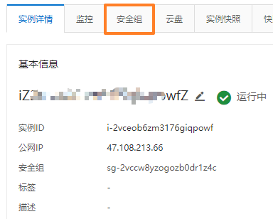

# MySQL 的安装 ( tar.gz ) - for Linux

--------------------

> 在日常开发中 , 我们或多或少都会接触 Linux 服务器 , 对于服务器的使用 , 一般我们会安装 MySQL , Java , Tomcat , Nginx 等开发工具 , 笔者作为一名半维护人员 , 或多或少地也接触到了这些内容 , 由此作出以下记录 , 一方面方便自己查阅 , 一方面希望能帮助到正在被 Linux 服务器困扰的小白 , 希望能帮到大家.
>
> 直入主题 , 接下来从安装 MySQL 开始 , 一步一步地搭建起一个基础的服务器开发环境

### 下载

* [PS] 以 CentOS 7 为例 , 在此系统中安装解压版 MySQL

* 进入以下页面下载适用于 Linux 的 MySQL 数据库

* https://dev.mysql.com/downloads/mysql/

  > 一般来说我们使用 Linux 是为了开发和部署环境 , 我们会安装最为稳定和市场上常用的 MySQL 版本
  >
  > 比如现在常用 5.7 版本的 MySQL , 但是至写下此文章时 MySQL 已有 8.0.25 的版本了
  >
  > 所以我们需要去下载先前版本的 MySQL
  >
  > 在下载页面选择以下选项进入先前版本的相关页面 : 
  >
  > 
  >
  > 一般会直接跳转到 5.7 版本的 MySQL 下载目录
  >
  > 在这里选择系统为 <kbd>Linux - Generic</kbd> 然后在下面的下载中选择类似于这样的版本
  >
  > <kbd>Linux - Generic(glibc 2.12)(x86, 64-bit),Compressed TAR Archive</kbd> 
  >
  > 注意这里的下载版本只有 Archive 后缀 , 没有或者多出 Test Suite 都是不行的
  >
  > 
  >
  > [PS] 下载的时候可能需要使用 VPN 等工具 , 下载页面会提示登录 , 选择左下角的 <font color="#b1e1d2">No thanks , just start my download</font>即可正常下载了

### 安装

* 当我们下载完成之后 , 会获得一个 *.tar.gz 的压缩包 , 接下来就是把它放到 Linux 里面并且解压了
* 比如我这里下载的是 <kbd>mysql-5.7.34-linux-glibc2.12-x86_64.tar.gz</kbd> 

-------------------------

### 下载安装 XShell 套件连接 Linux 

* **( 不想使用此方法可以跳过此项 , 使用后面的另一种下载方式下载 MySQL 解压版 )**

* 不同于 Windows 的解压方式 , 我们一般使用的 Linux 都是命令行界面 , 一般我们会用到 XShell 工具套件

* 首先进入 NETSARANG 的下载地址页面 https://www.netsarang.com/en/xshell-download/

* XShell 套件商业授权版是要收费的 , 我们只是用于个人用途 , 点击页面右侧的 Free Licensing Page

  

* 在进入的页面中输入你的名字和邮箱 , 我们需要 XShell 和 XFTP 两款软件 , 直接勾选 both 选项即可

  

* XShell 的使用也十分简单 , 当安装完成后 , 桌面会有相应的图标 , 它们分别长这样

   

* 双击 Xshell 打开程序 , 我们要通过它建立和 Linux 系统的连接

* 首先需要知道你的 Linux 系统 ip 是多少 , 有时候我们 Linux 系统的 ip 地址是自动分配的

* 这种自动 ip 地址虽然不需要过多配置 , 但是一旦我们重启服务器可能就会有一个新的 ip 地址

* 为了方便使用 , 建议给 Linux 配置一下静态 ip 地址

* 首先进入 Linux 系统查看系统的 ip 地址 , 我们一般使用 ifconfig 即可获取 Linux 主机的 IP 地址

  ```shell
  [root@localhost ~]# ifconfig
  enp1s0: flags=4163<UP,BROADCAST,RUNNING,MULTICAST>  mtu 1500
          inet 192.168.2.34  netmask 255.255.255.0  broadcast 192.168.2.255
          inet6 fe80::1e1b:dff:fe9a:b02  prefixlen 64  scopeid 0x20<link>
          ether 1c:1b:0d:9a:0b:02  txqueuelen 1000  (Ethernet)
          RX packets 1523547  bytes 1862955308 (1.7 GiB)
          RX errors 0  dropped 0  overruns 0  frame 0
          TX packets 203711  bytes 19072508 (18.1 MiB)
          TX errors 0  dropped 0 overruns 0  carrier 0  collisions 0
  
  lo: flags=73<UP,LOOPBACK,RUNNING>  mtu 65536
          inet 127.0.0.1  netmask 255.0.0.0
          inet6 ::1  prefixlen 128  scopeid 0x10<host>
          loop  txqueuelen 1000  (Local Loopback)
          RX packets 68  bytes 5768 (5.6 KiB)
          RX errors 0  dropped 0  overruns 0  frame 0
          TX packets 68  bytes 5768 (5.6 KiB)
          TX errors 0  dropped 0 overruns 0  carrier 0  collisions 0
  ```

* 有的时候你的电脑可能会提示没有 ifconfig 这个命令 , 执行 <kbd>yum install net-tools.x86_64</kbd> 安装一下即可

* 在最精简版的 CentOS 7 中 , 如果没有安装 ifconfig 相关工具 , 只有使用 <kbd>ip addr</kbd> 才能直接查看 ip 地址

* 查完 ip 地址 , 记住 enxxx 后面的 inet 内容即可开始下一步连接操作了 , 比如我这里的 ip 是 <kbd>192.168.2.34</kbd> 

* [PS] 需要保证 Linux 系统中有 ssh 插件 , 一般我们安装好的 Linux 系统都有 , 直接在这里建立连接即可

* 单机文件下方的新建  图标 , 在打开的表单中修改和输入以下内容创建和 Linux 的连接

  

* 确定之后会自动打开命令行界面 , 也就是可以直接使用 shell 控制 Linux 系统了

  

* 接下来把我们刚刚下好的 <kbd>mysql-5.7.34-linux-glibc2.12-x86_64.tar.gz</kbd> 包放进 Linux

* 打开刚刚连接了的 Linux 标签 , 从 XShell 上侧工具栏选择 XFTP 工具  

* 接下来 XFTP 界面会直接弹出并连接好 Linux , 并展示出你的 Windows 和 Linux 目录

* 把包直接从左侧的 Windows 目录列表拖入右侧的 Linux 目录列表 , 会自动上传文件到指定位置

   

* 准备工作已经完成了 , 接下来返回 XShell 操作 Linux 系统

--------------------------

### [PS] 另一种下载 MySQL 解压包的方式

* 一般我们使用 Linux 的时候 , 不会都有 FTP 工具 , 那么我们就需要使用一些 Linux 应用来进行下载

* 比如我们会常用 <kbd>wget</kbd> 来进行下载 :

* 当然我们首先要先安装 <kbd>wget</kbd> 才能使用它

  ```shell
  yum install wget
  ```

* 首先创建好我们想要下载解压包的目录 , 并进入此目录 , 执行 wget 命令 , 完成下载后解压包就会显示在 **运行 wget 命令的目录下** 

  ```shell
  [root@iZ2vceob6zm3176giqpowfZ /]cd home
  [root@iZ2vceob6zm3176giqpowfZ home]# ls
  [root@iZ2vceob6zm3176giqpowfZ home]# mkdir test
  [root@iZ2vceob6zm3176giqpowfZ home]# ls
  test
  [root@iZ2vceob6zm3176giqpowfZ home]# cd test
  [root@iZ2vceob6zm3176giqpowfZ test]# wget https://dev.mysql.com/get/Downloads/MySQL-5.7/mysql-5.7.34-linux-glibc2.12-x86_64.tar.gz
  [root@iZ2vceob6zm3176giqpowfZ test]# ls
  mysql-5.7.34-linux-glibc2.12-x86_64.tar.gz
  ```

---------------------------

### 继续安装 

* 笔者上传的 <kbd>mysql-5.7.34-linux-glibc2.12-x86_64.tar.gz</kbd> 包放在了 <kbd>/home/MySQL</kbd> 目录中

* 个人习惯 , 将解压包和安装包都放在 home 目录中 , 不同软件创建不同的文件夹名称 , 便于识别和记忆

* 在 bash 中进入本目录

  ```shell
  [root@iZ2vceob6zm3176giqpowfZ /]# cd /home/MySQL/
  [root@iZ2vceob6zm3176giqpowfZ MySQL]# ls
  mysql-5.7.34-linux-glibc2.12-x86_64.tar.gz
  ```

* 解压压缩包到当前目录下

  ```shell
  [root@iZ2vceob6zm3176giqpowfZ MySQL]# tar -zxvf mysql-5.7.34-linux-glibc2.12-x86_64.tar.gz 
  ```

* 解压完成之后查看一下当前目录结构

  ```bash
  [root@iZ2vceob6zm3176giqpowfZ MySQL]# ls
  mysql-5.7.34-linux-glibc2.12-x86_64  mysql-5.7.34-linux-glibc2.12-x86_64.tar.gz
  ```

* 可以看到 <kbd>mysql-5.7.34-linux-glibc2.12-x86_64</kbd> 是一个目录 , 我们的包文件也还在

  ---------------------------

* **为了防止有所冲突 , 检查一下电脑是否本身就有 MySQL **

### 卸载已有的 MySQL

* 查找是否以前有安装过 mysql

  ```shell
  rpm -qa|grep -i mysql
  ```

* 停止 mysql 服务 , 卸载之前安装的 mysql , 为防止依赖报错 , 添加参数卸载

  ```shell
  rpm -ev 包名 --nodeps
  ```

* 回到 Linux 根目录 , 查找之前老版本的 mysql 文件并删除所有查找到的目录和文件 , 一个一个删除即可

  ```shell
  [root@iZ2vceob6zm3176giqpowfZ MySQL]# whereis mysql
  mysql:
  [root@iZ2vceob6zm3176giqpowfZ MySQL]# whereis mysqld
  mysqld:
  [root@iZ2vceob6zm3176giqpowfZ MySQL]# cd /
  [root@iZ2vceob6zm3176giqpowfZ /]# find / -name mysql
  /home/MySQL/mysql-5.7.34-linux-glibc2.12-x86_64/bin/mysql
  /home/MySQL/mysql-5.7.34-linux-glibc2.12-x86_64/include/mysql
  [root@iZ2vceob6zm3176giqpowfZ /]# find / -name mysqld
  /home/MySQL/mysql-5.7.34-linux-glibc2.12-x86_64/bin/mysqld
  ```

* 会查到刚刚上传上去的文件和刚刚解包的文件 , 不要误伤友军

  ```shell
  whereis mysql
  whereis mysqld
  find / -name mysql
  find / -name mysqld
  ```

* 当输入以上四条命令不再输出目录或文件路径时 , 代表 mysql 已经删干净了 , 接下来开始继续安装 mysql

* [PS] Linux 的删除命令为 <kbd>rm -rf 路径</kbd> , 这一命令会直接删除所指定路径以及其下的所有文件

------------------------------

### 完成安装

* 安装 MySQL 之前需要确保系统中有 <kbd>libaio</kbd> 的依赖

  ```shell
  # 搜索依赖
  yum search libaio
  # 安装依赖
  yum install libaio
  ```

* 如果安装过该依赖会提示如下内容

  ```shell
  [root@iZ2vceob6zm3176giqpowfZ /]# yum install libaio
  Last metadata expiration check: 2:06:57 ago on Thu 17 Jun 2021 04:19:25 PM CST.
  Package libaio-0.3.112-1.el8.x86_64 is already installed.
  Dependencies resolved.
  Nothing to do.
  Complete!
  ```

* 为了权限操作 , 我们需要单独创建一个 mysql 用户组 , 并添加 mysql 用户到组中

  ```shell
  #添加用户组
  groupadd mysql
  #添加用户mysql 到用户组mysql(使用-r参数表示mysql用户是一个系统用户，不能登录)
  useradd -r -g mysql mysql
  #添加完用下面命令测试,能看到mysql用户的信息
  id mysql
  ```

* 为了能正常使用 mysql 我们需要将其放到 <kbd>/usr/</kbd> 目录的文件夹下

  ```shell
  [root@iZ2vceob6zm3176giqpowfZ home]# cd /usr
  [root@iZ2vceob6zm3176giqpowfZ usr]# cd local/
  [root@iZ2vceob6zm3176giqpowfZ local]# ls
  aegis  bin  etc  games  include  lib  lib64  libexec  sbin  share  src
  [root@iZ2vceob6zm3176giqpowfZ local]# mkdir mysql
  [root@iZ2vceob6zm3176giqpowfZ local]# ls
  aegis  bin  etc  games  include  lib  lib64  libexec  mysql  sbin  share  src
  [root@iZ2vceob6zm3176giqpowfZ local]# cd mysql
  [root@iZ2vceob6zm3176giqpowfZ mysql]# 
  ```

* 个人习惯 , 笔者多把此类工具应用放在 <kbd>/usr/local</kbd> 目录中的特定文件夹下 ( 例如这里的 mysql文件夹 )

* 回到之前解压 MySQL 解压包的路径中 , 复制相关文件到我们创建的 <kbd>/usr/local/mysql</kbd> 文件夹下

  ```shell
  [root@iZ2vceob6zm3176giqpowfZ MySQL]# cd /home/MySQL/mysql-5.7.34-linux-glibc2.12-x86_64/
  [root@iZ2vceob6zm3176giqpowfZ mysql-5.7.34-linux-glibc2.12-x86_64]# ls
  bin  docs  include  lib  LICENSE  man  README  share  support-files
  [root@iZ2vceob6zm3176giqpowfZ mysql-5.7.34-linux-glibc2.12-x86_64]# cp * /usr/local/mysql/ -r
  [root@iZ2vceob6zm3176giqpowfZ mysql-5.7.34-linux-glibc2.12-x86_64]# ls /usr/local/mysql/
  bin  docs  include  lib  LICENSE  man  README  share  support-files
  [root@iZ2vceob6zm3176giqpowfZ mysql-5.7.34-linux-glibc2.12-x86_64]# 
  ```

* 接下来我们需要修改 <kbd>/usr/local/mysql</kbd> 目录的权限 , 将其赋权给 mysql 用户

  ```shell
  # 将 MySQL 及其下所有的目录所有者和组均设为 mysql
  chown -R mysql:mysql /usr/local/mysql/
  # 查看是否设置成功,执行以下命令查看文件所有者和组,若均为 mysql 则成功了
  cd /usr/local/
  ll
  # 结果若有类似内容则证明成功
  drwxr-xr-x 10 mysql mysql 99 Jun 17 18:07 mysql
  ```

  > 其实是否需要创建 mysql 用户并不是很必要 , 只是一种为了保证安全性的习惯
  >
  > 我们知道 Windows 系统的用户切换很麻烦 , 在 Linux 中可以同时存在多个用户 , 他们可以有不同的权限
  >
  > 所以为了方便起见 , 我们会对不同的应用场景创建不同的用户和用户组
  >
  > 这样的好处是 , 当某一个应用的使用用户和用户组被渗透之后 , 不会导致整个 Linux 系统被渗透
  >
  > 如果你使用的是一个云服务器的 Linux 系统的话 , 你可能没法赋权目录给用户 , 跳过赋权过程即可

* 接下来手动在 mysql 目录中创建 <kbd>data</kbd> 目录

  ```shell
  [root@iZ2vceob6zm3176giqpowfZ mysql-5.7.34-linux-glibc2.12-x86_64]# cd /usr/local/mysql/
  [root@iZ2vceob6zm3176giqpowfZ mysql]# ls
  bin  docs  include  lib  LICENSE  man  README  share  support-files
  [root@iZ2vceob6zm3176giqpowfZ mysql]# mkdir data
  [root@iZ2vceob6zm3176giqpowfZ mysql]# ls
  bin  data  docs  include  lib  LICENSE  man  README  share  support-files
  ```

* data 目录将会在之后自动被放入数据库文件 , 实际的文件内容会被加密

* 在初始化数据库之前 , 我们需要给我们所要使用的数据库创建一个配置文件 , 并写入配置信息

  > 与 Windows 不同的是 , 我们在 Linux 中的配置文件不再是 *.conf 结尾的文件了
  >
  > 而是一个需要手动配置写入的 my.cnf 文件
  >
  > 有些版本的 MySQL 可能会带有这个文件 , 但是我们一般更推荐创建这个文件

* 在 Linux 中 , 我们可以直接在某个目录去编辑一个不存在的文件 , 一旦我们给它存入了内容之后 , 保存时这个文件会自动被创建并写入刚刚我们编辑的内容

  ```shell
  # 首先确定此文件不存在,直接执行删除操作即可
  [root@iZ2vceob6zm3176giqpowfZ mysql]# rm -rf /etc/my.cnf
  # 直接编辑新文件
  [root@iZ2vceob6zm3176giqpowfZ mysql]# vi /etc/my.cnf
  # 文件内容如下 (具体的路径根据自己的实际情况):
  [client]
  port = 3306
  socket = /tmp/mysql.sock
  
  [mysqld]
  init-connect='SET NAMES utf8'
  # 安装路径
  basedir=/usr/local/mysql    
  # 数据文件存储地址
  datadir=/usr/local/mysql/data    
  socket=/tmp/mysql.sock
  # 允许的最大连接数
  max_connections=200        
  # 服务端使用的默认字符集,这里设置为8bit编码的latin1字符集
  character-set-server=utf8       
  # 创建新表的时候使用的默认存储引擎
  default-storage-engine=INNODB
  
  # 检查是否修改成功了
  [root@iZ2vceob6zm3176giqpowfZ mysql]# cat /etc/my.cnf
  [client]
  port = 3306
  socket = /tmp/mysql.sock
  
  [mysqld]
  init-connect='SET NAMES utf8'
  # 安装路径
  basedir=/usr/local/mysql    
  # 数据文件存储地址
  datadir=/usr/local/mysql/data    
  socket=/tmp/mysql.sock
  # 允许的最大连接数
  max_connections=200        
  # 服务端使用的默认字符集,这里设置为8bit编码的latin1字符集
  character-set-server=utf8       
  # 创建新表的时候使用的默认存储引擎
  default-storage-engine=INNODB
  ```

* 初始化 mysql 数据库 , 注意以此方法创建的 MySQL 数据库是没有密码的 , 第一次进入数据库后一定要自己设定一下密码

  ```shell
  /usr/local/mysql/bin/mysqld --initialize-insecure --user=mysql --basedir=/usr/local/mysql --datadir=/usr/local/mysql/data
  # 注意初始化的数据库root用户密码为空
  ```

* 接下来修改一下各个目录的权限所有者

  ```shell
  #把安装目录的目录的权限所有者改为root
  chown -R root:root /usr/local/mysql/      
  #把data目录的权限所有者改为mysql
  chown -R mysql:mysql /usr/local/mysql/data/   
  ```

* 进入目录确认一下权限

  ```shell
  [root@iZ2vceob6zm3176giqpowfZ /]# cd /usr/local/
  [root@iZ2vceob6zm3176giqpowfZ local]# ll
  total 0
  ....
  drwxr-xr-x  10 root root 141 Jun 18 09:27 mysql
  ....
  [root@iZ2vceob6zm3176giqpowfZ local]# cd mysql/
  [root@iZ2vceob6zm3176giqpowfZ mysql]# ll
  total 268
  ....
  drwxr-xr-x  5 mysql mysql    314 Jun 18 10:15 data
  ....
  
  ```

* 可以看到各级目录权限已经确定好了 , 接下来检查下我们的 mysql 是否能启动 , 进入 <kbd>bin</kbd> 目录查看权限

* 权限如果是 <kbd>-rwxr-xr-x</kbd> 就代表无误了 , 如果不是请手动配置一下权限

  ```shell
  [root@iZ2vceob6zm3176giqpowfZ mysql]# cd bin
  [root@iZ2vceob6zm3176giqpowfZ bin]# ls -lrt
  total 1345036
  ....
  -rwxr-xr-x 1 root root 253993666 Jun 18 09:27 mysqld
  ....
  -rwxr-xr-x 1 root root  10453715 Jun 18 09:27 mysql
  ....
  -rwxr-xr-x 1 root root   9765668 Jun 18 09:27 mysql_install_db
  ....
  -rwxr-xr-x 1 root root     27836 Jun 18 09:27 mysqld_safe
  ....
  ```

* 接下来启动 mysql

  ```shell
  # 安全模式测试启动
  [root@iZ2vceob6zm3176giqpowfZ /]# /usr/local/mysql/bin/mysqld_safe --user=mysql &
  [1] 215735
  [root@iZ2vceob6zm3176giqpowfZ /]# Logging to '/usr/local/mysql/data/iZ2vceob6zm3176giqpowfZ.err'.
  2021-06-18T03:09:12.161392Z mysqld_safe Starting mysqld daemon with databases from /usr/local/mysql/data
  # 没有报错,再次回车跳出测试,进入mysql目录下启动数据库
  [root@iZ2vceob6zm3176giqpowfZ /]# cd /usr/local/mysql/bin/
  [root@iZ2vceob6zm3176giqpowfZ bin]# ./mysql -u root -p
  # 密码为空
  Enter password: 
  Welcome to the MySQL monitor.  Commands end with ; or \g.
  Your MySQL connection id is 2
  Server version: 5.7.34 MySQL Community Server (GPL)
  
  Copyright (c) 2000, 2021, Oracle and/or its affiliates.
  
  Oracle is a registered trademark of Oracle Corporation and/or its
  affiliates. Other names may be trademarks of their respective
  owners.
  
  Type 'help;' or '\h' for help. Type '\c' to clear the current input statement.
  # 进入数据库成功,进入mysql数据库,设置root用户密码
  mysql> use mysql;
  Reading table information for completion of table and column names
  You can turn off this feature to get a quicker startup with -A
  
  Database changed
  # 修改 root 用户的密码为 root
  mysql> update user set authentication_string=password('root') where user='root';
  # 刷新一下权限
  mysql> flush privileges;
  Query OK, 1 row affected, 1 warning (0.00 sec)
  Rows matched: 1  Changed: 1  Warnings: 1
  # 结束设置,退出mysql后重新进入
  mysql> exit
  Bye
  [root@iZ2vceob6zm3176giqpowfZ bin]# ./mysql mysql -u root -p
  Enter password: # 这里输入刚刚设定的密码,密码可能不显示
  Reading table information for completion of table and column names
  You can turn off this feature to get a quicker startup with -A
  
  Welcome to the MySQL monitor.  Commands end with ; or \g.
  Your MySQL connection id is 8
  Server version: 5.7.34 MySQL Community Server (GPL)
  
  Copyright (c) 2000, 2021, Oracle and/or its affiliates.
  
  Oracle is a registered trademark of Oracle Corporation and/or its
  affiliates. Other names may be trademarks of their respective
  owners.
  
  Type 'help;' or '\h' for help. Type '\c' to clear the current input statement.
  
  mysql> exit
  Bye
  # 进入成功,mysql安装完毕
  ```

* 接下来我们需要让 mysql 开机启动 , 并且我们要能够使用 service 服务命令控制 mysql 的开启和关闭

  ```shell
  # 复制启动脚本到系统的启动目录
  # mysql 的启动脚本为:/usr/local/mysql/support-files/mysql.server
  cp /usr/local/mysql/support-files/mysql.server /etc/init.d/mysql
  # 添加服务
  chkconfig --add mysql  
  # 显示服务列表
  [root@iZ2vceob6zm3176giqpowfZ bin]# chkconfig --list
  Note: This output shows SysV services only and does not include native
        systemd services. SysV configuration data might be overridden by native
        systemd configuration.
  
        If you want to list systemd services use 'systemctl list-unit-files'.
        To see services enabled on particular target use
        'systemctl list-dependencies [target]'.
  aegis          	0:off	1:off	2:on	3:on	4:on	5:on	6:off
  mysql          	0:off	1:off	2:on	3:on	4:on	5:on	6:off
  # 开机启动
  chkconfig --level 345 mysql on
  # 测试添加的服务是否能用
  service mysql status #查看状态
  # 有以下内容表示mysql正在启动
  MySQL running (215931)                                     [  OK  ]
  # 关于服务的操作
  service mysql start  #启动mysql服务
  service mysql stop   #停止mysql服务
  ```

* 至此 , Linux 系统中的本机数据库就可以正常使用了 , 但是我们一般是把云主机当做服务器在用的 , 所以需要我们设置使 mysql 可以被外网访问

* 登入 mysql 数据库 , 执行下面的命令

  ```shell
  [root@iZ2vceob6zm3176giqpowfZ bin]# ./mysql -u root -p
  Enter password: 
  Welcome to the MySQL monitor.  Commands end with ; or \g.
  Your MySQL connection id is 9
  Server version: 5.7.34 MySQL Community Server (GPL)
  
  Copyright (c) 2000, 2021, Oracle and/or its affiliates.
  
  Oracle is a registered trademark of Oracle Corporation and/or its
  affiliates. Other names may be trademarks of their respective
  owners.
  
  Type 'help;' or '\h' for help. Type '\c' to clear the current input statement.
  # 进入 mysql 数据库
  mysql> use mysql;
  Reading table information for completion of table and column names
  You can turn off this feature to get a quicker startup with -A
  
  Database changed
  # 查看当前数据库 user 表的 host,user 列
  mysql> select host,user from user;
  +-----------+---------------+
  | host      | user          |
  +-----------+---------------+
  | localhost | mysql.session |
  | localhost | mysql.sys     |
  | localhost | root          |
  +-----------+---------------+
  3 rows in set (0.00 sec)
  # 可以看到 root 用户的 host 为 localhost,这表示只能本机连接
  # 将其修改为 % 即可
  mysql> update user set host='%' where user='root';
  Query OK, 1 row affected (0.00 sec)
  Rows matched: 1  Changed: 1  Warnings: 0
  # 执行刷新权限命令
  mysql> flush privileges;
  Query OK, 0 rows affected (0.00 sec)
  mysql> quit
  Bye
  ```

* 接下来我们需要开放防火墙的相应端口 , 使得外网连接请求不会被防火墙屏蔽

* 以 CentOS 为例 , 在开放端口之前我们首先需要打开系统的防火墙

  ```shell
  systemctl start firewalld
  ```

* 接下来开放指定端口 , 比如我们需要访问数据库 , 那就得开启 3306 端口 , 因为我们在配置文件中就是这么写的

  ```shell
  # --zone 表示作用域
  # --add-port=3306/tcp 表示添加的端口/协议
  # --permanent 使此设定永久生效
  firewall-cmd --zone=public --add-port=3306/tcp --permanent
  ```

* 在 windows 中我们甚至还需要重启电脑完成操作 , 但是在 Linux 中我们只需要重启防火墙即可

  ```shell
  firewall-cmd --reload
  ```

* 查看端口号 , 检查系统开放的端口

  ```shell
  # 查看当前所有tcp端口
  netstat -ntlp 
  # 查看所有1935端口使用情况
  netstat -ntulp |grep 1935 
  ```

* 如果你的电脑是本地机器的话 , 到这一步应该就能通过 Navicat 连接 MySQL 了

* 但是如果是云服务器主机的话 , 还需要在相应的安全组中添加规则 , 使端口开放

* 以阿里云为例 : 登入阿里云之后 , 点击右上角个人信息旁边的 <kbd>控制台</kbd> 选项 , 然后在面板中选择 <kbd>云服务器ECS</kbd> 

   

   

* 在这里可以看到你运行中的云服务器 , 点击云服务器名进入实例详情

* 在上方的选项卡中选择 <kbd>安全组</kbd> 选项卡

   

* 在这里点击安全组 ID 名 , 或者右侧操作中的 <font color="#4163fc">**配置规则**</font> 选项

   

* 点击手动或快速添加 , 按照已有的配置 , 为其添加相应端口 , 我们这里要使用 MySQL , 则开放 3306 端口即可

* 做完这些操作之后 , 就可以通过本机访问云服务器的 MySQL 了 , 我们的安装也就完成了

### 额外的内容

----------

* 我们一般在使用 MySQL 的时候 , 需要进入其目录下才能运行 mysql 并操作

* 为了让我们能直接通过命令去使用 MySQL 数据库 , 我们还需要给它配置环境变量

* 同 Windows 一样 , Linux 也需要添加 MySQL 相关的环境变量到系统中 , 不同的是 Linux 中只需要修改文件

  ```shell
  # 通过以下命令查看Linux的所有环境变量
  export
  # 仅仅单独查看 PATH 环境变量
  echo $PATH
  # 结果
  /usr/local/sbin:/usr/local/bin:/usr/sbin:/usr/bin:/root/bin
  ```

* 检查完本机的环境变量之后 , 可以看到并没有与 MySQL 相关的内容 , 我们手动添加一下即可

* 添加环境变量的方式有两种 , 一种是通过 <kbd>bashrc</kbd> 添加 , 这种添加仅对单一用户永久生效

* 另一种是直接添加全局系统变量 <kbd>profile</kbd> , 这种添加则对所有用户永久生效

* 我们要随时随地可用 , 所以打开 Linux 系统的 <kbd>profile</kbd> 文件 , 配置全局系统变量即可

  ```shell
  # 编辑profile文件
  vi /etc/profile
  # 在末尾添加以下内容,最好加上一个注释便于日后维护
  
  # mysql
  export PATH=/usr/local/mysql/bin:$PATH
  ```

* [PS] 这里最后的 $PATH 表示对原有 PATH 内容的引用 , 也就是我们添加的内容是添加而不是覆盖

* 设置完成之后 , 需要手动应用一下环境变量 , 这样才能保证其生效

  ```shell
  # 手动应用
  source /etc/profile
  ```

* 我们不可能一次添加完所有的环境变量 , 所以需要每次添加新环境变量的时候最好先清理旧有内容为出厂设置再修改

* 清理原有 PATH 为出厂设置 , 也就是手动覆盖一下即可

  ```shell
  # 手动覆盖
  export PATH=/usr/local/sbin:/usr/local/bin:/usr/sbin:/usr/bin:/root/bin
  # 检查是否生效
  echo $PATH
  # 结果
  /usr/local/sbin:/usr/local/bin:/usr/sbin:/usr/bin:/root/bin
  # 添加完成之后重新应用
  source /etc/profile
  ```

* 测试一下 , 可以通过在任意地方输入 <kbd>mysql -u root -p</kbd> 命令启动数据库了 , 完成配置

[PS] 可能在使用 MySQL 数据库时会遇到一些问题 , 请注意 Linux 上的 MySQL 是区分大小写的 , 有需要请自行修改
