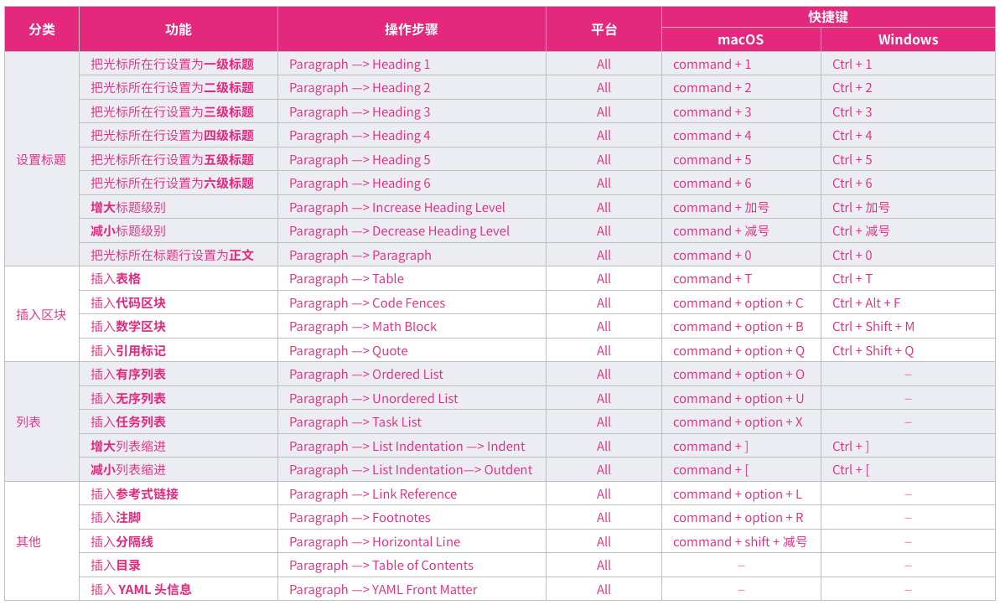
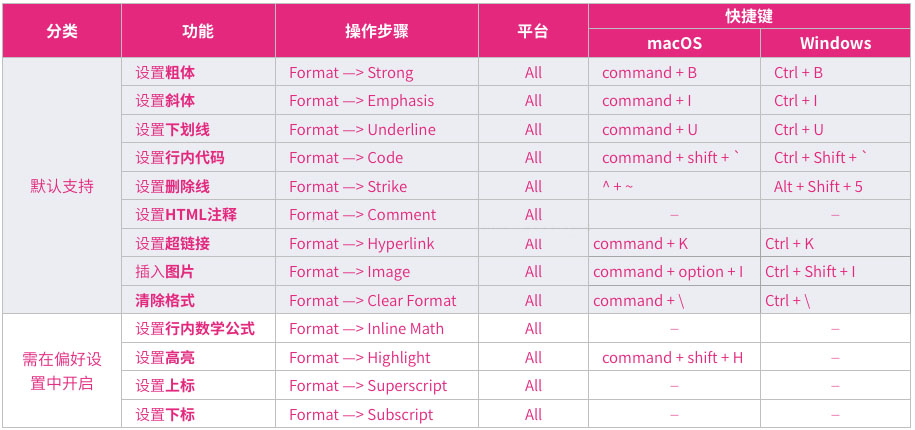

# LearningNotes
-----------------

I create this repository to upload my own learning notes.

This repository includes these learning notes :

* Redis
* Vue
* Tomcat ( Which in the Deploy folder )
* Nginx ( Which in the Deploy folder too )

--------------------

The markdown editor client I using is Typora , and here are some of its shortcut keys. 

As you can see its a chinese version , I'll make another version of it somedays.

