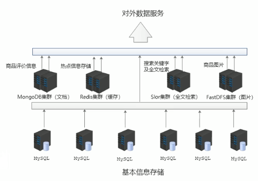
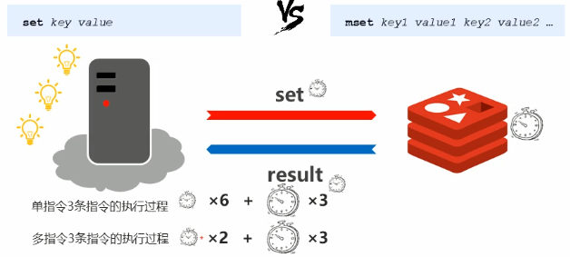

# **Redis**

-----

NoSQL 是关系型数据库的补充 (Redis,MongoDB 都是一种NoSQL)

现阶段的数据解决方案:

> 1. 基本信息内容 --> MySQL
> 2. 商品附加信息(描述,详情,评论) --> MongoDB
> 3. 图片信息 --> 分布式文件系统
> 4. 搜索关键字 --> ES,Lucene,solr
> 5. ☆热点信息 -- 高频/波动性 --> <font color=orange>**Redis**</font>

具体的结构如图:



-----------

## **Redis 安装:(Windows)**

------------------

> 直接下载 Windows 版本https://github.com/MicrosoftArchive/redis/releases
>
> 下载 Redis-x64-3.2.100.zip ,然后解压缩即可开始使用
>
> redis-server 是服务端,用于启动 redis
>
> redis-cli 是客户端,用于链接 redis

## **Redis的基本使用**

---------------

### **信息添加 (cli)**

* 特点 : <font color=red>**单点式**</font> , 当 java 的 map 看待即可

* 功能 : 设置 key , value 数据

* 命令:

* ```sql
  set key value
  ```

* ```sql
  # 例子
  set name cyber
  ```

<font color=#c95d64>**[Conclusion] : redis 自身是一个 Map , 其中所有的数据都是采用 key : value 的形式存储的**</font>

### **信息查询 (cli)**

* 功能 : 根据 key 查询对应的 value , 如果不存在, 返回 <font color=pink>**空**</font> ( <font color=pink>**nil**</font> )

* 命令:

* ```sql
  get key
  ```

* ```sql
  # 例子
  get name
  ```

[PS] 由于是单点式,所以 <font color=orange>**一个 key 只对应一个 value**</font>

### **清屏 (cli)**

```sql
clear
```

### **帮助信息 (cli)**

```sql
help 命令名 or help @组名
```

[PS] 关于组名 : string 就是一个组名

对于一个帮助信息 , 有如下需要知道的 :


### **退出 (cli)**

```sql
quit
exit
esc
ctrl+c
```

-----------------------

# --------- 入门结束 ---------

-------------------

# **Redis数据类型**

----------------

## 数据存储类型介绍

### 针对哪些特殊的业务数据?

#### <font color=pink>**作为缓存使用的**</font>

1. 原始业务功能设计

> * 秒杀
> * 618活动
> * 双11活动
> * 排队购票

2. 运营平台监控到的突发高频访问数据

> * 突发时政要闻 , 被强势关注围观

3. 高频 , 复杂的统计数据

> * 实时在线人数
> * 实时投票排行榜

#### <font color=pink>**作为系统功能优化或升级使用的**</font>

* 单服务器升级集群 (高并发 , 加机器)
* Session 管理
* Token 管理

### <font color=cyan>结果 : 五种常用的 Redis 数据类型</font>

<font color=orange>[PS]对应项只是为了便于理解 , 两者的思想相似 , 甚至有的和数据结构有关 , 所以这五种类型也会被称为五种数据结构</font>

* string  ----  对应 Java : String
* hash  ----  对应 Java : HashMap
* list  ----  对应 Java : LinkedList
* set  ----  对应 Java : HashSet
* sorted_set  ----  对应 Java : TreeSet

-----------

* 我们知道 redis 自身就像一个 Map , 那么 key 和 value 的类型是不同的
* key 的数据类型 <font color=#7bed9f>**永远都是 字符串(string)**</font> 它不存在什么操作的,我们永远都在看 value
* 我们现在所说的数据类型 <font color=#ffd43b>**指的都是 value 部分的数据类型**</font> 

## **string 类型**

* 存储的数据 : 单个数据 , 最简单的数据存储类型 , 也是最常用的数据存储类型
* 存储数据的格式 : 一个存储空间保存一个数据
* 存储内容 : 通常使用字符串 , 如果字符串以整数的形式展示 , 可以作为数字进行操作和使用
* 最大大小: string 类型的 value 最大的大小为 512MB

#### **string 类型的基本操作**

* 添加 / 修改数据 <font color=#eddd9e>**原来有的覆盖 , 原来没有的新建**</font>

* ```sql
  set key value
  ```

* 获取数据

* ```sql
  get key
  ```

* 删除数据

* ```sql
  del key
  ```

<font color=orange>**[PS] 在 redis 中,操作如果是以成功和失败为标识的话 , 一般就是 (integer) 1 或者 (integer) 0**</font>

* 添加 / 修改多个数据 (这里的 m 代表 multiple)

* ```css
  mset key1 value1 key2 value2 ...
  ```

* 获取多个数据

* ```css
  mget key1 key2 ...
  ```

* 获取数据字符个数 (字符串长度)

* ```sql
  strlen key
  ```

* <font color=#777bce>**[PS] strlen 获取到的结果会是**</font><font color=#e88b00> **(integer) ?**</font> <font color=#777bce>**这样的结果**</font>

* 追加信息到原始信息后补 (如果原始信息存在就追加, 否则新建)

* ```sql
  append key value
  ```

* <font color=#777bce>**[PS] append 获取到的结果会是**</font><font color=#e88b00> **(integer) ?**</font> <font color=#777bce>**这样的结果 , 也就是说返回的是长度**</font>

* <font color=#777bce>**[PS] 当 append 追加到一个不存在的 key 上时 , 会新建这个 key-value**</font>

----------------

#### 单数据操作和多数据操作



* 主要看的是 : <font color=#1de9b6>多条单数据</font>和<font color=#26c6da>一条多数据</font>所消耗的发送时间 , 处理时间 , 返回时间 的长短关系

------------------------

#### string 类型数据的拓展 操作

##### 场景方案 1

* 业务场景

  > 大型企业级应用中 , 分表操作是基本操作 , 使用多张表存储同类型的数据 , 但是对应的主键 id 必须保证统一性 , 不能重复 . Oracle 数据库具有 sequence 设定 , 可以解决该问题 , 但是现阶段适用范围广的 MySQL 数据库并不具有类似的机制 , 那么如何解决 ?
  >
  > 解决的是啥问题 ? ---- 不同表主键重复的问题

* **解决方案**

  > * 设置数值数据增加指定范围的值
  >
  > * ```sql
  >   # 让 key值 为 key 的数据递增一下 (+1)
  >   incr key
  >   # 让 key值 为 key 的数据以 increment(需为整数)(若为10) 的值递增 (+10)
  >   incrby key increment
  >   # 让 key值 为 key 的数据以 increment(可为小数)(若为1.5) 的值递增 (+1.5)
  >   incrbyfloat key increment # 显而易见带 float 的和小数有关系
  >   ```
  >
  > * 设置数值数据减少指定范围的值
  >
  > * ```sql
  >   # 让 key值 为 key 的数据递减一下 (-1)
  >   decr key
  >   # 让 key值 为 key 的数据以 给定的 increment(若为10) 的值递减 (+10)
  >   decrby key increment
  >   ```

* **string 作为数值操作**

  > * string 在 redis 内部存储默认就是一个字符串 , 当遇到增减类操作 incr , decr 时会转成数值型进行计算.
  > * <font color=#dd5568>**☆ redis 所有的操作都是原子性的 , 采用单线程处理所有业务, 命令是一个一个执行的 , 因此无需考虑并发带来的数据影响 (也就是说不可能出现好几个人同时操作一个内容的情况出现)**</font>
  > * [PS] : <font color=#fdc408>按数值进行操作的数据 , 如果原始数据不能转成数值 , 或者超越了 redis 数值上限范围 , 那么将会报错</font>
  > * 比如 java 中 long 型数据的最大值为 : Long.MAX_VALUE = 9223372036854775807 这就是 redis 的限制

* 方案1 总结
* redis 用来控制数据库表的主键 id , 为数据库表主键提供生成策略 , 保障数据库表的主键唯一性
* 此方案适用于所有的数据库 , 且支持数据库集群

##### 场景方案 2

* 业务场景

  > 海选投票 , 只能通过微信投票 , 且每个微信号每 4h 内只能投 1 票
  >
  > 电商热门商品推荐 , 商品不能一直处于热门期 , 每种商品热门状态仅维持 3d , 3d 之后自动取消热门状态
  >
  > 热点新闻 , 热点新闻的最大特征就是时效性 , 如何自动控制热点新闻的时效性
  >
  > <font color=#dd775d>[★] 这种模型的共同性质为 : 在一定时长内数据有效 , 过时无效 (需要记住唯一标识 , 过一段时间后删除)</font>

* **解决方案**

  > * 设定具有指定<font color=#e8e2b1>生命周期</font>的数据
  >
  > * ```sql
  >   # 设定 key值 为 key 的数据存活给定的 seconds 时长,value 的值就是 key 对应的 value ,这个内容其实并不重要,一般写 1 即可
  >   # 当再次对 key值 为 key 的数据执行操作时,会覆盖刚刚的 setex 操作
  >   setex key seconds value
  >   # 使用方式同上,只不过这里用的时长单位为毫秒 milliseconds
  >   psetex key milliseconds value
  >   ```

* 方案2 总结

* redis 可以创建具有一定生命周期的数据,很适合用于大型投票等行为中

#### string 类型数据操作的注意事项

* [PS] 这一章只是总结了之前 string 类型的一些特殊内容
* 数据操作不成功的反馈与数据正常操作之间的差异
* 1. 表示运行结果是否成功
     * (integer) 0 → false 失败
     * (integer) 1 → true  成功
  2. 表示运行结果值
     * (integer) 3 → 3	表示结果为数值 3 
     * (integer) 1 → 1    表示结果为数值 1
* 数据未获取到
  * (nil) 等同于空值 null
* string 数据的最大存储量
  * 512MB
* string 数值计算最大范围 (等同于 java 中 long 的最大值)
  * 9223372036854775807

#### string 类型数据的应用场景

* 业务场景

  > 主页高频访问信息显示控制 , 例如新浪微博大V主页实时显示粉丝数与微博数量
  >
  > [具体如何设计呢?]
  >
  > * 在 redis 中为大V用户设定用户信息 , 以用户主键和属性值作为 key , 后台设定定时刷新策略即可
  >
  >   * eg : user​ : id : 3506728370:fans	  →	12210947
  >   * eg : user : id : 3506728370:blogs    →     6164
  >   * eg : user​ : id : 3506728370:focuss   →    83
  >
  > * ```sql
  >   # 给定用户表id为3506728370的fans值设定为12210947
  >   set user:id:3506728370:fans 12210947
  >   ```
  >
  > * 这样存储就有对象那味儿了, 理所当然, 我们可以用 JSON 格式去存储这个数据
  >
  > * ```json
  >   set user:id:00789 {id:3506728371,blogs:789,fans:123456789}
  >   ```
  >
  > * 都是放一组数据,这两种的区别是什么呢? 第一种是单值更新 , JSON 则是全内容更新
  
* Key 的设置约定

  > * 数据库中的热点数据 key 命名惯例:
  >
  >   |      | <font color=#dd5568>表名</font>  | <font color=#8bb8fb>主键名</font> |  <font color=#488efa>主键值</font>   | <font color=#8dce06>字段名</font> |
  >   | :--: | :------------------------------: | :-------------------------------: | :----------------------------------: | :-------------------------------: |
  >   | eg1  | <font color=#dd5568>order</font> |   <font color=#8bb8fb>id</font>   | <font color=#488efa>29437595</font>  |  <font color=#8dce06>name</font>  |
  >   | eg2  | <font color=#dd5568>equip</font> |   <font color=#8bb8fb>id</font>   | <font color=#488efa>390472345</font> |  <font color=#8dce06>type</font>  |
  >   | eg3  | <font color=#dd5568>news</font>  |   <font color=#8bb8fb>id</font>   | <font color=#488efa>202004150</font> | <font color=#8dce06>title</font>  |

