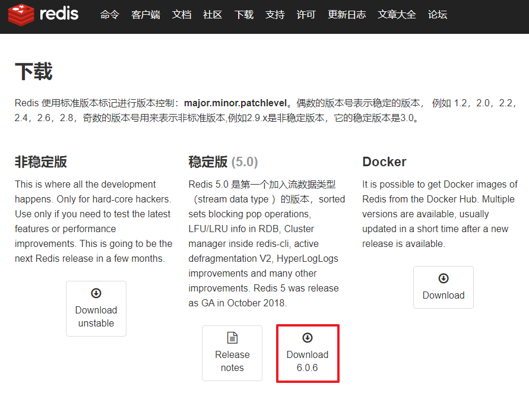

# Linux 中安装 Redis

--------------

> 在现阶段的工作中 , 我们越来越不满足于 MySQL 在处理大数据上的卡顿 , 越来越注重高并发 , 多数据源等技术 , 随之开始使用 Redis 等一众内存数据库 , 今天笔者就来演示一下如何在 Linux 云服务器中安装 Redis 数据库
>
> 话不多说 , 从下载开始

### 下载 Redis

* 笔者之前在 MySQL 和 Tomcat 等工具的安装演示中 , 有提到过如何寻找一个软件的压缩版下载链接并通过 wget 下载它 , 这里也使用此方法下载 Redis 解压版包

* 首先进入 Redis 官方下载页面 http://www.redis.cn/download.html

* 在下面获取到 **Redis 6.0.6** 的下载链接 http://download.redis.io/releases/redis-6.0.6.tar.gz

   

  > [ps] 不用在乎这个版本是否是 Windows 版本 , 因为 Redis 是一个明确的 , 只专注于提供 Linux 版本的工具 , 当然它也有 Windows 版本 , 但是不是在这里下载的 , 所以我们直接复制这个下载地址即可

* 进入 Linux 系统 , 创建放置解压版包的目录 , 并通过 <kbd>wget</kbd> 命令获取解压版包

* 老习惯了 , 我将它放置在了 <kbd>/home/Redis/</kbd> 目录下

  ```shell
  cd /home/
  # 创建文件夹
  mkdir Redis
  # 检查目录
  ls
  # 可以看到Redis目录创建成功
  Java  MySQL  Nginx  Redis  Tomcat
  # 进入目录下载相关解压版包
  cd Redis
  # 下载目标
  wget http://download.redis.io/releases/redis-6.0.6.tar.gz
  --2021-06-22 17:08:22--  http://download.redis.io/releases/redis-6.0.6.tar.gz
  Resolving download.redis.io (download.redis.io)... 45.60.125.1
  Connecting to download.redis.io (download.redis.io)|45.60.125.1|:80... connected.
  HTTP request sent, awaiting response... 200 OK
  Length: 2228781 (2.1M) [application/octet-stream]
  Saving to: ‘redis-6.0.6.tar.gz’
  redis-6.0.6.tar.gz        100%[==================================>]   2.12M  81.1KB/s    in 24s   
  2021-06-22 17:08:47 (89.9 KB/s) - ‘redis-6.0.6.tar.gz’ saved [2228781/2228781]
  ```

* 接下来解压此文件并将其内容递归复制到 <kbd>/usr/local/redis/</kbd> 目录下 , 没有此目录就创建一个 , 具体咋创建不说啦

  ```shell
  # 解压并解包
  tar -zvxf redis-6.0.6.tar.gz
  # 检查目录
  ls
  # 结果
  redis-6.0.6  redis-6.0.6.tar.gz
  # 创建 /usr/local/redis/ 目录,进入 redis-6.0.6 目录
  mkdir /usr/local/redis
  cd redis-6.0.6/
  # 递归复制内容到目标目录中
  cp * /usr/local/redis/ -r
  # 检查是否复制成功
  ls /usr/local/redis/
  # 成功
  00-RELEASENOTES  COPYING  Makefile   redis.conf       runtest-moduleapi  src     utils
  BUGS             deps     MANIFESTO  runtest          runtest-sentinel   tests
  CONTRIBUTING     INSTALL  README.md  runtest-cluster  sentinel.conf      TLS.md
  ```

### 安装 Redis

------------

* 和其他工具一样 , 在安装 Redis 之前我们需要安装相应的依赖环境

* 首先是 gcc 编译环境 , 这个环境在之前 Nginx 的安装演示中安装过 , 不过没关系 , 我们再运行一遍 , 以防万一

  ```shell
  yum install gcc-c++
  ```

* 有时候可能安装会提示已有此内容 , 可以更新一下 gcc 编译环境

  ```shell
  yum upgrad gcc-c++
  ```

* 在这里我们需要查看一下 gcc 的版本 , redis 需要 gcc 达到 5.3 以上的版本

  ```shell
  # 查看 gcc 版本
  gcc -v
  # 结果
  Using built-in specs.
  COLLECT_GCC=gcc
  COLLECT_LTO_WRAPPER=/usr/libexec/gcc/x86_64-redhat-linux/8/lto-wrapper
  OFFLOAD_TARGET_NAMES=nvptx-none
  OFFLOAD_TARGET_DEFAULT=1
  Target: x86_64-redhat-linux
  Configured with: ../configure --enable-bootstrap --enable-languages=c,c++,fortran,lto --prefix=/usr --mandir=/usr/share/man --infodir=/usr/share/info --with-bugurl=http://bugzilla.redhat.com/bugzilla --enable-shared --enable-threads=posix --enable-checking=release --enable-multilib --with-system-zlib --enable-__cxa_atexit --disable-libunwind-exceptions --enable-gnu-unique-object --enable-linker-build-id --with-gcc-major-version-only --with-linker-hash-style=gnu --enable-plugin --enable-initfini-array --with-isl --disable-libmpx --enable-offload-targets=nvptx-none --without-cuda-driver --enable-gnu-indirect-function --enable-cet --with-tune=generic --with-arch_32=x86-64 --build=x86_64-redhat-linux
  Thread model: posix
  # 可以看到阿里云服务器中的 gcc 版本为 8.4.1
  gcc version 8.4.1 20200928 (Red Hat 8.4.1-1) (GCC)
  ```

  > 服务器一般我们更新之后 gcc 版本就已经满足要求了 , 但是一般在本地机器中 , 可能会遇到一些问题
  >
  > 比如笔者使用的 CentOS7 主机 , 其默认 gcc 版本为 4.8.5 , yum 安装更新也是最高到此版本
  >
  > 这时需要通过以下命令升级 gcc 环境为别的版本 , 这里我使用的是 9 的版本
  >
  > ```shell
  > yum  -y  install  centos-release-scl
  > yum  -y  install  devtoolset-9-gcc  devtoolset-9-gcc-c++  devtoolset-9-binutils
  > ```
  >
  > 配置环境 , 使其长期有效
  >
  > ```shell
  > # 临时有效，退出 shell 或重启会恢复原 gcc 版本
  > scl enable devtoolset-9 bash
  > # 长期有效
  > echo "source /opt/rh/devtoolset-9/enable" >>/etc/profile
  > ```
  >
  > [PS] 可以参考 [Redis下载页面 ](http://www.redis.cn/download.html) 里面评论区也有网友说明GCC升级方式和方法

* 既然 gcc 版本已经满足了 , 那么就开始安装 Redis 吧

* 首先进入 Redis 程序目录 <kbd>/usr/local/redis/</kbd> 并执行编译和安装命令

  ```shell
  # 进入 redis 目录
  cd /usr/local/redis/
  # 编译程序
  make
  # 安装 Redis
  make install
  ```

* 这样配置之后 , Redis 会被安装到默认的 <kbd>/usr/local/bin/</kbd> 目录下 , 可以通过以下命令将其安装在指定位置

  ```shell
  # 安装 Redis 到指定位置
  make install PREFIX=/usr/local/redis
  ```

* 这样会将 Redis 安装到 <kbd>/usr/local/redis/bin/</kbd> 目录下 , <kbd>/bin/</kbd> 目录是 Redis 安装时自动生成的

  > 你肯定想已经安到默认路径了但是想换到指定路径要怎么做 , 其实很简单
  >
  > 首先 Redis 被默认安装到了 <kbd>/usr/local/bin/</kbd> 目录下 , 查看这个目录会看到很多以 <kbd>redis-</kbd> 开头的文件夹
  >
  > 把它们全部删掉然后再将 Redis 安装到指定位置即可
  >
  > ```shell
  > # 检查 /usr/local/bin/ 目录内容
  > ls /usr/local/bin
  > # 结果
  > ......
  > redis-check-aof  redis-sentinel
  > redis-check-rdb  redis-server
  > redis-benchmark  redis-cli
  > ......
  > # 删除这些目录和其中的文件
  > rm -rf /usr/local/bin/redis-*
  > # 重新安装 Redis 到想要的路径
  > make install PREFIX=/usr/local/redis/
  > ```

* 进入 bin 目录下 , 查看文件及权限

  ```shell
  cd bin
  # 查看文件
  ls
  # 结果
  redis-benchmark  redis-check-aof  redis-check-rdb  redis-cli  redis-sentinel  redis-server
  # 查看权限
  ll
  # 结果
  total 45660
  -rwxr-xr-x 1 root root  6383192 Jun 22 17:45 redis-benchmark
  -rwxr-xr-x 1 root root 11224168 Jun 22 17:45 redis-check-aof
  -rwxr-xr-x 1 root root 11224168 Jun 22 17:45 redis-check-rdb
  -rwxr-xr-x 1 root root  6688376 Jun 22 17:45 redis-cli
  lrwxrwxrwx 1 root root       12 Jun 22 17:45 redis-sentinel -> redis-server
  -rwxr-xr-x 1 root root 11224168 Jun 22 17:45 redis-server
  ```

* 接下来 , 把 Redis 程序解压目录中的配置文件放入到 redis 所在的 conf 目录中 , 当然该创建的文件夹还是要创建的

  ```shell
  # 创建目录
  mkdir /usr/local/redis/bin/conf
  # 复制配置文件
  cp redis.conf /usr/local/redis/bin/conf/
  # 进入 redis 配置目录
  cd /usr/local/redis/bin/conf/
  # 检查文件
  ls
  # 确认文件存在
  redis.conf
  ```

* 测试启动 Redis , 进入 bin 目录 , 使用命令启动 Redis 服务

  ```shell
  # 进入 Redis 的 bin 目录
  cd /usr/local/redis/bin/
  # 启动 redis 服务,指定使用的配置文件
  ./redis-server conf/redis.conf
  # 结果
  243268:C 22 Jun 2021 18:02:07.495 # oO0OoO0OoO0Oo Redis is starting oO0OoO0OoO0Oo
  243268:C 22 Jun 2021 18:02:07.495 # Redis version=6.0.6, bits=64, commit=00000000, modified=0, pid=243268, just started
  243268:C 22 Jun 2021 18:02:07.495 # Configuration loaded
                  _._                                                  
             _.-``__ ''-._                                             
        _.-``    `.  `_.  ''-._           Redis 6.0.6 (00000000/0) 64 bit
    .-`` .-```.  ```\/    _.,_ ''-._                                   
   (    '      ,       .-`  | `,    )     Running in standalone mode
   |`-._`-...-` __...-.``-._|'` _.-'|     Port: 6379
   |    `-._   `._    /     _.-'    |     PID: 243268
    `-._    `-._  `-./  _.-'    _.-'                                   
   |`-._`-._    `-.__.-'    _.-'_.-'|                                  
   |    `-._`-._        _.-'_.-'    |           http://redis.io        
    `-._    `-._`-.__.-'_.-'    _.-'                                   
   |`-._`-._    `-.__.-'    _.-'_.-'|                                  
   |    `-._`-._        _.-'_.-'    |                                  
    `-._    `-._`-.__.-'_.-'    _.-'                                   
        `-._    `-.__.-'    _.-'                                       
            `-._        _.-'                                           
                `-.__.-'                                               
  
  243268:M 22 Jun 2021 18:02:07.496 # WARNING: The TCP backlog setting of 511 cannot be enforced because /proc/sys/net/core/somaxconn is set to the lower value of 128.
  243268:M 22 Jun 2021 18:02:07.496 # Server initialized
  243268:M 22 Jun 2021 18:02:07.496 # WARNING overcommit_memory is set to 0! Background save may fail under low memory condition. To fix this issue add 'vm.overcommit_memory = 1' to /etc/sysctl.conf and then reboot or run the command 'sysctl vm.overcommit_memory=1' for this to take effect.
  243268:M 22 Jun 2021 18:02:07.496 # WARNING you have Transparent Huge Pages (THP) support enabled in your kernel. This will create latency and memory usage issues with Redis. To fix this issue run the command 'echo never > /sys/kernel/mm/transparent_hugepage/enabled' as root, and add it to your /etc/rc.local in order to retain the setting after a reboot. Redis must be restarted after THP is disabled.
  243268:M 22 Jun 2021 18:02:07.496 * Ready to accept connections
  ```

* 不管有多少警告和问题 , 总之 redis 已经 Ready to accept connections 了 , 我们新开一个 shell 窗口尝试去连接它

  ```shell
  # 新开窗口执行命令
  # 进入 redis 的 bin 目录
  cd /usr/local/redis/bin/
  # 运行 redis 客户端连接
  ./redis-cli -p 6379
  # 测试连接
  127.0.0.1:6379> ping
  # 有回应,连接正常
  PONG
  # 停止redis服务,断开连接
  127.0.0.1:6379> shutdown
  not connected> exit
  ```

* 这时回到我们原先的 shell 中 , 可以看到后面多出来了这几行

  ```shell
  243268:M 22 Jun 2021 18:04:18.993 # User requested shutdown...
  243268:M 22 Jun 2021 18:04:18.993 * Saving the final RDB snapshot before exiting.
  243268:M 22 Jun 2021 18:04:18.994 * DB saved on disk
  243268:M 22 Jun 2021 18:04:18.994 * Removing the pid file.
  243268:M 22 Jun 2021 18:04:18.994 # Redis is now ready to exit, bye bye...
  ```

* 