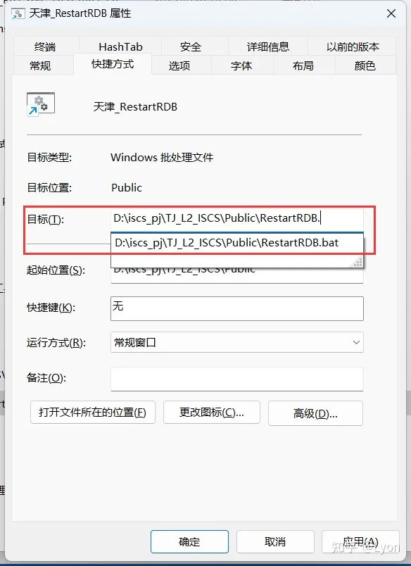

# Windows 10 贴士

------------------------

### 如何查看端口被是否被占用

* 首先查看所有的端口情况

  ```shell
  netstat -ano
  ```

  > 输入此命令会列出所有的端口情况 , 并以 IP:Port 的方式展示出来
  >
  > 首先找到需要检查的端口 , 比如是 8080 , 然后获取最后一列的 PID

* 如果已经知道被占用的端口是哪个了 , 只想获取它而不是检查列表 , 比如 8080

* 那么可以使用此命令

  ```shell
  netstat -ano|findstr "8080"
  ```

  > 这样就能获取 8080 端口对应的单条数据了

* 假如我们获取到 8080 端口对应的占用应用 PID 为 2720

* 那么我们可以通过以下命令查看实际的应用信息

  ```shell
  tasklist|findstr "2720"
  ```

  > 假如结果是 svchost.exe

* 这样我们就可以在任务管理器的进程中关闭它了

* 结束的方式可以直接在任务管理器中结束进程

* 也可以在命令行中输入以下命令结束

  ```shell
  taskkill /f /t /im svchost.exe
  ```

* 另外 , 在任务管理器中可以点击查看看到 PID 的开启选项

----------------------------

### 如何设置Windows-10任务栏完全透明化教程

* 首先打开 Windows设置 , 可以通过快捷键 <kbd>win + i</kbd> 打开

* 依次点击 **个性化** → **颜色** , 打开本选项卡中更多选项下的 **透明效果** 

* 使用快捷键 <kbd>win + R</kbd> 运行 , 输入 **regedit** 打开注册表编辑器

* 进入以下路径

  ```sh
  计算机\HKEY_CURRENT_USER\SOFTWARE\Microsoft\Windows\CurrentVersion\Explorer\Advanced
  ```

* 在当前栏的空白处点击鼠标右键 , 新建一个名为 **TaskbarAcrylicOpacity** 的 **DWORD(32位)值** 

* 创建好之后右键选择 **修改** 选项 , 将基数改为 **十进制** 

* 此时左边的数值数据效果为 : **0是全透，10是不透，1至9为半透明** 

* 修改在电脑重启之后生效

--------------------

### Windows-10 远程桌面

* 通过使用**运行**命令 <kbd>mstsc</kbd> 可以快速调出 Windows 远程桌面应用

-------------

### Windows-10/11 查看无线网络命令

- 通过使用以下**命令**可以快速显示出本机连接过的所有WiFi以及其属性

  ```shell
  # 查看所有连接过的无线网络
  netsh wlan show profiles
  # 查看所有连接过的无线网络的密码
  netsh wlan show profile * key=clear
  # 查看指定的无线网络的密码
  netsh wlan show profile name="name" key=clear
  # 直接执行以下命令
  for /f "skip=9 tokens=1,2 delims=:" %i in ('netsh wlan show profiles') do @echo %j | findstr -i -v echo | netsh wlan show profiles %j key=clear
  ```

- 或者复制以下命令并保存为<kbd>.bat</kbd>文件 , 执行完毕之后 , 会自动在桌面生成 **WiFi.txt** 文件并自动打开

  ```shell
  for /f "skip=10 tokens=1,2 delims=:" %i in ('netsh wlan show profiles') do 
  @for /f "tokens=1-2 delims=:" %k in ('netsh wlan show profiles %j key ^=
   clear ^|findstr /i "关键内容"') do @echo %%j,%%l>> %USERPROFILE%\desktop\WiFi.txt
  %USERPROFILE%\desktop\WiFi.txt

### Windows-11 创建批处理文件快捷方式到开始

- 来源 : [知乎Lyon](https://www.zhihu.com/question/601260693/answer/3030330037)

- **采用曲线救国的方式 :** 
  1. 将文件后缀改为.exe, 右键菜单选择 `固定到“开始”屏幕` 
  2. 将文件重新改回原来的后缀
  3. 在开始菜单中, 找到刚刚固定的文件图标, 右键选择 `打开文件位置` 
  4. 在弹出的资源管理器中选择该文件的快捷方式, 右键选择 `属性` 
  5. 将 `目标(T):` 中的文件路径后缀改为正确的后缀即可 (将自动弹出提示)
  

### 检查笔记本电脑电池报告

- 通过在命令行中输入以下命令, 然后在对应的路径查看相关报告即可

  ```shell
  powercfg /batteryreport
  ```

  一般路径应该为如下类似的文件:

  ```shell
  C:\Users\YuiNo\battery-report.html
  ```

  
